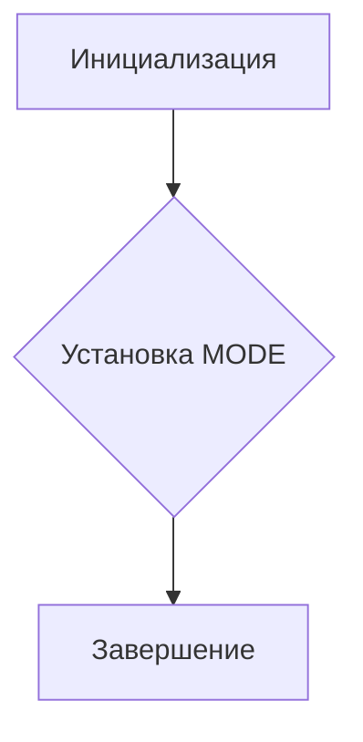

# <input code>

```python
## \file hypotez/src/endpoints/__init__.py
# -*- coding: utf-8 -*-\
#! venv/Scripts/python.exe
#! venv/bin/python/python3.12

"""
.. module: src.endpoints 
	:platform: Windows, Unix
	:synopsis:

"""


# from .prestashop import PrestaShop, PrestaCategory, PrestaCustomer, PrestaLanguage, PrestaProduct, PrestaShopShop, PrestaSupplier, PrestaWarehouse, PriceListRequester 
# from .kazarinov import KazarinovTelegramBot
```

# <algorithm>

Алгоритм работы представленного кода достаточно прост.  Он инициализирует переменную `MODE` со значением 'dev'.  Далее идут комментарии, которые импортируют классы из подпапок `prestashop` и `kazarinov`, но эти импорты закомментированы.  Таким образом, данный код не выполняет каких-либо действий, кроме инициализации переменной, и не взаимодействует с другими частями приложения до момента, когда импорты будут разкомментированы.

**Блок-схема (пока импорты закомментированы):**



В примере нет обработки данных, перемещения между функциями или классами.


# <mermaid>

```mermaid
graph TD
    A[init.py] --> B();
    subgraph "Закомментированные импорты"
        B --> C[from .prestashop import ...];
        B --> D[from .kazarinov import ...];
    end
    B --> E[Завершение]
```

# <explanation>

* **Импорты:**
    Код содержит закомментированные импорты.  Если они будут разкомментированы, это позволит использовать классы из подпапок `prestashop` и `kazarinov` (подразумевая, что эти подпапки содержат соответствующие определения классов).  Это характерно для модулей Python, организованных в иерархии пакетов.
    * `from .prestashop import ...`: Импортирует классы, связанные с платформой PrestaShop, такие как `PrestaShop`, `PrestaCategory`, и т.д.  Это предполагает, что в папке `hypotez/src/endpoints/prestashop` лежат соответствующие модули с этими классами.
    * `from .kazarinov import ...`: Импортирует классы, связанные с ботом KazarinovTelegramBot. Аналогично, предполагается существование папки `hypotez/src/endpoints/kazarinov`.

* **Классы:**
    Классы, которые импортируются, будут определены в файлах `.py` в подпапках `prestashop` и `kazarinov`.  Они представляют собой сущности (например, магазин, категория товаров), и их методы, вероятно, будут отвечать за взаимодействие с данными.  Их функциональность неизвестна без анализа этих файлов.

* **Функции:**
    Функции отсутствуют в данном файле.

* **Переменные:**
    ``: Переменная, вероятно, задаёт режим работы приложения (например, 'dev' - для разработки, 'prod' - для производства).  Изменённое значение этой переменной может влиять на поведение программного обеспечения (например, конфигурацию базы данных).

* **Возможные ошибки/улучшения:**
    * **Отсутствующие импорты:** Если код будет запущен, а импорты не будут разкомментированы, он вызовет ошибки `ImportError`. Следует разкомментировать нужные импорты.
    * **Недостаточная документация:** Хотя есть docstring, он может быть расширен, описывая каждый класс и функцию более подробно.
    * **Нет логики:** Файл `__init__.py` в папке `endpoints` является точкой входа для взаимодействия с другими классами, но пока он не содержит активного кода.  Ожидается, что при разкоментировании импортов код станет больше и будет включать логику для работы с платформами и ботом.

* **Взаимосвязи с другими частями проекта:**
    Файл `endpoints/__init__.py` будет использоваться другими частями проекта для доступа к классам, связанным с API PrestaShop и KazarinovTelegramBot.  Например, в функции или методах другой части проекта может быть вызов `from hypotez.src.endpoints.prestashop import PrestaShop`, чтобы работать с классом `PrestaShop`.


```