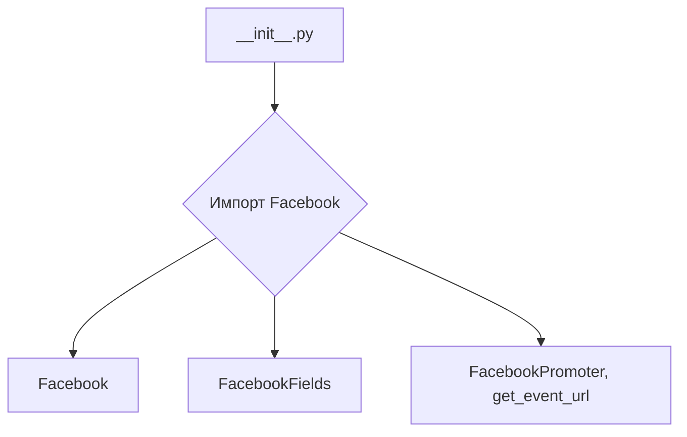
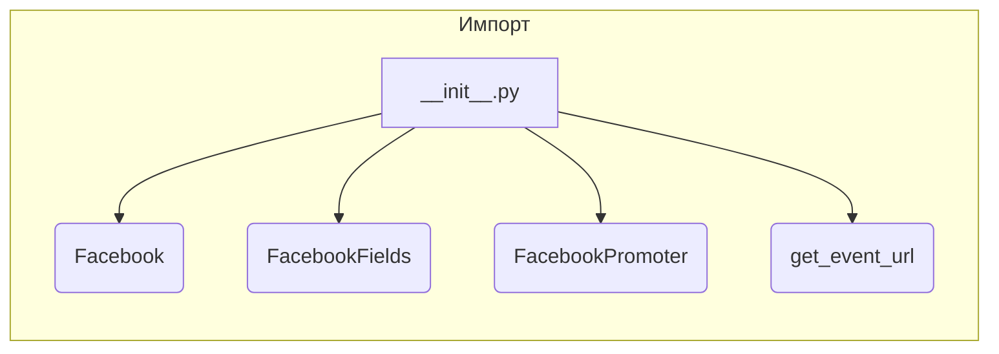

```MD
# Анализ кода hypotez/src/endpoints/advertisement/facebook/__init__.py

**1. <input code>**

```python
## \file hypotez/src/endpoints/advertisement/facebook/__init__.py
# -*- coding: utf-8 -*-

#! venv/bin/python/python3.12

"""
.. module:: src.endpoints.advertisement.facebook 
	:platform: Windows, Unix
	:synopsis:

"""


from .facebook import Facebook
from .facebook_fields import FacebookFields
from .promoter import FacebookPromoter, get_event_url
```

**2. <algorithm>**

Этот код представляет собой модуль инициализации для подсистемы рекламы в Facebook.  Алгоритм заключается в импорте необходимых компонентов из подпапок.  Блок-схема достаточно простая:



Пример использования: В другом файле проекта можно использовать импортированные классы и функции:

```python
from hypotez.src.endpoints.advertisement.facebook import Facebook, FacebookPromoter, get_event_url
# Дальше использование Facebook, FacebookPromoter и get_event_url
```


**3. <mermaid>**



**4. <explanation>**

* **Импорты**:
    * `from .facebook import Facebook`: Импортирует класс `Facebook` из файла `facebook.py` внутри текущей директории (`./`).  Предполагается, что `facebook.py` содержит реализацию функциональности, связанной с взаимодействием с Facebook API.
    * `from .facebook_fields import FacebookFields`: Импортирует класс `FacebookFields` из файла `facebook_fields.py`. Вероятно, этот класс содержит определения полей, используемых для работы с рекламой в Facebook.
    * `from .promoter import FacebookPromoter, get_event_url`: Импортирует класс `FacebookPromoter` и функцию `get_event_url` из файла `promoter.py`.  `FacebookPromoter` вероятно отвечает за взаимодействие с сервисами продвижения, а `get_event_url` - за получение URL событий.

* **Классы**:
    * `Facebook`:  Представляет собой класс, содержащий логику взаимодействия с Facebook API (создание объявлений, мониторинг, и т.п.).
    * `FacebookFields`: Вероятно, класс, хранящий константы или перечисления для полей, используемых при работе с рекламными кампаниями на Facebook.
    * `FacebookPromoter`:  Класс, отвечающий за настройку и запуск рекламных кампаний в Facebook.

* **Функции**:
    * `get_event_url`:  Возвращает URL для определенного события.  Это может быть полезно для отслеживания кликов или других действий, связанных с рекламными кампаниями.

* **Переменные**:
    * ``: Глобальная переменная, вероятно, используется для определения режима работы (разработка, производство).

* **Возможные ошибки и улучшения**:
    * Отсутствие документации для классов и функций в файлах `facebook.py`, `facebook_fields.py` и `promoter.py` затрудняет понимание их функциональности. Добавьте docstrings.
    *  Не указаны значения `MODE`.  Если режим `dev` используется только для логирования или других действий в разработке, это можно сделать более понятным.
    *  Нет информации о зависимости от внешних библиотек (например, `facebook-sdk`).


**Цепочка взаимосвязей:**

Модуль `__init__.py` в `endpoints/advertisement/facebook` является точкой входа для работы с рекламными компонентами Facebook.  Он предоставляет доступ к `Facebook`, `FacebookFields`, `FacebookPromoter` и `get_event_url`.   Эти компоненты, вероятно, взаимодействуют с внешними API Facebook, а также с другими модулями проекта.  Например, `FacebookPromoter` может получать данные о бюджете, целевой аудитории и других параметрах из других частей системы.