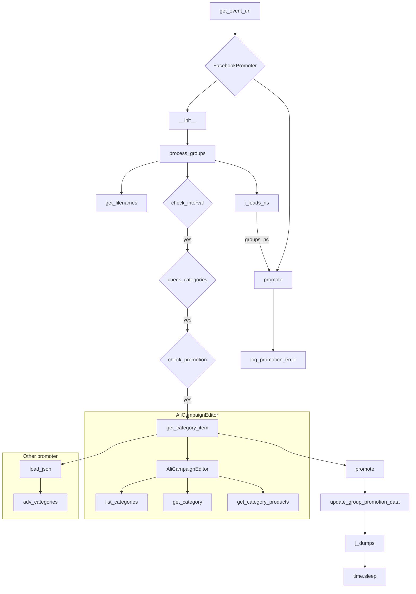

# <input code>

```python
## \file hypotez/src/endpoints/advertisement/facebook/promoter.py
# -*- coding: utf-8 -*-\
#! venv/Scripts/python.exe
#! venv/bin/python/python3.12

"""
.. module:: src.endpoints.advertisement.facebook 
    :platform: Windows, Unix
    :synopsis: module handles the promotion of messages and events in Facebook groups.
It processes campaigns and events, posting them to Facebook groups while avoiding duplicate promotions.
"""


import random
from datetime import datetime, timedelta
from pathlib import Path
from urllib.parse import urlencode
from types import SimpleNamespace
from typing import Optional

from src import gs
from src.endpoints.advertisement import facebook
from src.webdriver.driver import Driver
from src.suppliers.aliexpress.campaign import AliCampaignEditor
from src.endpoints.advertisement.facebook.scenarios import (post_message, 
                                                   post_event, 
                                                   post_message_title, 
                                                   upload_post_media,
                                                   message_publish,
                                                   post_ad,
                                                   )

from src.utils.file import (read_text_file,
                        get_filenames,
                        get_directory_names,
                        )
from src.utils.jjson import j_loads_ns, j_dumps
from src.utils.cursor_spinner import spinning_cursor
from src.logger import logger

def get_event_url(group_url: str) -> str:
    """
    Returns the modified URL for creating an event on Facebook, replacing `group_id` with the value from the input URL.

    Args:
        group_url (str): Facebook group URL containing `group_id`.

    Returns:
        str: Modified URL for creating the event.
    """
    group_id = group_url.rstrip('/').split('/')[-1]
    base_url = "https://www.facebook.com/events/create/"
    params = {
        "acontext": '{"event_action_history":[{"surface":"group"},{"mechanism":"upcoming_events_for_group","surface":"group"}],"ref_notif_type":null}',
        "dialog_entry_point": "group_events_tab",
        "group_id": group_id
    }

    query_string = urlencode(params)
    return f"{base_url}?{query_string}"

class FacebookPromoter:
    """ Class for promoting AliExpress products and events in Facebook groups.
    
    This class automates the posting of promotions to Facebook groups using a WebDriver instance,
    ensuring that categories and events are promoted while avoiding duplicates.
    """
    d: Driver = None
    group_file_paths: str | Path = None
    no_video: bool = False
    promoter: str

    def __init__(self, d: Driver, promoter: str, group_file_paths: Optional[list[str | Path] | str | Path] = None, no_video: bool = False):
        """ Initializes the promoter for Facebook groups.

        Args:
            d (Driver): WebDriver instance for browser automation.
            group_file_paths (list[str | Path] | str | Path): List of file paths containing group data.
            no_video (bool, optional): Flag to disable videos in posts. Defaults to False.
        """
        self.promoter = promoter
        self.d = d
        self.group_file_paths = group_file_paths if group_file_paths else get_filenames(gs.path.google_drive / 'facebook' / 'groups')
        self.no_video = no_video
        self.spinner = spinning_cursor()

    # ... (other methods)
```

# <algorithm>

**Описание алгоритма:**

Код реализует процесс автоматизированного продвижения товаров и мероприятий на Facebook группах.

1. **`get_event_url`**: Формирует URL для создания события на Facebook, подставляя ID группы из входного URL.
2. **`FacebookPromoter`**: Класс для управления процессом продвижения.
    * **`__init__`**: Инициализирует экземпляр класса с WebDriver, списком путей к файлам с данными групп, флагом для отключения видео.
    * **`promote`**: Продвигает категорию или событие на Facebook группе.
        * **Проверка языка и валюты:** Если заданы `language` и `currency`, сравниваются с настройками группы. Если не совпадают, возвращается `False`.
        * **Извлечение данных:** Получение имени события или категории.  Замена параметров `is_event`.
        * **Обработка события:** Если `is_event`, устанавливаются `start`, `end`, `promotional_link`, и вызывается `post_event`.
        * **Обработка сообщения:** Если не событие, вызывается `post_ad` или `post_message`.
        * **Обновление данных группы:** Вызов `update_group_promotion_data`.
    * **`log_promotion_error`**: Логирование ошибок при продвижении.
    * **`update_group_promotion_data`**: Обновление данных о продвинутых категориях/событиях в группе (с последним временем отправки, списками).
    * **`process_groups`**: Обработка списка групп для продвижения.
        * **Чтение данных о группах:** Из файла (json).
        * **Проверка интервала:** Если не событие, вызывается `check_interval`.  Если интервал не соблюден, пропускает группу.
        * **Проверка соответствия категориям:** Если не событие, проверяет соответствие категорий.  Если не совпадает, пропускает группу.
        * **Проверка на уже продвинутый товар/событие:** Проверяет, не был ли данный товар/событие уже продвинут на этой группе.  Если да, пропускает.
        * **Обработка данных кампании:** На основе `promoter` выбирает способ извлечения данных об товаре/событии (AliCampaignEditor, другие данные).
        * **Вызов `promote`**: Вызывает метод для продвижения товара/события.
        * **Запись обновленных данных:** Запись обновленных данных о группах в файл.
        * **Пауза:** Задержка случайной длительности.
    * **`get_category_item`**: Извлекает данные о категории или событии на основе кампании.  На основе `promoter` выбирает способ извлечения (например, `AliCampaignEditor`).
    * **`check_interval`**: Проверка интервала времени для продвижения группы (логика не приведена, но предположительно проверяет `last_promo_sended`).
    * **`validate_group`**: Проверка корректности данных о группе.


# <mermaid>



# <explanation>

**Импорты:**

* `from src import gs`: Импортирует модуль `gs`, вероятно, для взаимодействия с хранилищем данных (Google Sheets, Google Drive).
* `from src.endpoints.advertisement import facebook`: Импортирует модуль `facebook` из пакета `endpoints/advertisement`, относящийся к рекламе.
* `from src.webdriver.driver import Driver`: Импортирует класс `Driver` из пакета `webdriver`, отвечающего за взаимодействие с браузером.
* `from src.suppliers.aliexpress.campaign import AliCampaignEditor`: Импортирует класс `AliCampaignEditor` для работы с кампаниями AliExpress.
* `from src.endpoints.advertisement.facebook.scenarios import ...`: Импортирует функции для работы с Facebook API (публикация сообщений, событий, рекламных объявлений).
* `from src.utils.file import ...`: Импортирует функции для работы с файлами (чтение, получение списков файлов).
* `from src.utils.jjson import j_loads_ns, j_dumps`: Импортирует функции `j_loads_ns` (загрузка данных из JSON в `SimpleNamespace`) и `j_dumps` (сохранение данных в JSON) из утилитарного модуля `jjson`.
* `from src.utils.cursor_spinner import spinning_cursor`: Импортирует функцию `spinning_cursor` для отображения индикатора загрузки.
* `from src.logger import logger`: Импортирует логирующий объект `logger` для записи сообщений об ошибках и других событий.
* Остальные импорты стандартные библиотеки Python (`random`, `datetime`, `pathlib`, `urllib.parse`, `types`, `typing`).

**Классы:**

* `FacebookPromoter`: Класс для автоматизации продвижения товаров и событий. Содержит данные о WebDriver-е, пути к файлам с группами Facebook, флаги отключения видео и логирует ошибки.


**Функции:**

* `get_event_url`: Возвращает корректный URL для создания события на Facebook, используя ID группы из входного URL.
* `promote`: Основная функция для продвижения категории/события на Facebook группе.
* `log_promotion_error`: Логирование ошибок при продвижении.
* `update_group_promotion_data`: Обновляет данные о продвинутых категориях/событиях в группе.
* `process_groups`: Обрабатывает все группы для текущей кампании/события.
* `get_category_item`: Возвращает данные о категории или событии, в зависимости от выбранного `promoter` (Aliexpress, другие).
* `check_interval`: Проверяет интервал времени для продвижения.
* `validate_group`: Проверяет корректность данных о группе.


**Переменные:**

* `MODE`: Строковая переменная, вероятно, определяет режим работы (например, 'dev', 'prod').
* `group_file_paths`: Пути к файлам с данными о Facebook группах.


**Возможные ошибки и улучшения:**

* **Обработка ошибок:** Код содержит некоторые проверки на пустые значения и ошибки чтения, но обработка ошибок могла бы быть более структурированной и исчерпывающей (например, `try...except` блоки).
* **Запросы к API:** Важно учитывать лимиты запросов к Facebook API, чтобы не получить блокировку.
* **Более гибкая логика продвижения:** Добавление опций для персонализации процесса продвижения (например, выбор времени продвижения, приоритетных групп).
* **Обработка исключений:** Добавьте `try-except` блоки для обработки возможных ошибок (например, при чтении файлов, взаимодействии с Facebook API).
* **Документация:** Добавьте более подробные комментарии к методам и переменным для лучшей читабельности и понимания кода.
* **Логирование:** Внедрить более гибкую систему логирования, включающую уровень детализации и возможность фильтрации.
* **Проверка доступности веб-драйвера:**  Проверьте, что веб-драйвер работает должным образом.
* **Управление контекстом:** Использование `with` для управления ресурсами, такими как файлы и веб-драйверы.
* **Проверка на дубликаты:**  Убедиться, что механизм обработки дубликатов работает корректно.


**Взаимосвязи с другими частями проекта:**

Код напрямую зависит от модулей `gs`, `src.webdriver.driver`, `src.suppliers.aliexpress.campaign`, `src.endpoints.advertisement.facebook.scenarios`, `src.utils.file`, `src.utils.jjson`, `src.logger`.  Это указывает на то, что эти компоненты обеспечивают необходимые функции для работы `FacebookPromoter`. Код использует `gs.path.google_drive` для работы с файлами на Google Drive, `Driver` - для управления браузером, функции из `src.endpoints.advertisement.facebook.scenarios` - для взаимодействия с Facebook API.  Общая архитектура проекта предполагает разделение ответственности между различными модулями для лучшей организации и масштабируемости.