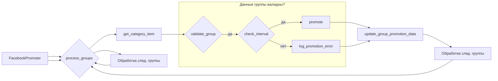

```MD
# Документация модуля Facebook Promoter

## <input code>

```python
# Документация модуля Facebook Promoter

## Обзор

Модуль **Facebook Promoter** автоматизирует продвижение товаров и мероприятий AliExpress в группах Facebook. Модуль управляет публикациями рекламных материалов на Facebook, избегая дублирования. Для эффективного продвижения используется WebDriver для автоматизации браузера.

## Особенности модуля

- Продвижение категорий и мероприятий в группах Facebook.
- Избежание дублирования публикаций через отслеживание уже опубликованных элементов.
- Поддержка конфигурации данных групп через файлы.
- Возможность отключения загрузки видео в публикациях.

## Требования

- **Python** 3.x
- Необходимые библиотеки:
  - `random`
  - `datetime`
  - `pathlib`
  - `urllib.parse`
  - `types.SimpleNamespace`
  - `src` (пользовательский модуль)

## Использование

### Пример использования класса FacebookPromoter

```python
from src.endpoints.advertisement.facebook.promoter import FacebookPromoter
from src.webdriver.driver import Driver
from src.utils.jjson import j_loads_ns

# Настройка экземпляра WebDriver (замените на реальный WebDriver)
d = Driver()

# Создание экземпляра FacebookPromoter
promoter = FacebookPromoter(
    d=d,
    promoter="aliexpress",
    group_file_paths=["path/to/group/file1.json", "path/to/group/file2.json"]
)

# Начало продвижения товаров или мероприятий
promoter.process_groups(
    campaign_name="Campaign1",
    events=[],
    group_categories_to_adv=["sales"],
    language="en",
    currency="USD"
)
```

## Документация классов

### Класс `FacebookPromoter`

Этот класс управляет процессом продвижения товаров и мероприятий AliExpress в группах Facebook.
```mermaid
flowchart TD
    A[Начало] --> B(Инициализация WebDriver);
    B --> C[Создание экземпляра FacebookPromoter];
    C --> D[Обработка групп для продвижения];
    D --> E{Получение данных группы};
    E -- Данные валидны? -- Yes --> F[Получение элемента категории];
    E -- Данные валидны? -- No --> G[Запись ошибки];
    F --> H{Группа может быть продвинута?};
    H -- Да --> I[Продвижение категории/мероприятия];
    H -- Нет --> J[Ждать интервал];
    I --> K[Обновление данных о группе];
    J --> K;
    K --> L[Завершение];
    G --> L;
```

#### Методы
```
```
```
```
```
```

```

```
```
```
```
```


## <algorithm>

**Шаг 1:** Инициализация `WebDriver` (создание экземпляра класса `Driver`).

**Шаг 2:** Создание экземпляра `FacebookPromoter`.  Включает в себя инициализацию с `WebDriver` и данными о промоутере, файлами групп, и опцией `no_video`.

**Шаг 3:** Вызов метода `process_groups`.

**Шаг 4:** В `process_groups` цикл по списку `group_file_paths`.

**Шаг 5:** Внутри цикла вызывается `get_category_item` для получения данных о товаре/мероприятии.

**Шаг 6:** Проверка валидности данных группы (метод `validate_group`).

**Шаг 7:** Если данные валидны, проверка возможности продвижения группы (`check_interval`).

**Шаг 8:** Если группу можно продвигать, вызов `promote` для выполнения продвижения товара/мероприятия.

**Шаг 9:**  Обновление данных о продвижении группы (`update_group_promotion_data`).

**Шаг 10:** Обработка ошибок (`log_promotion_error`) и повторная проверка, если продвижение не удалось.

**Шаг 11:** Завершение цикла по файлам групп.

**Пример данных:**

* `group_file_paths`:  ["path/to/group/file1.json", "path/to/group/file2.json"]
* `campaign_name`: "Campaign1"
* `group_categories_to_adv`: ["sales"]
* `language`: "en"
* `currency`: "USD"


## <mermaid>



## <explanation>

**Импорты:**

* `from src.endpoints.advertisement.facebook.promoter import FacebookPromoter`: Импортирует класс `FacebookPromoter` из модуля, расположенного в `src`.
* `from src.webdriver.driver import Driver`: Импортирует класс `Driver` из модуля `webdriver`.
* `from src.utils.jjson import j_loads_ns`: Импортирует функцию `j_loads_ns` для обработки данных из JSON-файлов.

**Классы:**

* `FacebookPromoter`: Класс, отвечающий за продвижение товаров и мероприятий на Facebook.  Он имеет атрибуты, такие как `d` (экземпляр `Driver`), `promoter`, `group_file_paths` и `no_video`.  Методы класса отвечают за инициализацию, обработку групп, продвижение и запись ошибок.

**Функции:**

* `process_groups`: Центральный метод класса, принимающий список параметров для продвижения, обрабатывающий группы и вызывающий другие методы для выполнения конкретных задач.

**Переменные:**

* `d`: Экземпляр класса `Driver` для управления веб-драйвером.
* `promoter`: Строка, представляющая название промоутера (например, "aliexpress").
* `group_file_paths`: Список путей к файлам с информацией о группах Facebook.

**Возможные ошибки и улучшения:**

* Отсутствует явное указание, что `Driver` – это класс, используемый для управления веб-драйвером. Необходимо это указать в документации.
* Неопределённые типы данных в документации (например, `str | Path`).
* Нет обработки исключений. Важно добавить обработку `try-except` блоков в методах для предотвращения аварийных остановок программы при возникновении ошибок (например, при чтении файла).
* Нет описания конкретного формата файлов `group_file_paths`.  Необходимо указать, какой JSON-формат используется, что ожидается в файлах.
*  Нет проверки на существование `group_file_paths`.

**Взаимосвязи:**

`FacebookPromoter` зависит от `Driver` и `j_loads_ns` (из `src.utils.jjson`).  Он, в свою очередь, используется для автоматизации продвижения.