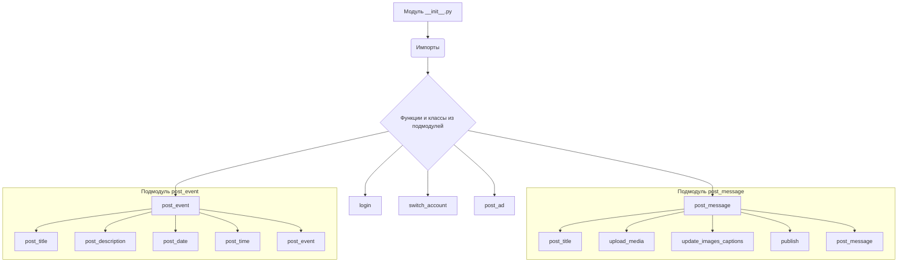
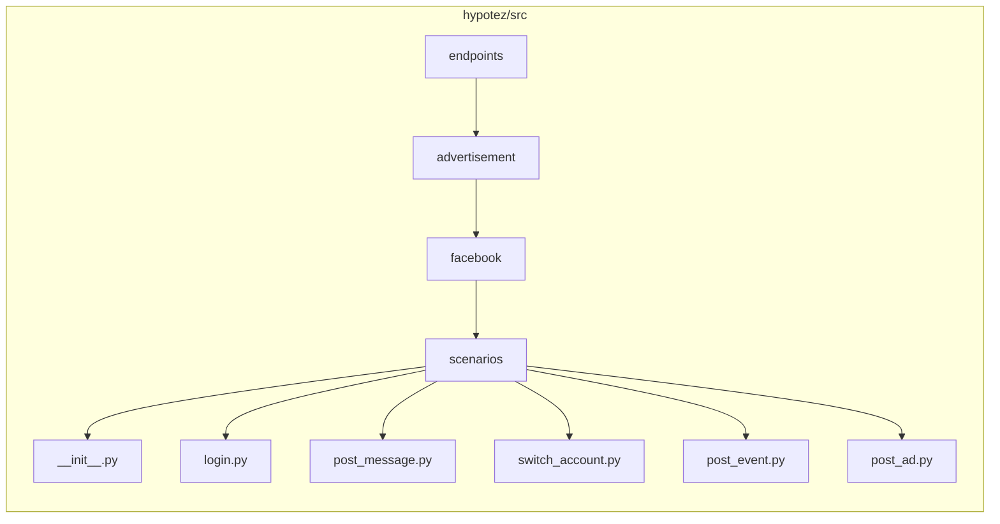

# <input code>

```python
## \file hypotez/src/endpoints/advertisement/facebook/scenarios/__init__.py
# -*- coding: utf-8 -*-\
#! venv/Scripts/python.exe
#! venv/bin/python/python3.12

"""
.. module:: src.endpoints.advertisement.facebook.scenarios 
	:platform: Windows, Unix
	:synopsis:

"""


from .login import login
from .post_message  import *
from .switch_account import switch_account
from .post_message import (post_title as post_message_title,   # <- заголовок
                           upload_media as upload_post_media, # <- изображения 
                           update_images_captions as update_post_media_captions, # <- подписи к изображениям 
                           publish as message_publish,
                           post_message,
                           )

from .post_event import (post_title as post_event_title,
                         post_description as post_event_description,
                         post_date,
                         post_time,
                         #send,
                         post_event
                         )

from .post_ad import post_ad
```

# <algorithm>



**Пример:**  Пользовательский запрос выполняется с помощью __init__.py.  Он импортирует нужные функции из других модулей. Например, для публикации сообщения пользователь сначала вызывает `login` из `login.py`.  Затем последовательно вызывает `post_message_title`, `upload_post_media`, `update_post_media_captions`, `message_publish`.

# <mermaid>



# <explanation>

**Импорты:**

* `from .login import login`: Импортирует функцию `login` из подмодуля `login.py` текущего каталога (`./`).
* `from .post_message import *`: Импортирует все объекты (переменные, функции, классы) из модуля `post_message.py`.  Это плохая практика, рекомендуется импортировать только необходимые элементы.
* Аналогично импортируются функции из других подмодулей (`post_event.py`, `post_ad.py`, `switch_account.py`).

**Классы:**

* Нет явно объявленных классов. В коде только функции.


**Функции:**

* `login`: Вероятно, функция для входа на Facebook. Необходимо просмотреть исходный код `login.py`.
* `switch_account`: Вероятно, функция для переключения учетных записей на Facebook.
* `post_message`, `post_message_title`, `upload_post_media`, `update_post_media_captions`, `message_publish`,  `post_event_title`, `post_event_description`, `post_date`, `post_time`, `post_event`:  Функции для создания, публикации и обновления информации в Facebook.  Названия функций очень информативные.

**Переменные:**

* ``:  Переменная, вероятно, задающая режим работы (development).

**Возможные ошибки и улучшения:**

* Импорт `*` из `post_message`: Не рекомендуется. Следует импортировать только необходимые функции и переменные. Это делает код менее читаемым и может создавать конфликты имен.
* Отсутствует документация для функций. Необходимо добавить docstrings к каждой функции, чтобы объяснить ее назначение, аргументы и возвращаемые значения.
* Отсутствие обработчиков исключений. Необходимо добавить обработку ошибок, чтобы предотвратить внезапные остановки при возникновении проблем при взаимодействии с Facebook.

**Взаимосвязи с другими частями проекта:**

Этот файл (`__init__.py`) служит точкой входа для доступа к функциям, которые выполняют действия на Facebook.  Он импортирует необходимые функции из других файлов.  Эти файлы (например, `login.py`) должны определять эти функции и быть доступны из текущей директории.

**Рекомендации:**

* Избегайте импорта `*`.
* Добавьте docstrings ко всем функциям.
* Добавьте обработку исключений.
* Разделите большую функцию на несколько более мелких и управляемых функций, чтобы повысить читаемость.