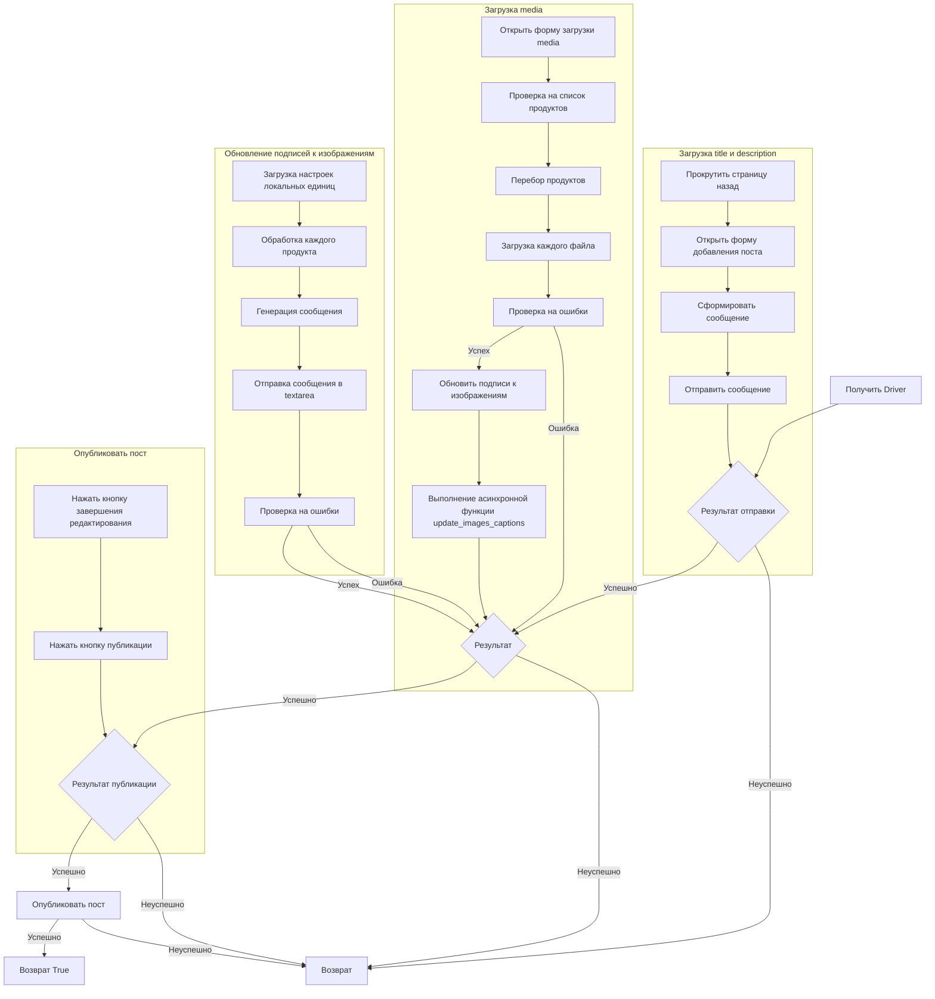

# <input code>

```python
## \file hypotez/src/endpoints/advertisement/facebook/scenarios/post_message_async.py
# -*- coding: utf-8 -*-\n
#! venv/bin/python/python3.12

"""
.. module:: src.endpoints.advertisement.facebook.scenarios.post_message_async 
	:platform: Windows, Unix
	:synopsis: Публикация сообщения из `aliexpress` промо

"""


import time
import asyncio
from pathlib import Path
from types import SimpleNamespace
from typing import Dict, List
from selenium.webdriver.remote.webelement import WebElement
from src import gs
from src.webdriver.driver import Driver
from src.utils.jjson import j_loads_ns, pprint
from src.logger import logger

# Load locators from JSON file.
locator: SimpleNamespace = j_loads_ns(
    Path(gs.path.src / 'endpoints' / 'advertisement' / 'facebook' / 'locators' / 'post_message.json')
)


def post_title(d: Driver, category: SimpleNamespace) -> bool:
    """ Sends the title and description of a campaign to the post message box.

    Args:
        d (Driver): The driver instance used for interacting with the webpage.
        category (SimpleNamespace): The category containing the title and description to be sent.

    Returns:
        bool: `True` if the title and description were sent successfully, otherwise `None`.

    Examples:
        >>> driver = Driver(...)
        >>> category = SimpleNamespace(title="Campaign Title", description="Campaign Description")
        >>> post_title(driver, category)
        True
    """
    # ... (Implementation details)
    return True


async def upload_media(d: Driver, products: List[SimpleNamespace], no_video: bool = False) -> bool:
    # ... (Implementation details)
    return True


async def update_images_captions(d: Driver, products: List[SimpleNamespace], textarea_list: List[WebElement]) -> None:
    # ... (Implementation details)
    pass


async def promote_post(d: Driver, category: SimpleNamespace, products: List[SimpleNamespace], no_video: bool = False) -> bool:
    # ... (Implementation details)
    return True
```

# <algorithm>

**Блок-схема алгоритма**



Пример данных:

* **`Driver`**: Экземпляр драйвера Selenium для взаимодействия с веб-страницей.
* **`category`**: `SimpleNamespace` с атрибутами `title` и `description`. Например, `category = SimpleNamespace(title="Новый T-Shirt", description="Описание изделия")`.
* **`products`**: Список объектов `SimpleNamespace` содержащих информацию о файлах media. Например, `products = [SimpleNamespace(local_image_path="путь/к/изображению.jpg", product_title="Название продукта"), ... ]`

Данные передаются между функциями, используя аргументы и возвращаемые значения. Функции `post_title`, `upload_media` и `promote_post` взаимодействуют, используя данные, содержащиеся в `Driver` и `SimpleNamespace`.


# <mermaid>

```mermaid
graph LR
    subgraph "Модули"
        gs --> "gs.path"
        "gs.path" --> "src/endpoints/advertisement/facebook/locators/post_message.json"
        "src/endpoints/advertisement/facebook/scenarios/translations.json"
        "src/webdriver/driver"
        "src/utils/jjson"
        "src/logger"
    end
    subgraph "Взаимодействия"
        "post_message_async.py" --> "Driver"
        "post_message_async.py" --> "locators.json"
        "post_message_async.py" --> "translations.json"
        "post_message_async.py" -- post_title --> "Driver"
        "post_message_async.py" -- upload_media --> "Driver"
        "post_message_async.py" -- update_images_captions --> "Driver"
        "post_message_async.py" -- promote_post --> "Driver"
    end
    subgraph "Объекты"
        "Driver" -- execute_locator --> "WebElement"
        "Driver" -- scroll --> "WebElement"
        "SimpleNamespace" -- product_title --> "string"
        "SimpleNamespace" -- local_image_path --> "string"
        "SimpleNamespace" -- local_video_path --> "string"
    end
    subgraph "Асинхронность"
        "post_message_async.py" -- await upload_media --> update_images_captions
        update_images_captions --> "post_message_async.py"
    end

```

**Описание подключаемых зависимостей**

* `src`: Базовый пакет проекта, содержащий вспомогательные модули.
* `gs`:  Модуль, содержащий константы и пути для ресурсов проекта.
* `src.webdriver.driver`: Модуль для работы с драйвером Selenium.
* `src.utils.jjson`: Модуль для работы с JSON.
* `src.logger`: Модуль для работы с логами.

# <explanation>

**Импорты:**

*  `gs`, `Driver`, `j_loads_ns`, `pprint`, `logger`: Импортируются из внутренних пакетов проекта (`src`).  Они обеспечивают взаимодействие с конфигурацией, драйвером Selenium, обработкой JSON и записью логов.
* `time`, `asyncio`, `pathlib`, `types`, `typing`, `selenium.webdriver.remote.webelement`: Стандартные библиотеки Python, используемые для работы с временем, асинхронностью, путями к файлам, типами данных, а также для взаимодействия с Selenium.

**Классы:**

*  `Driver`: Класс, представляющий собой интерфейс к драйверу Selenium.  (Подробности реализации класса `Driver` не приведены в данном фрагменте кода)
*  `SimpleNamespace`: используется для хранения данных в виде имени-значение, что удобно для передачи параметров.
* `WebElement`: Класс из Selenium для взаимодействия с элементами страницы.


**Функции:**

* `post_title`: Отправляет заголовок и описание в форму публикации поста. Принимает `Driver` и `category` (объект `SimpleNamespace`). Возвращает `True`, если успешно, и `None`, в противном случае.

* `upload_media`: Загружает медиа файлы и обновляет описания. Принимает `Driver`, список `products` (объектов `SimpleNamespace`) и флаг `no_video`. Возвращает `True`, если успешна.  Использует асинхронность (`async def`).

* `update_images_captions`: Асинхронная функция для добавления подписей к загруженным изображениям. Принимает `Driver`, список `products` и список `textarea_list`.

* `promote_post`:  Функция, управляющая общим процессом публикации поста. Принимает `Driver`,  `category` и `products`. Возвращает `True` в случае успеха,  использует асинхронность.

**Переменные:**

* `locator`:  Объект `SimpleNamespace`, содержащий данные локейторов (информацию о расположении элементов на странице) из `post_message.json`.


**Возможные ошибки и улучшения:**

*  **Обработка ошибок:** Код в функциях `post_title` и `upload_media` содержит логирование ошибок, но можно добавить более расширенную обработку исключений (например, перехватить конкретные типы исключений и принимать более осмысленные решения).
*  **Чёткость кода:**  Из-за использования `getattr` и `hasattr` код может быть менее читабельным.  Возможно, стоит использовать `if` и более конкретные проверки наличия атрибутов.
* **Улучшение перебора:** В `upload_media` можно пропустить проверку `isinstance(products, list)` и переделать в цикл `for` , если нет необходимости поддерживать `product` как одиночный элемент.
* **Оптимизация:** Если `upload_media` и `update_images_captions` выполняются последовательно, то стоит рассмотреть возможность паралельного выполнения этих операций для ускорения процесса.
* **Переменные:** `no_video` в `upload_media` - полезная возможность, но стоит проверить, как он будет работать в разных сценариях.


**Цепочка взаимосвязей:**

Функции `post_title`, `upload_media` и `update_images_captions`  вызываются в последовательности, формируя поток работ публикации поста.  Они взаимодействуют друг с другом через аргументы и результат функции (используя `Driver` и `SimpleNamespace`).  Данные передаются через аргументы и результаты функций.  Они получают данные о необходимых операциях с веб-страницей, извлекают нужные элементы, и, при необходимости, возвращают результаты другим функциям. Локальный json `post_message.json` определяет то, как будет взаимодействовать с web-страницей, что делает работу более гибкой и динамичной. Локальный json `translations.json` позволяет гибко использовать переводы для локализации приложения.