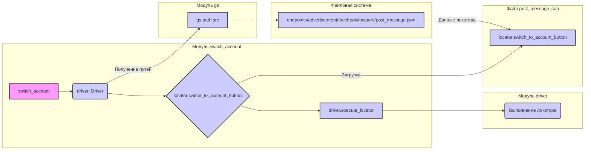

```MD
# Анализ кода switch_account.py

## <input code>

```python
## \file hypotez/src/endpoints/advertisement/facebook/scenarios/switch_account.py
# -*- coding: utf-8 -*-\
#! venv/Scripts/python.exe
#! venv/bin/python/python3.12

"""
.. module:: src.endpoints.advertisement.facebook.scenarios 
	:platform: Windows, Unix
	:synopsis: Переключение между аккаунатми
"""
MODE = 'dev'

from pathlib import Path
from types import SimpleNamespace
from src import gs
from src.webdriver.driver import Driver
from src.utils.jjson import j_loads_ns

# Load locators from JSON file.
locator: SimpleNamespace = j_loads_ns(
    Path(gs.path.src / 'endpoints' / 'advertisement' / 'facebook' / 'locators' / 'post_message.json')
)

def switch_account(driver: Driver):
    """ Если есть кнопка `Переключить` - нажимаю её  """
    driver.execute_locator(locator.switch_to_account_button)
```

## <algorithm>

```mermaid
graph TD
    A[Начало] --> B{Существует ли кнопка "Переключить?"};
    B -- Да --> C[driver.execute_locator(locator.switch_to_account_button)];
    B -- Нет --> D[Возврат без действий];
    C --> E[Конец];
    D --> E;
```

**Пример:**

Если в текущем контексте (например, страница Facebook) имеется элемент с локатором `locator.switch_to_account_button`, функция `switch_account` выполнит метод `driver.execute_locator`, что приведет к клику на кнопку. В противном случае, никаких действий не будет выполнено.


## <mermaid>



## <explanation>

**Импорты:**

- `from pathlib import Path`:  Импортирует класс `Path` для работы с путями к файлам.
- `from types import SimpleNamespace`: Импортирует класс `SimpleNamespace`, который используется для создания объекта, содержащего атрибуты (в данном случае, локаторы).
- `from src import gs`: Импортирует модуль `gs`, скорее всего, содержащий глобальные настройки, например, пути к файлам.
- `from src.webdriver.driver import Driver`: Импортирует класс `Driver` из модуля `driver` в пакете `webdriver`, вероятно, отвечающего за взаимодействие с браузером (webdriver).
- `from src.utils.jjson import j_loads_ns`: Импортирует функцию `j_loads_ns` из модуля `jjson` в пакете `utils`, предназначенную для загрузки данных из JSON-файлов и их обработки.

**Классы:**

- `Driver`:  Представляет драйвер веб-драйвера (например, Selenium).  Здесь не показан его код, но он, скорее всего, содержит методы для взаимодействия с браузером (нажатие кнопок, заполнение форм, и т.д.).  `driver` - экземпляр этого класса.

**Функции:**

- `switch_account(driver: Driver)`: Функция для переключения аккаунтов в Facebook. Принимает экземпляр класса `Driver` как аргумент, чтобы выполнить действие переключения на другой аккаунт.  Возвращаемое значение не указано и, скорее всего, является `None`. Внутри функции выполняется поиск и клик на кнопку переключения аккаунта.

**Переменные:**

- `locator`: Экземпляр класса `SimpleNamespace`. Содержит данные локаторов элементов на странице Facebook, загруженные из JSON-файла `post_message.json`.  Важно, что локаторы определяются в этом файле.

**Возможные ошибки и улучшения:**

- **Обработка ошибок:** Функция не содержит обработку случаев, когда кнопка "Переключить" отсутствует. Добавление `try...except` блоков позволит обрабатывать исключения, предотвращая сбой программы.
- **Явное указание путей:** Используйте абсолютные пути, если у вас есть проблемы с относительными путями.
- **Локализация локаторов:**  Локаторы должны быть устойчивыми к изменениям дизайна сайта. Рассмотрите возможность использования более надежных методов определения элементов (XPath, CSS-селекторы).
- **Тестирование:**  Добавление тестов поможет гарантировать корректную работу сценария в разных условиях.
- **Универсализация:** Модуль `jjson` и переменная `locator` связаны с конкретным JSON-файлом `post_message.json`. Это стоит сделать более универсальным (функция, принимающая имя файла).

**Взаимосвязь с другими частями проекта:**

- Модуль `gs` предоставляет глобальные переменные (например, пути к файлам).
- `driver` взаимодействует с `webdriver` - модулем, отвечающим за работу с браузером.
- Локаторы загружаются из файла `post_message.json`, который находится в директории `endpoints/advertisement/facebook/locators`.

**Вывод:**

Код достаточно прост и понятен. Однако, для надежности и расширяемости стоит добавить обработку ошибок и более устойчивую систему определения локаторов.