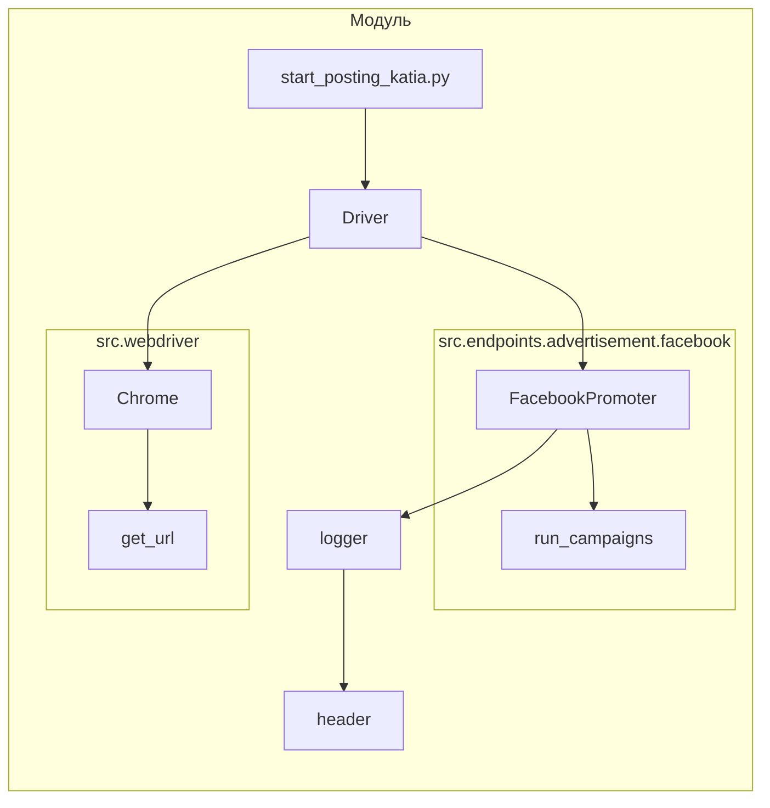

```MD
# Анализ кода start_posting_katia.py

1. **<input code>**:

```python
## \file hypotez/src/endpoints/advertisement/facebook/start_posting_katia.py
# -*- coding: utf-8 -*-
#! venv/Scripts/python.exe
#! venv/bin/python/python3.12

"""
.. module:: src.endpoints.advertisement.facebook 
	:platform: Windows, Unix
	:synopsis: Отправка рекламных объявлений в группы фейсбук (Katia?)

"""


import header 
from src.webdriver.driver import Driver, Chrome
from src.endpoints.advertisement.facebook.promoter import FacebookPromoter
from src.logger import logger

d = Driver(Chrome)
d.get_url(r"https://facebook.com")

filenames:list = ['katia_homepage.json',]
campaigns:list = [ 'sport_and_activity',
                  'bags_backpacks_suitcases',
                    'pain',
                    'brands',
                    'mom_and_baby',
                    'house',
                ]
promoter = FacebookPromoter(d, group_file_paths = filenames, no_video = False)

try:
    promoter.run_campaigns(campaigns)
except KeyboardInterrupt:
    logger.info("Campaign promotion interrupted.")
```

2. **<algorithm>**:

```mermaid
graph TD
    A[Инициализация] --> B{Создание драйвера};
    B --> C[Получение URL];
    C --> D[Инициализация списков];
    D --> E[Создание FacebookPromoter];
    E --> F[Запуск кампаний];
    F --Успешно-- G[Завершение];
    F --Прерывание-- H[Обработка исключения];
    H --> G;
```

**Пошаговый алгоритм:**

1. **Инициализация:** Создается экземпляр класса `Driver` с типом `Chrome`.
2. **Получение URL:**  Открывается веб-страница facebook.com.
3. **Инициализация списков:** Объявляются списки `filenames` и `campaigns`.
4. **Создание FacebookPromoter:** Создается экземпляр класса `FacebookPromoter` с драйвером и списками данных.
5. **Запуск кампаний:** Вызывается метод `run_campaigns` у объекта `promoter`. Этот метод, вероятно, инициирует процесс отправки рекламных объявлений в группы, используя данные из `filenames` и `campaigns`.
6. **Обработка исключения:** Блок `try-except` обрабатывает `KeyboardInterrupt`, позволяя корректно завершить работу программы при нажатии Ctrl+C.


3. **<mermaid>**:



**Объяснение диаграммы:**

* `start_posting_katia.py` - главная точка входа.
* `Driver` и `Chrome` представляют собой классы из модуля `src.webdriver.driver` для управления браузером.
* `FacebookPromoter` - класс из модуля `src.endpoints.advertisement.facebook.promoter`, отвечающий за отправку объявлений.
* `logger` - класс из модуля `src.logger`, используемый для логирования.
* `header` -  модуль, вероятно, для дополнительных функций или конфигурации.


4. **<explanation>**:

* **Импорты:**
    * `header`: Вероятно, содержит вспомогательные функции или константы, специфичные для проекта.
    * `Driver`, `Chrome`:  Классы из модуля `src.webdriver.driver` для управления веб-драйвером (например, ChromeDriver для Chrome).  Связаны с управлением браузером.
    * `FacebookPromoter`: Класс, реализующий логику отправки рекламных объявлений в Facebook. Находится в `src.endpoints.advertisement.facebook.promoter`.
    * `logger`:  Утилита для логирования событий, из `src.logger`.

* **Классы:**
    * `Driver`:  Предполагается, что содержит методы для управления браузером (например, `get_url`).
    * `Chrome`: По всей видимости, подкласс `Driver`, который конфигурирует драйвер Chrome.
    * `FacebookPromoter`:  Класс отвечает за логику отправки объявлений, вероятно, включает методы для загрузки данных из файлов, работы с API Facebook и т.д.

* **Функции:**
    * `get_url`: Метод класса `Driver`, принимает URL и открывает страницу.
    * `run_campaigns`: Метод класса `FacebookPromoter`, отвечает за запуск кампаний.  Подробности реализации должны находиться в `promoter.py` (в `src.endpoints.advertisement.facebook.promoter`).

* **Переменные:**
    * `MODE`: Строковая константа, вероятно, для выбора режима работы (например, 'dev', 'prod').
    * `filenames`: Список путей к JSON-файлам с данными для групп.
    * `campaigns`: Список названий рекламных кампаний.

* **Возможные ошибки и улучшения:**
    * Отсутствует обработка ошибок при подключении к Facebook или выполнении операций с API.  Необходимо добавить обработку исключений (например, `try-except` блоки) для таких ситуаций.
    * Отсутствует логирование действий, которые выполняются в `FacebookPromoter`.  Улучшение: добавить подробное логирование в процессе работы, включая успехи, ошибки и затраченное время.
    * Не указана структура JSON-файлов. Необходимо документация о формате `katia_homepage.json`.
    * Вместо `no_video=False` возможно стоит использовать `no_video=True`, если в дальнейшем планируется отключать видео.


**Цепочка взаимосвязей:**

`start_posting_katia.py` запускает `FacebookPromoter`, который, в свою очередь, использует `Driver` (и `Chrome`) для взаимодействия с браузером и `logger` для логирования. `FacebookPromoter` взаимодействует с данными из JSON-файлов, определенными в `filenames`.  Следовательно, все эти модули/классы должны быть связаны через определённые интерфейсы (API), обеспечивающие корректную передачу данных и управления.