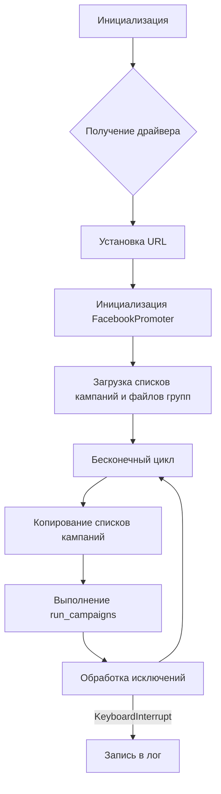
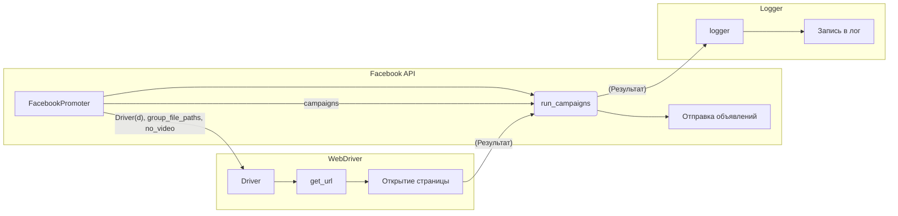

```MD
# Анализ кода start_posting_my_groups.py

## <input code>

```python
## \file hypotez/src/endpoints/advertisement/facebook/start_posting_my_groups.py
# -*- coding: utf-8 -*-
#! venv/Scripts/python.exe
#! venv/bin/python/python3.12

"""
.. module:: src.endpoints.advertisement.facebook 
	:platform: Windows, Unix
	:synopsis: Отправка рекламных объявлений в группы фейсбук (my groups?)

"""


import header 
import copy
from src.webdriver.driver import Driver, Chrome
from src.endpoints.advertisement.facebook.promoter import FacebookPromoter
from src.logger import logger

d = Driver(Chrome)
d.get_url(r"https://facebook.com")

filenames:list = ['my_managed_groups.json',]  

campaigns:list = ['brands',
                  'mom_and_baby',
                  'pain',
                  'sport_and_activity',
                  'house',
                  'bags_backpacks_suitcases',
                  'man']

promoter = FacebookPromoter(d, group_file_paths = filenames, no_video = True)

try:
    while True:
        
        promoter.run_campaigns(campaigns = copy.copy(campaigns), group_file_paths = filenames)
        ...

except KeyboardInterrupt:
    logger.info("Campaign promotion interrupted.")
```

## <algorithm>



**Пример:**

* **A**: Создаётся переменная `d` типа `Driver`, инициализированная `Chrome`.
* **B**:  Вызывается метод `d.get_url(r"https://facebook.com")`.
* **C**:  Открывается страница Facebook.
* **D**:  Создаётся объект `FacebookPromoter` с заданными параметрами (драйвер, файлы групп, отключение видео).
* **E**: Загружаются данные из файлов `my_managed_groups.json` и списки `campaigns`.
* **F**: Начинается бесконечный цикл.
* **G**:  Создаются копии списков `campaigns`, чтобы не менять оригинальный список.
* **H**: Вызывается метод `promoter.run_campaigns()` с копиями списков кампаний и файлов групп.
* **I**:  Обрабатывается `KeyboardInterrupt` (например, при нажатии Ctrl+C).
* **J**:  Записывается сообщение в лог о прерывании кампании.


## <mermaid>



**Объяснение диаграммы:**

Диаграмма показывает взаимодействие `FacebookPromoter` с `Driver` для работы с веб-страницей Facebook и с `logger` для записи в лог.  `FacebookPromoter` использует `Driver` для взаимодействия с браузером (загрузка страницы, управление элементами), а `FacebookPromoter` пишет в `logger` информацию о ходе выполнения.


## <explanation>

**Импорты:**

* `header`:  Предположительно содержит вспомогательные функции или константы, специфичные для проекта.
* `copy`: Используется для создания копий списков (`campaigns`), чтобы избежать изменения исходных данных.
* `src.webdriver.driver`: Модуль, предоставляющий классы для работы с веб-драйвером (в данном случае, с Chrome).
* `src.endpoints.advertisement.facebook.promoter`:  Содержит класс `FacebookPromoter`, который отвечает за отправку рекламных объявлений в группы Facebook.
* `src.logger`: Модуль для логирования событий.


**Классы:**

* `Driver`:  Представляет абстракцию веб-драйвера (Chrome в данном случае).  Содержит методы для управления браузером (например, `get_url`).
* `FacebookPromoter`:  Класс для управления рекламными кампаниями на Facebook.  Атрибуты: `d` (веб-драйвер), `group_file_paths` (пути к файлам с данными групп), `no_video` (флаг для отключения видео). Методы: `run_campaigns` (отвечает за запуск кампаний).


**Функции:**

* `run_campaigns`:  Обрабатывает кампании и отправляет объявления. (Подробный анализ внутренней логики требует просмотра кода класса `FacebookPromoter`).  Аргументы: `campaigns`, `group_file_paths`.


**Переменные:**

* `MODE`:  Строковая переменная, хранящая режим работы (в данном случае, 'dev').
* `filenames`: Список путей к файлам с информацией о группах.
* `campaigns`: Список названий рекламных кампаний.
* `d`: Экземпляр класса `Driver`.


**Возможные ошибки/улучшения:**

* Нет обработки ошибок при работе с файлами (`my_managed_groups.json`).
* Нет проверки на корректность данных в файлах и списках кампаний.
* Отсутствие явного определения типов данных для переменных (хотя оно присутствует в аннотациях) - нужно улучшить.
* `...` в коде — не понятно, что там происходит. Необходимо реализовать логику обработки объявлений и вывода результатов в этом цикле.


**Взаимосвязь с другими частями проекта:**

`start_posting_my_groups.py` использует классы из `src.webdriver.driver` и `src.endpoints.advertisement.facebook.promoter`, что указывает на наличие модулей для работы с веб-драйвером и управления рекламой на Facebook соответственно. `logger` - логирование событий.  Необходимо просмотреть `promoter` для понимания интеграции с другими частями проекта.  Необходимо проанализировать содержание `my_managed_groups.json` для понимания структуры данных.