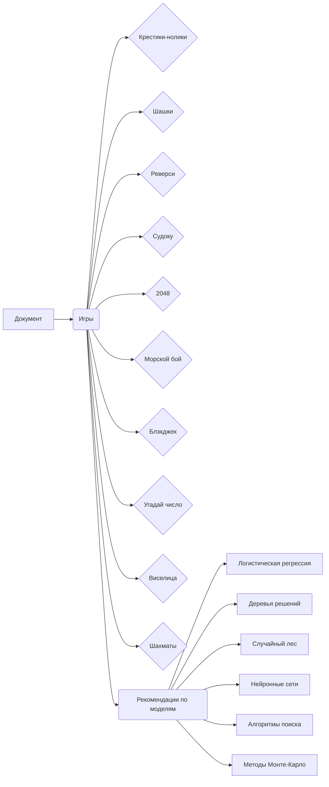

# Анализ кода: 10 простых игр для обучения моделей машинного обучения

## <input code>

```
## 10 простых игр для обучения моделей машинного обучения

**Отбор игр для обучения моделей машинного обучения зависит от сложности, которую вы хотите достичь, и от того, какие типы моделей вы планируете использовать.**

Вот 10 игр, которые часто используются для обучения моделей, от простых до более сложных:

### Игры с полной информацией:
1. **Крестики-нолики:** Классическая игра для начала. Простые правила, ограниченное количество возможных ходов.
2. **Шашки:** Игра с более глубокой стратегией, но все же с ограниченным количеством возможных позиций.
3. **Реверси:** Похожа на шашки, но с другими правилами захвата фигур.
4. **Судоку:** Задача заполнения пустых клеток таблицы цифрами от 1 до 9, при этом каждая цифра должна встречаться в каждой строке, каждом столбце и каждом квадрате 3х3. 
5. **2048:** Цель игры - получить плитку с числом 2048, сливая плитки с одинаковыми числами.

### Игры с неполной информацией:
6. **Морской бой:** Классическая детская игра, где часть информации скрыта от игрока.
7. **Блэкджек:** Карточная игра, где игроки соревнуются с дилером, пытаясь набрать больше очков, но не перебрать 21.

### Игры с элементами случайности:
8. **Угадай число:** Компьютер загадывает число, а игрок должен его угадать за минимальное количество попыток.
9. **Виселица:** Игрок пытается угадать слово, отгадывая по одной букве.

### Игры с элементами стратегии и тактики:
10. **Шахматы:** Одна из самых сложных игр, требующая глубокого понимания и стратегического мышления.

**Почему эти игры?**

* **Простые правила:** Легко формализовать правила и создать среду для обучения.
* **Ограниченное количество возможных состояний:** Упрощает поиск оптимальных решений.
* **Наличие обучающих данных:** Для многих игр существуют большие базы данных партий, что облегчает обучение с учителем.

**Какие модели использовать?**
* **Для простых игр:** Логистическая регрессия, деревья решений, случайный лес.
* **Для игр со сложной стратегией:** Нейронные сети (в том числе глубокое обучение), алгоритмы поиска (например, альфа-бета отсечение).
* **Для игр с элементами случайности:** Методы Монте-Карло.

**Дополнительные соображения:**
* **Окружение:** Для каждой игры необходимо создать виртуальное окружение, где модель сможет обучаться и играть.
* **Оценка:** Необходимо определить метрики для оценки качества игры модели (например, процент побед, среднее количество ходов).
* **Усложнение:** По мере того, как модель становится лучше, можно усложнять игру (например, увеличивать размер доски в шахматах).

**Выбрав игру, вы сможете начать создавать свою модель машинного обучения и наблюдать, как она учится принимать все более сложные решения.**

**Хотите углубиться в какую-то конкретную игру или метод обучения?**
```

## <algorithm>

Этот код не содержит алгоритма в виде программного кода. Он представляет собой список игр, подходящих для обучения моделей машинного обучения, и рекомендации по выбору модели для каждой игры.  Блок-схема не применима в данном случае.  Данные не перемещаются между функциями или классами, так как это текстовый документ, а не программный код.


## <mermaid>



Диаграмма показывает структуру документа, где основной блок - "Документ" - содержит список игр и рекомендации по их обучению.  Игры разделены на категории по типу, а рекомендации связаны с типом игры, что показывает зависимость выбора модели от типа игры.  Подключаемые зависимости – это типы игр и рекомендации по типам моделей машинного обучения.


## <explanation>

Этот код – это *документ*, описывающий 10 игр, которые подходят для обучения моделей машинного обучения.  В нём нет программного кода, классов или функций в традиционном понимании.

* **Импорты:** Нет импортируемых библиотек или модулей. Это текстовый документ, написанный в markdown формате.

* **Классы:** Нет.

* **Функции:** Нет.

* **Переменные:** Нет.

* **Возможные ошибки/улучшения:**  Документ — хороший пример документирования идей. Однако для практического использования,  необходимо будет создать код, который реализует  алгоритмы для каждой из описанных игр, а также обучит и протестирует на ней модели.  Указание конкретных типов моделей (логистическая регрессия, деревья решений, нейронные сети) без примера кода или описания данных для обучения — это общая рекомендация.


**Взаимосвязь с другими частями проекта:**

Этот документ служит справочником, описывающим *возможности* и *варианты* для последующей реализации алгоритмов обучения машинного обучения. Он описывает концептуальную сторону задач, не содержащую конкретных реализаций.  Для построения взаимосвязей с другими частями проекта необходимо дальнейшее программирование и разработка.