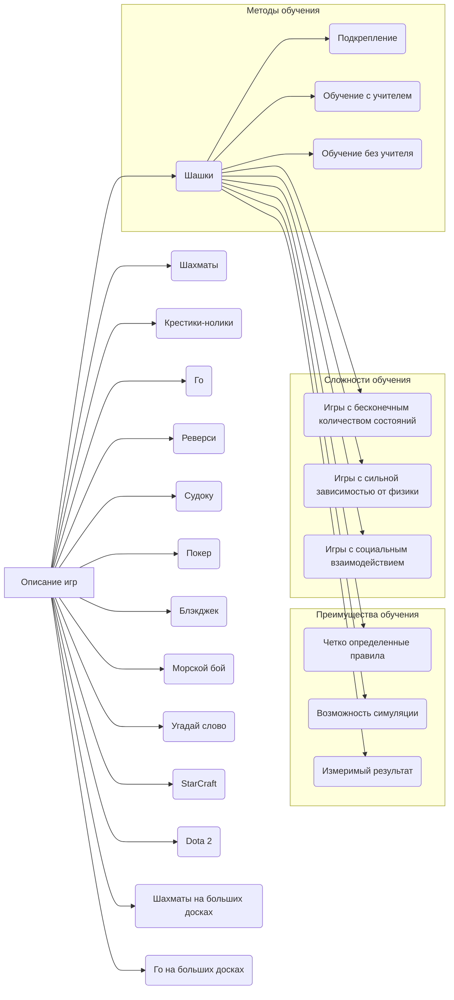

## <input code>

```
## Игры, которые легко научить машину играть
Выбор игры для обучения ИИ зависит от конкретных целей исследования. Некоторые игры лучше подходят для обучения базовым алгоритмам, другие — для разработки более сложных систем искусственного интеллекта.

**Отбор игр для обучения ИИ зависит от нескольких факторов:**

* **Простота правил:** Чем проще правила игры, тем проще обучить модель.
* **Ограниченное количество возможных состояний:** Игры с небольшим количеством возможных позиций на доске или в игровом мире легче поддаются анализу.
* **Полная информация:** Если все игроки имеют доступ к полной информации о состоянии игры, это упрощает обучение.
* **Дискретные действия:** Если действия игрока выбираются из ограниченного набора опций, модель может легче выстроить стратегию.

**Примеры игр, подходящих для обучения ИИ:**

### Игры с полной информацией и дискретными действиями:

* **Шашки и шахматы:** Классические примеры игр, где ИИ достигли впечатляющих результатов. Благодаря четким правилам и ограниченному количеству возможных ходов, эти игры отлично подходят для обучения алгоритмов.
* **Крестики-нолики:** Простая игра, часто используемая для обучения базовым алгоритмам машинного обучения.
* **Го:** Несмотря на огромное количество возможных позиций, современные алгоритмы глубокого обучения успешно освоили и эту игру.
* **Реверси:** Еще одна абстрактная стратегическая игра, похожая на шашки.
* **Судоку:** Задача заполнения пустых клеток таблицы цифрами от 1 до 9, при этом каждая цифра должна встречаться в каждой строке, каждом столбце и каждом квадрате 3х3.

### Игры с неполной информацией:

* **Покер:** В покере у игрока нет полной информации о картах соперников, что делает игру более сложной. Однако, современные алгоритмы машинного обучения успешно применяются для игры в покер.
* **Блэкджек:** Еще одна карточная игра с элементами случайности и принятия решений.

### Игры с элементами случайности:

* **Морской бой:** Игра, где часть информации скрыта от игрока, добавляет элемент случайности.
* **Угадай слово:** Здесь задача игрока — отгадать загаданное слово, задавая вопросы.

### Игры реального времени:

* **StarCraft:** Сложная стратегическая игра в реальном времени, где ИИ должен принимать решения быстро и эффективно.
* **Dota 2:** Еще одна популярная киберспортивная дисциплина, требующая от ИИ не только стратегического мышления, но и умения координировать действия нескольких юнитов.

### Игры с большим количеством возможных состояний:

* **Шахматы на больших досках:** Увеличивая размер доски, можно значительно повысить сложность игры.
* **Го на больших досках:** Аналогично шахматам.

**Методы обучения:**

* **Подкрепление:** ИИ обучается путем проб и ошибок, получая вознаграждение за правильные действия и наказание за неправильные.
* **Обучение с учителем:** ИИ обучается на большом количестве данных, где для каждого состояния указан оптимальный ход.
* **Обучение без учителя:** ИИ самостоятельно изучает структуру данных и находит закономерности.

**Преимущества обучения ИИ на играх:**

* **Четко определенные правила:** Легко формализовать правила игры и создать среду для обучения.
* **Возможность симуляции:** Можно проводить большое количество игр, чтобы обучить модель.
* **Измеримый результат:** Легко оценить успешность обучения, сравнивая результаты ИИ с результатами профессиональных игроков.

**Игры, которые могут быть сложнее для обучения:**

* **Игры с бесконечным количеством возможных состояний:** Например, игры с открытым миром.
* **Игры с сильной зависимостью от физики:** Игры, где важна точная симуляция физических процессов.
* **Игры с социальным взаимодействием:** Игры, где важны психологические факторы и умение общаться с другими игроками.
```

## <algorithm>

(Не применимо, так как код представляет собой текстовое описание, а не код на языке программирования)


## <mermaid>



## <explanation>

Этот код представляет собой текстовое описание, а не код на языке программирования. Он описывает различные игры, подходящие для обучения ИИ, а также факторы, влияющие на выбор игры, и методы обучения.

* **Импорты**:  Нет импортов, так как это текстовое описание.
* **Классы**: Нет классов.
* **Функции**: Нет функций.
* **Переменные**: Нет переменных.
* **Возможности улучшения**:  Текст можно было бы дополнить, например, добавив конкретные примеры алгоритмов обучения ИИ, которые можно применить к каждой игре, или конкретные данные о сложности игр (например, число возможных состояний в шахматах).  Можно было бы использовать таблицу для лучшей организации информации.


**Взаимосвязи с другими частями проекта**:  Нет взаимосвязей с другими частями проекта, так как это отдельный фрагмент, описывающий общие принципы выбора игр для обучения ИИ, а не конкретную реализацию.  Этот текст скорее служит документом для понимания подходов к задачам обучения ИИ и выбора подходящих наборов данных.