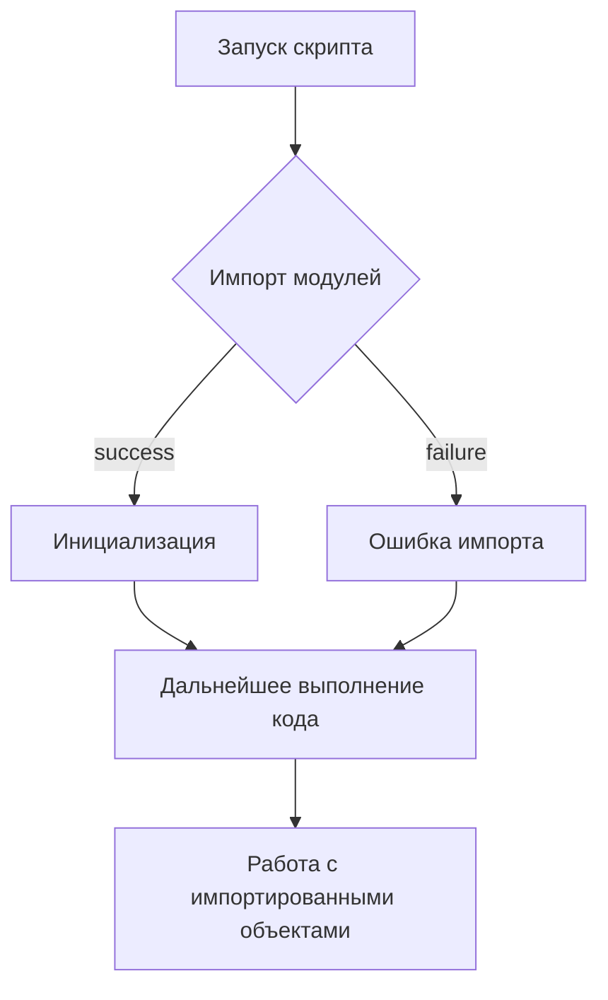

# <input code>

```python
## \file hypotez/src/endpoints/__init__.py
# -*- coding: utf-8 -*-

#! venv/bin/python/python3.12

"""
.. module: src.endpoints 
	:platform: Windows, Unix
	:synopsis:

"""


# from .prestashop import PrestaShop, PrestaCategory, PrestaCustomer, PrestaLanguage, PrestaProduct, PrestaShopShop, PrestaSupplier, PrestaWarehouse, PriceListRequester 
# from .kazarinov import KazarinovTelegramBot
```

# <algorithm>

Алгоритм работы файла `hypotez/src/endpoints/__init__.py` состоит в том, чтобы определить глобальную переменную `MODE` и импортировать модули из подпапок `prestashop` и `kazarinov`. Однако, эти импорты являются комментариями и не выполняют никакого действия в этом файле.

**Пример:**

Поскольку импорты закомментированы,  никакого действия не происходит.  Данные не передаются между функциями или классами.  Если бы эти строки были активны, то код выполнял бы загрузку модулей `PrestaShop`, `PrestaCategory`, и т.д., и другие.

**Блок-схема (при активных импортах):**



# <mermaid>

```mermaid
graph LR
    A[hypotez/src/endpoints/__init__.py] --> B();
    A --> C[Import PrestaShop];
    A --> D[Import KazarinovTelegramBot];
    subgraph "Внешние зависимости"
        C --> E[hypotez/src/endpoints/prestashop.py];
        D --> F[hypotez/src/endpoints/kazarinov.py];
    end
```


# <explanation>

**Импорты:**

Файл `hypotez/src/endpoints/__init__.py` предназначен для инициализации модулей, которые находятся в подпапках (например, `prestashop` и `kazarinov`).  В нём, через `from .prestashop import ...`, планируется импорт классов и функций из файла `hypotez/src/endpoints/prestashop.py`  и аналогично для `kazarinov.py`.  Закомментированные строки показывают, что эти импорты временно отключены.
Строки `# -*- coding: utf-8 -*-`, ``, `#! venv/bin/python/python3.12` это служебные директивы для интерпретатора Python,  они не относятся непосредственно к функциональности программы, но влияют на то, как интерпретатор Python обрабатывает скрипт.

**Классы:**

Этот файл *не* определяет классы напрямую. Он служит для импорта классов, определённых в других файлах (например, `PrestaShop` и др.).

**Функции:**

В данном файле нет определений функций. Импортированные функции находятся в других модулях.

**Переменные:**

`` — глобальная переменная, которая, вероятно, используется для настройки различных режимов работы (разработки, тестирования, производства).

**Возможные ошибки и улучшения:**

* **Отсутствие проверки импортов:** Файл не содержит проверок на то, что импортируемые модули существуют и доступны. В будущем стоит добавить такую проверку, например, используя `try...except` блоки.

* **Документация:** Документация в формате `"""docstring"""` для модуля, переменных и функций была бы полезной.

**Взаимосвязи с другими частями проекта:**

Этот файл является частью более крупного проекта.  Он импортирует классы из модулей в папке `endpoints`.  Следовательно, другие файлы в проекте (возможно, в `__main__.py` или другом стартовом файле) будут импортировать классы и функции из `endpoints` для взаимодействия с  различными API-интерфейсами.