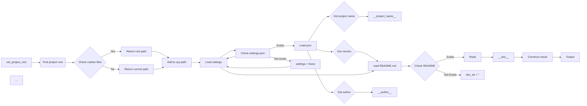

```MD
# <input code>

```python
## \file hypotez/src/endpoints/header.py
# -*- coding: utf-8 -*-\
#! venv/Scripts/python.exe
#! venv/bin/python/python3.12

"""
.. module: src.endpoints 
	:platform: Windows, Unix
	:synopsis:

"""
MODE = 'dev'


import sys
import json
from packaging.version import Version

from pathlib import Path
def set_project_root(marker_files=('__root__')) -> Path:
    """
    Finds the root directory of the project starting from the current file's directory,
    searching upwards and stopping at the first directory containing any of the marker files.

    Args:
        marker_files (tuple): Filenames or directory names to identify the project root.
    
    Returns:
        Path: Path to the root directory if found, otherwise the directory where the script is located.
    """
    __root__:Path
    current_path:Path = Path(__file__).resolve().parent
    __root__ = current_path
    for parent in [current_path] + list(current_path.parents):
        if any((parent / marker).exists() for marker in marker_files):
            __root__ = parent
            break
    if __root__ not in sys.path:
        sys.path.insert(0, str(__root__))
    return __root__


# Get the root directory of the project
__root__ = set_project_root()
"""__root__ (Path): Path to the root directory of the project"""

from src import gs

settings:dict = None
try:
    with open(gs.path.root / 'src' /  'settings.json', 'r') as settings_file:
        settings = json.load(settings_file)
except (FileNotFoundError, json.JSONDecodeError):
    ...

doc_str:str = None
try:
    with open(gs.path.root / 'src' /  'README.MD', 'r') as settings_file:
        doc_str = settings_file.read()
except (FileNotFoundError, json.JSONDecodeError):
    ...


__project_name__ = settings.get("project_name", 'hypotez') if settings  else 'hypotez'
__version__: str = settings.get("version", '')  if settings  else ''
__doc__: str = doc_str if doc_str else ''
__details__: str = ''
__author__: str = settings.get("author", '')  if settings  else ''
__copyright__: str = settings.get("copyrihgnt", '')  if settings  else ''
__cofee__: str = settings.get("cofee", "Treat the developer to a cup of coffee for boosting enthusiasm in development: https://boosty.to/hypo69")  if settings  else "Treat the developer to a cup of coffee for boosting enthusiasm in development: https://boosty.to/hypo69"
```

# <algorithm>

**Шаг 1:** `set_project_root(marker_files)`
*   Находит корневую директорию проекта, начиная с текущей директории файла.
*   Ищет файлы/директории из `marker_files` (в данном случае `pyproject.toml`, `requirements.txt`, `.git`).
*   Если найден, возвращает путь к родительской директории.
*   В ином случае возвращает директорию текущего файла.
*   Добавляет корневую директорию в `sys.path`, если она туда еще не добавлена.
*   **Пример:** Если `__file__` находится в `hypotez/src/endpoints/header.py`, и `pyproject.toml` находится в `hypotez`, то функция вернёт `hypotez`.


**Шаг 2:** Получение `settings`
*   Ищет файл `settings.json` в корневой директории проекта.
*   Если файл найден, загружает его содержимое в `settings` с помощью `json.load`.
*   Если файл не найден или содержимое не является корректным JSON, то `settings` остается `None`.

**Шаг 3:** Получение `doc_str`
*   Ищет файл `README.MD` в корневой директории проекта.
*   Если файл найден, считывает его содержимое и сохраняет в `doc_str`.
*   Если файл не найден или содержимое не является корректным, то `doc_str` остается `None`.

**Шаг 4:** Чтение настроек из `settings.json`
*   Извлекает значения из словаря `settings` по ключам (`project_name`, `version`, `author`, `copyrihgnt`, `cofee`), используя метод `get`.
*   Использует значение по умолчанию, если ключ не найден.


**Передача данных:**
- Данные передаются между функциями и переменными.
- `set_project_root()` возвращает Path к корневой директории.
- Путь к корневой директории используется для поиска `settings.json` и `README.MD`.
- Содержимое `settings.json` сохраняется в переменной `settings`.
- Содержимое `README.MD` сохраняется в переменной `doc_str`.
- Значения из `settings` используются для определения `__project_name__`, `__version__`, `__author__`, `__copyright__`, `__cofee__`.


# <mermaid>



**Описание зависимостей:**

* **`pathlib`:** Для работы с путями к файлам.
* **`json`:** Для работы с файлом `settings.json`.
* **`packaging.version`:** Для работы с версиями.
* **`sys`:** Для доступа к системным переменным, в частности, `sys.path`.
* **`gs`:** Неизвестный модуль (предположительно из собственного проекта). Зависит от него, т.к. используются его методы.

# <explanation>

**Импорты:**

- `sys`: для работы с системными переменными, особенно `sys.path`.
- `json`: для работы с файлами JSON.
- `packaging.version`: для работы с версиями.
- `pathlib`: для работы с путями к файлам.
- `gs`:  Модуль, вероятно, из собственной библиотеки проекта, необходимый для определения корневой директории проекта.


**Классы:**

Нет классов в этом коде.

**Функции:**

- `set_project_root(marker_files)`:
    - Аргументы: `marker_files` (кортеж строк) — имена файлов/папок, используемые для определения корня проекта. По умолчанию `('pyproject.toml', 'requirements.txt', '.git')`.
    - Возвращаемое значение: `Path` — путь к корневой директории проекта.
    - Назначение: находит корневую директорию проекта, начиная с текущего файла и двигаясь вверх по дереву директорий.
    - Пример: `set_project_root()` может найти путь `'/home/user/project'`, если `pyproject.toml` находится в этой директории.

**Переменные:**

- `MODE`: Строковая константа, определяющая режим работы (в данном случае 'dev').
- `__root__`: `Path` — путь к корневой директории проекта.
- `settings`: Словарь (`dict`), содержащий настройки проекта, загруженные из файла `settings.json`.
- `doc_str`: Строка, содержащая текст из файла `README.MD`.
- `__project_name__`, `__version__`, `__doc__`, `__details__`, `__author__`, `__copyright__`, `__cofee__`: Строки, содержащие информацию о проекте, полученные из настроек.


**Возможные ошибки/улучшения:**

- **Обработка исключений:**  Блок `try...except` для открытия файлов `settings.json` и `README.MD` важен для предотвращения аварийных остановок программы при отсутствии или некорректном формате этих файлов.  Но, возможно, стоит использовать более подробные сообщения об ошибках.
- **Обработка пустых файлов:** Если файлы `settings.json` или `README.MD` пустые, то код будет работать, но `settings` и `doc_str` соответственно будут `None` или пустой строкой. Стоит рассмотреть возможность обработки таких случаев.
- **Временные метки:**  Для более эффективного кэширования файлов можно добавить временные метки, чтобы не загружать их при каждой загрузке.
- **Документация:** Документировать `gs` — очень важно для понимания и поддержки кода.
- **Константы:** Используйте более подходящие имена для констант (например, `PROJECT_ROOT_MARKER_FILES`).


**Взаимосвязь с другими частями проекта:**

Код из `hypotez/src/endpoints/header.py` явно использует модуль `gs`, который, скорее всего, содержит функции для работы с корневой директорий проекта, что подразумевает наличие зависимостей от других частей приложения. Без понимания `gs` не ясно, как этот файл взаимодействует с другими частями проекта.