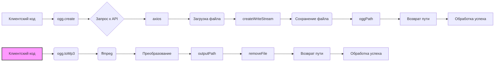

```MD
# Анализ кода OggConverter

**1. <input code>**

```javascript
import axios from 'axios';
import { createWriteStream } from 'fs';
import { dirname, resolve } from 'path';
import { fileURLToPath } from 'url';
import ffmpeg from 'fluent-ffmpeg';
import installer from '@ffmpeg-installer/ffmpeg';
import { removeFile } from './utils.js';

const __dirname = dirname(fileURLToPath(import.meta.url));
// ====
class OggConverter {
  constructor() {
    ffmpeg.setFfmpegPath(installer.path);
  }
  toMp3(input, output) {
    try {
      const outputPath = resolve(dirname(input), `${output}.mp3`);
      return new Promise((resolve, reject) => {
        ffmpeg(input)
          .inputOption('-t 30')
          .output(outputPath)
          .on('end', () => {
            removeFile(input);
            resolve(outputPath);
          })
          .on('error', (err) => reject(err.message))
          .run();
      });
    } catch (e) {
      console.log('Error while creating mp3', e.message);
    }
  } // ====
  async create(url, filename) {
    try {
      const oggPath = resolve(__dirname, '../voices', `${filename}.ogg`);
      const response = await axios({
        method: 'get',
        url,
        responseType: 'stream',
      });
      return new Promise((resolve) => {
        const stream = createWriteStream(oggPath);
        response.data.pipe(stream);
        stream.on('finish', () => resolve(oggPath));
      });
    } catch (e) {
      console.log('Error while creating ogg', e.message);
    }
  }
}
export const ogg = new OggConverter();
```

**2. <algorithm>**

**Класс `OggConverter`**

*   **`constructor()`**: Устанавливает путь к ffmpeg исполняемому файлу.
*   **`toMp3(input, output)`**: Преобразует аудиофайл из формата OGG в MP3.
    *   Вычисляет путь к выходному файлу.
    *   Использует `fluent-ffmpeg` для преобразования.
    *   Устанавливает временное ограничение `-t 30`.
    *   Обрабатывает события завершения и ошибок.
    *   Удаляет исходный OGG файл после преобразования.
*   **`create(url, filename)`**: Загружает аудио в формате OGG по предоставленному URL.
    *   Вычисляет путь к выходному OGG файлу.
    *   Использует `axios` для загрузки файла по URL.
    *   Использует `createWriteStream` для сохранения загруженного файла.
    *   Обрабатывает событие завершения записи.


**Пример использования (`toMp3`)**:

1. Вызывается `ogg.toMp3('/path/to/input.ogg', 'output')`.
2. Вычисляется путь к `output.mp3`.
3. `fluent-ffmpeg` обрабатывает преобразование.
4. При успешном завершении `resolve(outputPath)`.
5. `removeFile` удаляет входной файл.


**Пример использования (`create`)**:

1. Вызывается `ogg.create('https://example.com/audio.ogg', 'myaudio')`.
2. Вычисляется путь к `myaudio.ogg`.
3. `axios` загружает файл в поток.
4. `createWriteStream` сохраняет загруженный поток в `myaudio.ogg`.
5. При успешном завершении `resolve(oggPath)`.


**3. <mermaid>**



**4. <explanation>**

*   **Импорты**:
    *   `axios`: для асинхронной загрузки файлов по URL.
    *   `fs`: для работы с файловой системой (создание потока для записи).
    *   `path`: для работы с путями файлов.
    *   `url`: для работы с URL.
    *   `fluent-ffmpeg`: для преобразования аудио.
    *   `@ffmpeg-installer/ffmpeg`: для установки пути к ffmpeg.
    *   `utils.js`: для удаления файлов.

*   **Классы**:
    *   `OggConverter`: Класс для конвертирования аудио в формате OGG.

*   **Функции**:
    *   `toMp3(input, output)`: Конвертирует файл из OGG в MP3. `input` - путь к входному файлу, `output` - имя выходного файла (без расширения). Возвращает `Promise` с путем к выходному файлу.
    *   `create(url, filename)`: Загружает аудио файл из `url` в формате OGG по предоставленному `filename` Возвращает `Promise` с путем к загруженному файлу.

*   **Переменные**:
    *   `__dirname`: путь к директории текущего файла.
    *   `oggPath`: путь к выходному файлу OGG.
    *   `outputPath`: путь к выходному файлу MP3.
    *   `response`: ответ `axios` загрузки.

*   **Возможные ошибки/улучшения**:
    *   В `toMp3` нет обработки случаев, когда входной файл не существует или имеет неверный формат.
    *   Необходимо добавить обработку ошибок при неудачной загрузке или преобразовании.
    *   Нет проверки, что входной файл является OGG.
    *   Можно добавить параметр для настройки временного ограничения при конвертации.
    *   Возможна оптимизация обработки потока для повышения производительности.
    *   Добавить logging


**Цепочка взаимосвязей**:  Код `ogg.js` использует `utils.js` для удаления файлов, а также зависит от внешних библиотек `ffmpeg` и `axios` для работы.