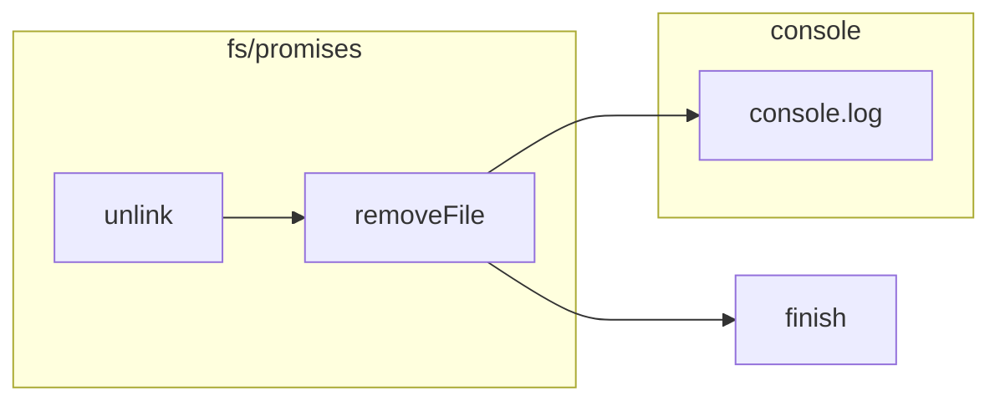

```MD
# Анализ кода utils.js

## <input code>

```javascript
import { unlink } from 'fs/promises'
export async function removeFile(path) {
    try {
        await unlink(path)
    } catch (e) {
        console.log('Error while removing file', e.message)
    }
}
```

## <algorithm>

**Блок-схема:**

```mermaid
graph TD
    A[Начать] --> B{Получить путь к файлу};
    B -- путь к файлу -- C[unlink(path)];
    C -- success -- D[Завершить];
    C -- error -- E[Обработка ошибки];
    E --> F[Вывести сообщение об ошибке];
    F --> D;
```

**Примеры:**

* **Шаг B:**  path = `/tmp/myFile.txt`
* **Шаг C:**  unlink() успешно удаляет файл.
* **Шаг C (ошибка):** unlink() возвращает ошибку (например, файл не найден или нет доступа).


## <mermaid>



## <explanation>

**Импорты:**

`import { unlink } from 'fs/promises';` - импортирует функцию `unlink` из модуля `fs/promises`.  `fs/promises` предоставляет асинхронные методы для работы с файловой системой, что важно для избежания блокировок.  Этот модуль является частью Node.js, поэтому нет внешней зависимости, которая связывала бы `src` с другим проектом.

**Функции:**

`export async function removeFile(path) { ... }` -  Экспортирует асинхронную функцию `removeFile`, принимающую строковый аргумент `path` (путь к файлу).  Эта функция предназначена для удаления файла по заданному пути.

**Пошаговое описание работы функции:**

1. **Асинхронность:** `async` ключевое слово делает функцию асинхронной, позволяя ей работать без блокировки основного потока.
2. **Обработка ошибок:** `try...catch` блок обрабатывает возможные исключения при удалении файла.  Если `unlink` завершается ошибкой, сообщение об ошибке выводится в консоль, сохраняя логирование работы.
3. **Удаление файла:** `await unlink(path)` - асинхронное удаление файла по заданному пути. `await` гарантирует, что функция продолжит выполнение только после завершения удаления файла.
4. **Возвращаемое значение:** Функция не возвращает явного значения, она асинхронно выполняет удаление файла.

**Переменные:**

`path` - строка, содержащая путь к файлу, который требуется удалить.

**Возможные ошибки/улучшения:**

* **Обработка ошибок:** текущий код выводит сообщение об ошибке в консоль. Для более продвинутых приложений, желательно использовать логирование, чтобы можно было детально отследить причины ошибок.
* **Контроль наличия файла:** перед вызовом `unlink` можно добавить проверку, существует ли файл по указанному пути, и возвращать код ошибки, если файла нет (например, `fs.existsSync()`).  В данном случае это не критично, так как `unlink` и так обрабатывает случай, когда файла нет.
* **Добавление обработки исключений `fs.constants`**:  В некоторых случаях, при удалении файла может возникнуть исключение, связанное с правами доступа. В этом случае полезно обрабатывать его.

**Взаимосвязи с другими частями проекта:**

Функция `removeFile` может быть использована в других модулях проекта для удаления временных файлов или файлов, которые больше не нужны.  Например, в боте Telegram, она может быть частью процесса очистки кеша или временных данных.