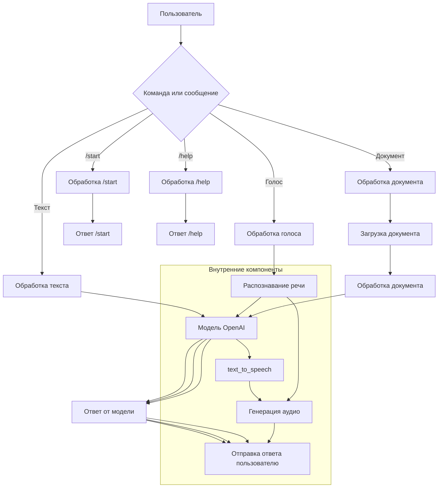

# <input code>

```python
## \file hypotez/src/bots/openai_bots/telegram_bot_trainger.py
# -*- coding: utf-8 -*-

#! venv/bin/python/python3.12

"""
.. module:: src.bots.openai_bots 
	:platform: Windows, Unix
	:synopsis:

"""


""" This script creates a simple Telegram bot using the python-telegram-bot library."""

from pathlib import Path
import tempfile
import asyncio
from telegram import Update
from telegram.ext import Application, CommandHandler, MessageHandler, filters, CallbackContext

import header
from src import gs
from src.ai.openai.model.training import Model
from src.utils.jjson import j_loads_ns, j_loads_ns, j_dumps
from src.logger import logger
import speech_recognition as sr  # Библиотека для распознавания речи
import requests  # Для скачивания файлов
from pydub import AudioSegment  # Библиотека для конвертации аудио
from gtts import gTTS  # Библиотека для текстового воспроизведения
from src.utils.convertors.tts import recognizer, text_to_speech

model = Model()

# Replace 'YOUR_TOKEN_HERE' with your actual bot token
TELEGRAM_TOKEN = gs.credentials.telegram.bot_token

async def start(update: Update, context: CallbackContext) -> None:
    """ Handle the /start command."""
    await update.message.reply_text('Hello! I am your simple bot. Type /help to see available commands.')

async def help_command(update: Update, context: CallbackContext) -> None:
    """ Handle the /help command."""
    await update.message.reply_text('Available commands:\n/start - Start the bot\n/help - Show this help message')
    
async def handle_document(update: Update, context: CallbackContext):
    # Получаем файл
    file = await update.message.document.get_file()
    #tmp_file_path = f"{tempfile.gettempdir()}/received.txt"
    tmp_file_path = await file.download_to_drive()  # Сохраняем файл локально

    # Читаем содержимое файла
    with open(tmp_file_path, 'r') as f:
        file_content = f.read()

    response = model.send_message(f"Обучение модели на следующем содержимом:{file_content}")
    await update.message.reply_text(response)
    #tts_file_path = await text_to_speech (response)
    #await update.message.reply_audio(audio=open(tts_file_path, 'rb'))
    
async def handle_message(update: Update, context: CallbackContext) -> None:
    """ Handle any text message."""
    text_received = update.message.text
    response = model.send_message(text_received)
    await update.message.reply_text(response)
    #tts_file_path = await text_to_speech (response)
    #await update.message.reply_audio(audio=open(tts_file_path, 'rb'))
   
async def handle_voice(update: Update, context: CallbackContext) -> None:
    """ Handle voice messages."""
    voice_file = await update.message.voice.get_file()
    message = recognizer(audio_url=voice_file.file_path)
    response = model.send_message(message)
    await update.message.reply_text(response)
    tts_file_path = await text_to_speech (response)
    await update.message.reply_audio(audio=open(tts_file_path, 'rb'))

def main() -> None:
    """ Start the bot."""
    application = Application.builder().token(TELEGRAM_TOKEN).build()

    # Register command handlers
    application.add_handler(CommandHandler('start', start))
    application.add_handler(CommandHandler('help', help_command))

    # Register message handlers
    application.add_handler(MessageHandler(filters.TEXT & ~filters.COMMAND, handle_message))
    application.add_handler(MessageHandler(filters.VOICE, handle_voice))
    application.add_handler(MessageHandler(filters.Document.ALL, handle_document))
    # Start the bot
    application.run_polling()

if __name__ == '__main__':
    main()
```

# <algorithm>

**Блок-схема:**

1. **Инициализация:** Создается объект `Application` Telegram бота с токеном из `gs.credentials`.  Регистрируются обработчики команд (`/start`, `/help`) и сообщений (текст, голос, документ).


2. **Обработка команды /start:**  Отправляет ответное сообщение «Hello!».


3. **Обработка команды /help:**  Отправляет сообщение с доступными командами.


4. **Обработка текстовых сообщений:** Получает текст, отправляет его в модель `Model` для обработки. Получает ответ от модели и отправляет его обратно в Telegram.


5. **Обработка голосовых сообщений:** Получает голосовое сообщение. Использует `recognizer` для преобразования голоса в текст. Отправляет текст в модель `Model`. Получает ответ от модели и отправляет его обратно в Telegram.  Дополнительно конвертирует ответ в аудио с помощью `text_to_speech` и отправляет его как аудио файл.


6. **Обработка документов:** Получает документ. Скачивает документ. Читает содержимое документа. Отправляет содержимое документа в модель `Model`. Получает ответ от модели и отправляет его обратно в Telegram.


7. **Запуск бота:** Запускает `application.run_polling()`.

**Пример данных:**

Пользователь отправляет сообщение "Привет".
- Данные передаются в `handle_message`.
- `model.send_message("Привет")` отправляет сообщение в модель.
- Модель возвращает ответ.
- Ответ отправляется пользователю в Telegram.

# <mermaid>



# <explanation>

**Импорты:**

- `from pathlib import Path`: Используется для работы с путями к файлам.
- `import tempfile`: Для временных файлов.
- `import asyncio`:  Для асинхронной обработки сообщений.
- `from telegram import Update`:  Из библиотеки `python-telegram-bot`, отвечает за взаимодействие с Telegram.
- `from telegram.ext import Application, CommandHandler, MessageHandler, filters, CallbackContext`:  Из библиотеки `python-telegram-bot`, включает классы для создания Telegram-бота.
- `import header`: Скорее всего, содержит конфигурацию, но не видно из контекста.
- `from src import gs`:  Импортирует модуль `gs` из пакета `src`. Скорее всего, содержит конфигурационные данные (например, токен телеграм бота).
- `from src.ai.openai.model.training import Model`: Импортирует класс `Model` из пакета `src.ai.openai.model.training`. Предположительно, он взаимодействует с OpenAI API для обработки сообщений.
- `from src.utils.jjson import j_loads_ns, j_loads_ns, j_dumps`:  Для работы с JSON. Непонятно зачем трижды. Скорее всего, это ошибка.
- `from src.logger import logger`: Для логирования.
- `import speech_recognition as sr`: Для распознавания речи.
- `import requests`: Для загрузки файлов (не используется в данном фрагменте).
- `from pydub import AudioSegment`: Для работы с аудио файлами.
- `from gtts import gTTS`: Для синтеза речи.
- `from src.utils.convertors.tts import recognizer, text_to_speech`:  для преобразования текста в аудио и распознавания аудио.


**Классы:**

- `Model`: Вероятно, класс, взаимодействующий с OpenAI API. Необходим для обработки запросов.

**Функции:**

- `start()`, `help_command()`: Обработчики команд `/start` и `/help`.
- `handle_message()`: Обработчик текстовых сообщений. Отправляет сообщение в `Model` и получает ответ.
- `handle_voice()`: Обработчик голосовых сообщений. Использует `recognizer` для преобразования голоса в текст, затем работает как `handle_message`.
- `handle_document()`: Обработчик документов. Загружает документ, обрабатывает его содержимое с помощью `Model` и возвращает ответ.
- `main()`: Точка входа для запуска Telegram бота.


**Переменные:**

- `TELEGRAM_TOKEN`: Токен Telegram бота. Должен быть получен из `gs.credentials`.
- `model`: Объект класса `Model`.

**Возможные ошибки/улучшения:**

- **Дублирование импортов `j_loads_ns`:**  Непонятно зачем импортирован трижды. Это ошибка.
- **Отсутствие обработки ошибок:** Нет обработки случаев, когда `model.send_message()` возвращает ошибку. Необходимо добавить обработку исключений.
- **Неоптимальный путь загрузки файла:**  Используется `await file.download_to_drive()`.  Вместо временных файлов, рекомендуется использовать более управляемые механизмы.
- **Неэффективное использование `text_to_speech`:** Функция `text_to_speech` вызывается дважды в handle_message и handle_document (хотя ответ выводится в любом случае). Лучше вызывать ее один раз, независимо от типа сообщения.
- **Отсутствует валидация входных данных:** Неизвестно, как `model.send_message` обрабатывает невалидные входные данные.

**Взаимосвязи с другими частями проекта:**

- `gs`: Вероятно, отвечает за загрузку конфигурационных данных (например, токена Telegram бота) из файла/базы данных.
- `src.utils.convertors.tts`: Содержит функции для распознавания речи (`recognizer`) и синтеза речи (`text_to_speech`).
- `Model`:  Непосредственно взаимодействует с OpenAI.

В целом, код выполняет базовые функции Telegram-бота, но требует улучшений для устойчивости и эффективности.