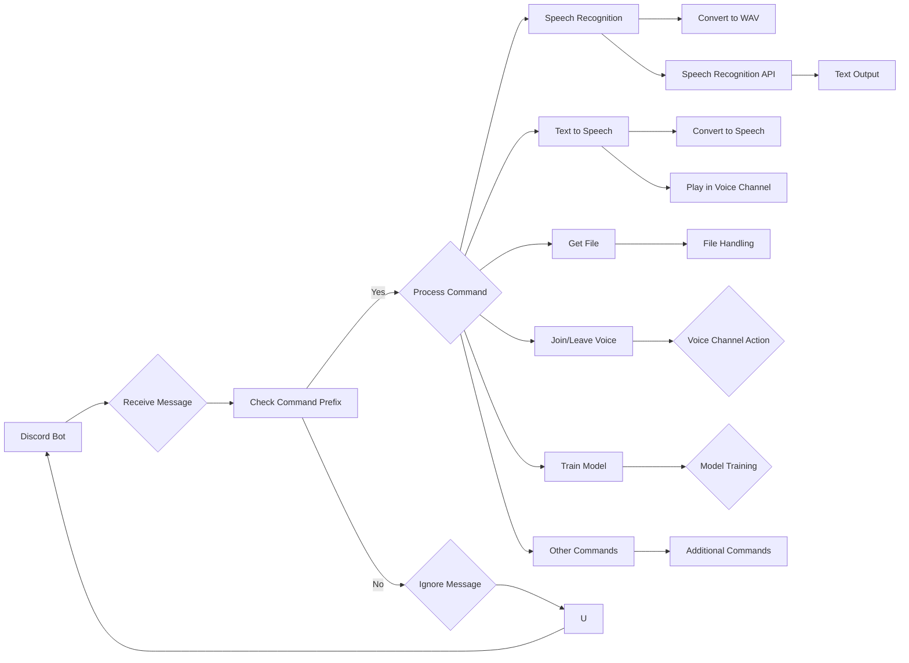

```MD
# Анализ кода Discord бота

## <input code>

```rst
.. module:: src.endpoints.bots.discord
```

```
<TABLE >
<TR>
<TD>
<A HREF = 'https://github.com/hypo69/hypo/blob/master/README.MD'>[Root ↑]</A>
</TD>
<TD>
<A HREF = 'https://github.com/hypo69/hypo/blob/master/src/README.MD'>src</A> /
<A HREF = 'https://github.com/hypo69/hypo/blob/master/src/endpoints/README.MD'>endpoints</A> /
<A HREF = 'https://github.com/hypo69/hypo/blob/master/src/bots/README.MD'>bots</A>
</TD>
<TD>
<A HREF = 'https://github.com/hypo69/hypo/blob/master/src/bots/discord/readme.ru.md'>Русский</A>
</TD>
</TABLE>


This code represents a Discord bot written in Python using the `discord.py` library. The bot performs several functions related to managing a machine learning model, processing audio, and interacting with users in both text and voice channels on Discord. Here is a brief description of the main functions and commands that this bot implements:

### Main Functions and Commands of the Bot:

# ... (description of commands and functions) ...

### Main Modules and Libraries:
- `discord.py`: The main library for creating Discord bots.
- `speech_recognition`: For speech recognition.
- `pydub`: For audio file conversion.
- `gtts`: For text-to-speech conversion.
- `requests`: For downloading files.
- `pathlib`: For working with file paths.
- `tempfile`: For creating temporary files.
- `asyncio`: For asynchronous task execution.

### Running the Bot:
- The bot is launched using a token stored in the `gs.credentials.discord.bot_token` variable.

### Conclusion:
This bot is designed for interactive user interaction on Discord, including handling voice commands, training and testing a machine learning model, providing instructions, and receiving feedback.
```

## <algorithm>

К сожалению, предоставленный код является описанием функциональности, а не самим кодом. Поэтому построить блок-схему алгоритма невозможно.  Описание функций и команд,  перечисленных в документе, позволяет предположить, что алгоритм бота включает такие этапы:

1. **Инициализация бота:** Настройка префикса команд, подключение необходимых интов (разрешений).
2. **Обработка сообщений:** Проверка сообщений на команды.
3. **Обработка команд:** Выполнение соответствующих функций (например, `!join`, `!leave`, `!train`).
4. **Распознавание речи:** Преобразование аудио в текст.
5. **Синтез речи:** Преобразование текста в речь и воспроизведение в голосовом канале.
6. **Обработка файлов:** Загрузка, сохранение и работа с файлами.
7. **Обучение модели:**  (По предположению, реализовано через соответствующие функции).
8. **Тестирование модели:**  (По предположению, реализовано через соответствующие функции).
9. **Логирование:** Запись событий и ошибок в лог.


## <mermaid>



* **Discord Bot (A):** Главный элемент, получает и обрабатывает данные.
* **Receive Message (B):** Прием сообщений от пользователей.
* **Check Command Prefix (C):** Проверка на наличие префикса `!`.
* **Process Command (D):** Обработка команды.
* **Ignore Message (E):** Обработка некоманды.
* **Join/Leave Voice (F):** Функция подключения/отключения от голосового канала.
* **Train Model (G):** Функция обучения модели.
* **Speech Recognition (H):** Модуль распознавания речи.
* **Convert to WAV (L):** Преобразование аудио в формат WAV.
* **Speech Recognition API (M):**  API для распознавания речи (Google Speech Recognition).
* **Text Output (N):** Результат распознавания речи (текст).
* **Convert to Speech (O):**  Модуль преобразования текста в речь.
* **Play in Voice Channel (P):** Функция воспроизведения речи в голосовом канале.
* **Get File (J):** Загрузка файла.
* **File Handling (Q):** Обработка файлов.
* **Other Commands (K):**  Обработка других команд.
* **Voice Channel Action (R):**  Действия, связанные с голосовым каналом.


## <explanation>

Описание кода предоставлено в виде документации, а не кодом, поэтому данное объяснение основано на документе.

* **Импорты:** Документ указывает на использование библиотек `discord.py`, `speech_recognition`, `pydub`, `gtts`, `requests`, `pathlib`, `tempfile`, `asyncio` и `logger`.  Все эти импорты необходимы для работы Discord бота и предоставляют необходимые функции для обработки сообщений, распознавания речи, воспроизведения аудио, работы с файлами и асинхронной обработки. Связь с пакетами `src.` не указана в данном документе.

* **Классы:** Документ не содержит описание классов,  однако предполагается, что бот использует классы из `discord.py` для взаимодействия с Discord.

* **Функции:** Документ перечисляет функции, которые реализуют обработку сообщений, команд,  распознавания речи и воспроизведения аудио, обработку файлов и обучение/тестирование модели.  Функции, вероятнее всего, определены в файлах python,  и их аргументы и возвращаемые значения, основаны на описании функциональности.

* **Переменные:**  Документ упоминает переменную `gs.credentials.discord.bot_token`. Эта переменная содержит токен доступа к Discord API, необходимый для аутентификации бота.

* **Возможные ошибки и улучшения:**  Без кода сложно сказать, где могут быть ошибки. Возможные улучшения включают:
    * **Улучшение обработки ошибок:** Добавление обработки исключений в функции.
    * **Модульная структура:** Разделение логики на модули для большей читаемости и поддержки.
    * **Использование менеджера контекста для ресурсов:** (файлы, соединения)
    * **Документация кода:** Добавление docstrings для функций, классов и переменных.
    * **Валидация входных данных:** Проверка корректности входных данных (команд, файлов, параметров).
    * **Улучшение логирования:** Более подробное и структурированное логирование.

**Цепочка взаимосвязей:** Бот взаимодействует с Discord через API, используя библиотеку `discord.py`.  Он вероятно взаимодействует с другими частями проекта (например, моделью машинного обучения), выполняя команды, связанные с обучением и тестированием модели. Но эта связь в описании недостаточно детализирована.