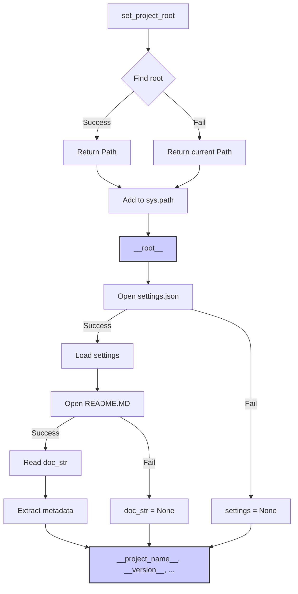

```MD
# <input code>

```python
## \file hypotez/src/bots/discord/header.py
# -*- coding: utf-8 -*-\
#! venv/Scripts/python.exe
#! venv/bin/python/python3.12

"""
.. module:: src.bots.discord 
	:platform: Windows, Unix
	:synopsis:

"""


"""
	:platform: Windows, Unix
	:synopsis:

"""


"""
	:platform: Windows, Unix
	:synopsis:

"""


"""
  :platform: Windows, Unix

"""
"""
  :platform: Windows, Unix
  :platform: Windows, Unix
  :synopsis:
"""
  
""" module: src.bots.discord """

import sys
import json
from packaging.version import Version

from pathlib import Path
def set_project_root(marker_files=('__root__','.git')) -> Path:
    """
    Finds the root directory of the project starting from the current file's directory,
    searching upwards and stopping at the first directory containing any of the marker files.

    Args:
        marker_files (tuple): Filenames or directory names to identify the project root.
    
    Returns:
        Path: Path to the root directory if found, otherwise the directory where the script is located.
    """
    __root__:Path
    current_path:Path = Path(__file__).resolve().parent
    __root__ = current_path
    for parent in [current_path] + list(current_path.parents):
        if any((parent / marker).exists() for marker in marker_files):
            __root__ = parent
            break
    if __root__ not in sys.path:
        sys.path.insert(0, str(__root__))
    return __root__


# Get the root directory of the project
__root__ = set_project_root()
"""__root__ (Path): Path to the root directory of the project"""

from src import gs

settings:dict = None
try:
    with open(gs.path.root / 'src' /  'settings.json', 'r') as settings_file:
        settings = json.load(settings_file)
except (FileNotFoundError, json.JSONDecodeError):
    ...

doc_str:str = None
try:
    with open(gs.path.root / 'src' /  'README.MD', 'r') as settings_file:
        doc_str = settings_file.read()
except (FileNotFoundError, json.JSONDecodeError):
    ...


__project_name__ = settings.get("project_name", 'hypotez') if settings  else 'hypotez'
__version__: str = settings.get("version", '')  if settings  else ''
__doc__: str = doc_str if doc_str else ''
__details__: str = ''
__author__: str = settings.get("author", '')  if settings  else ''
__copyright__: str = settings.get("copyrihgnt", '')  if settings  else ''
__cofee__: str = settings.get("cofee", "Treat the developer to a cup of coffee for boosting enthusiasm in development: https://boosty.to/hypo69")  if settings  else "Treat the developer to a cup of coffee for boosting enthusiasm in development: https://boosty.to/hypo69"
```

# <algorithm>

1. **`set_project_root()`:**
   - Принимает кортеж `marker_files` с именами файлов для поиска корня проекта.
   - Начинает поиск с текущей директории и поднимается по дереву каталогов к родительским.
   - Проверяет существование файлов из `marker_files` в каждом родительском каталоге.
   - Если найден родительский каталог с одним из файлов из `marker_files`, то возвращает его `Path`.
   - Иначе возвращает `Path` текущей директории.
   - Добавляет найденный корень в `sys.path`, если его там нет.

2. **Получение корневой директории:**
   - Вызывается функция `set_project_root()`.
   - Результат сохраняется в переменную `__root__`.

3. **Чтение `settings.json`:**
   - Пробует открыть файл `gs.path.root / 'src' / 'settings.json'`.
   - Если файл существует и корректен, загружает данные JSON в `settings`.
   - Если файл не найден или некорректен, `settings` остаётся `None`.

4. **Чтение `README.MD`:**
   - Аналогично пункту 3, но для файла `README.MD` и переменной `doc_str`.

5. **Получение метаданных:**
   - Извлекает значения из словаря `settings` для метаданных проекта (`project_name`, `version`, `author`, `copyright`, `cofee`).
   - Если `settings` пустое или значение не найдено, использует значения по умолчанию.
   - Записывает результат в глобальные переменные.


**Пример данных:**
- `marker_files`: `('pyproject.toml', 'requirements.txt', '.git')`
- `gs.path.root`: `Path('/path/to/project_root')`

**Перемещение данных:** Функция `set_project_root` возвращает путь к корню проекта, который затем используется для поиска `settings.json` и `README.MD`. Результат из `settings.json` и `README.MD` используется для заполнения глобальных переменных, которые затем доступны другим частям проекта.

# <mermaid>



# <explanation>

**Импорты:**

- `sys`: Предоставляет доступ к системным переменным, включая `sys.path`.
- `json`: Для работы с файлами JSON.
- `packaging.version`: Для работы с версиями пакетов.
- `pathlib`: Для работы с путями к файлам.
- `src import gs`:  Для доступа к модулю `gs`, скорее всего, содержащему константы или функции для работы с путями проекта.

**Классы:**

- Нет определенных классов в данном файле.

**Функции:**

- `set_project_root(marker_files)`: Находит корень проекта, поднимаясь по дереву каталогов от текущего файла. Очень важная функция для построения абсолютных путей.


**Переменные:**

- `MODE`: Строковая константа, скорее всего, для указания режима работы (например, 'dev', 'prod').
- `__root__`: Путь к корню проекта, вычисляется функцией `set_project_root()`.
- `settings`: Словарь с настройками проекта, загружается из `settings.json`.
- `doc_str`: Строка с описанием проекта, загружается из `README.MD`.
- `__project_name__`, `__version__`, `__doc__`, `__details__`, `__author__`, `__copyright__`, `__cofee__`: Глобальные переменные, содержащие метаданные о проекте, полученные из `settings`.


**Возможные ошибки и улучшения:**

- **Обработка ошибок:** Использование блоков `try...except` для обработки `FileNotFoundError` и `json.JSONDecodeError` является хорошей практикой, но можно улучшить обработку, например, добавить логирование или более информативные сообщения об ошибках.
- **Использование `gs`:** Непонятно, где определён `gs.path.root`, необходимо уточнить его назначение и использование. Это потенциальная точка для ошибок, если `gs` не инициализирован или используется некорректно.


**Взаимосвязь с другими частями проекта:**

- Модуль `gs` (если он есть) необходим для работы с путями проекта.
- Файлы `settings.json` и `README.MD` содержат важную информацию о проекте, используемую различными частями кода.
- Этот код, скорее всего, является частью бота для Discord, поэтому его взаимодействие с другими частями проекта, включая логику бота, должно быть детально изучено.