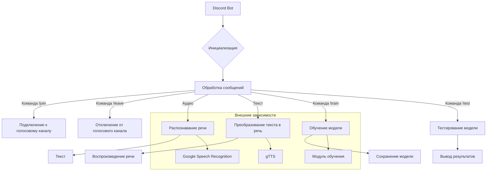

# Анализ кода Discord-бота

## <input code>

```rst
.. module:: src.endpoints.bots.discord
```
<TABLE >
<TR>
<TD>
<A HREF = 'https://github.com/hypo69/hypo/blob/master/README.MD'>[Root ↑]</A>
</TD>
<TD>
<A HREF = 'https://github.com/hypo69/hypo/blob/master/src/readme.ru.md'>src</A> /
<A HREF = 'https://github.com/hypo69/hypo/blob/master/src/endpoints/readme.ru.md'>endpoints</A> /
<A HREF = 'https://github.com/hypo69/hypo/blob/master/src/endpoints/bots/readme.ru.md'>bots</A>
</TD>
<TD>
<A HREF = 'https://github.com/hypo69/hypo/blob/master/src/bots/discord/README.MD'>English</A>
</TD>
</TABLE>


Модуль Discord-бота.
======================

Бот выполняет несколько функций, связанных с управлением моделью машинного обучения, обработкой аудио,
и взаимодействием с пользователями в текстовых и голосовых каналах Discord.
Вот краткое описание основных функций и команд, которые реализует этот бот:

### Основные функции и команды бота:

1. **Инициализация бота:**
   - Бот инициализируется с префиксом команд `!` и включает необходимые интенты (интенты — это разрешения на доступ к определенным событиям Discord).

2. **Команды:**
   - `!hi`: Отправляет приветственное сообщение.
   - `!join`: Подключает бота к голосовому каналу, в котором находится пользователь.
   - `!leave`: Отключает бота от голосового канала.
   - `!train`: Обучает модель на предоставленных данных. Можно передать данные в виде файла или текста.
   - `!test`: Тестирует модель на предоставленных данных.
   - `!archive`: Архивирует файлы в указанной директории.
   - `!select_dataset`: Выбирает датасет для обучения модели.
   - `!instruction`: Отправляет инструкции из внешнего файла.
   - `!correct`: Позволяет пользователю исправить предыдущее сообщение бота.
   - `!feedback`: Позволяет пользователю отправить обратную связь о работе бота.
   - `!getfile`: Отправляет файл из указанного пути.

3. **Обработка сообщений:**
   - Бот обрабатывает входящие сообщения, игнорируя свои собственные сообщения.
   - Если пользователь отправляет аудиофайл, бот распознает речь в аудио и отправляет текст в ответ.
   - Если пользователь находится в голосовом канале, бот преобразует текст в речь и воспроизводит его в голосовом канале.

4. **Распознавание речи:**
   - Функция `recognizer` скачивает аудиофайл, конвертирует его в формат WAV и распознает речь с помощью Google Speech Recognition.

5. **Текст в речь:**
   - Функция `text_to_speech_and_play` преобразует текст в речь с помощью библиотеки `gTTS` и воспроизводит его в голосовом канале.

6. **Логирование:**
   - Используется модуль `logger` для логирования событий и ошибок.

### Основные модули и библиотеки:
- `discord.py`: Основная библиотека для создания Discord-ботов.
- `speech_recognition`: Для распознавания речи.
- `pydub`: Для конвертации аудиофайлов.
- `gtts`: Для преобразования текста в речь.
- `requests`: Для скачивания файлов.
- `pathlib`: Для работы с путями файлов.
- `tempfile`: Для создания временных файлов.
- `asyncio`: Для асинхронного выполнения задач.

### Запуск бота:
- Бот запускается с использованием токена, который хранится в переменной `gs.credentials.discord.bot_token`.

### Заключение:
Этот бот предназначен для интерактивного взаимодействия с пользователями в Discord, включая обработку голосовых команд, обучение и тестирование модели машинного обучения, а также предоставление инструкций и обратной связи.
```

## <algorithm>

(блок-схема отсутствует, так как это текстовое описание, а не код)

## <mermaid>



## <explanation>

Этот документ описывает функциональность Discord-бота, но не содержит самого кода. Он описывает, какие задачи выполняет бот, какие команды он поддерживает, и какие библиотеки используются.  Из текста видно, что бот использует `discord.py` для взаимодействия с Discord, `speech_recognition` для распознавания речи, `pydub` для обработки аудио, `gTTS` для преобразования текста в речь, и другие библиотеки для выполнения дополнительных задач.  Заметим отсутствие детального описания алгоритма работы кода.  Отсутствуют детали реализации, классы, переменные и функции.


**Возможные ошибки/улучшения:**

* **Отсутствие кода:**  Для полноценного анализа необходим сам код.
* **Недостаток детализации:**  Описание функций и команд слишком поверхностное.  Не указано, как реализуются команды, какие параметры они принимают,  и как обрабатываются ошибки.
* **Отсутствие блок-схемы:**  Блок-схема помогла бы визуализировать взаимосвязи между функциями и классами.


**Взаимосвязи с другими частями проекта (предполагаемые):**

* **`src.endpoints`**:  Бот скорее всего интегрирован в общий API/фреймворк для обработки запросов.
* **`src.models`**:  Вероятно, используются классы/модели машинного обучения для обучения и тестирования.
* **`src.utils`**: Модули для работы с файлами, базами данных, аутентификацией, если они используются.
* **`gs.credentials`**:  Объект, содержащий конфиденциальную информацию (токены, API-ключи), защищенный от прямого доступа.


Без кода сложно говорить о конкретных проблемах и предложениях по улучшению.  Необходимо предоставить код, чтобы дать точный и исчерпывающий анализ.