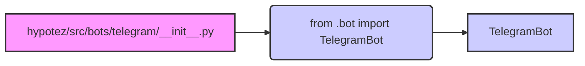

# <input code>

```python
## \file hypotez/src/bots/telegram/__init__.py
# -*- coding: utf-8 -*-\
#! venv/Scripts/python.exe
#! venv/bin/python/python3.12

"""
.. module:: src.bots.telegram 
	:platform: Windows, Unix
	:synopsis:

"""
MODE = 'dev'

from .bot import TelegramBot
```

# <algorithm>

Этот код представляет собой модуль инициализации для Telegram бота.

**Шаг 1:**  Импорт `TelegramBot` из подмодуля `bot`.

**Пример:**

```
from .bot import TelegramBot  # Импортируется класс TelegramBot из подмодуля bot в текущем модуле.
```

**Шаг 2:** Установка константы `MODE` со значением 'dev'.

**Пример:**

```
MODE = 'dev' # Определяется константа, которая вероятно, используется для различных режимов работы бота (например, разработка, продакшен).
```

**Шаг 3:**

Нет дальнейших действий, модуль завершается.


# <mermaid>




**Объяснение диаграммы:**

Модуль `hypotez/src/bots/telegram/__init__.py` импортирует класс `TelegramBot` из подмодуля `bot`.  Это указывает на существование файла `hypotez/src/bots/telegram/bot.py` содержащего определение класса `TelegramBot`.  Зависимость отображается стрелкой от модуля `__init__.py` к классу `TelegramBot`.

# <explanation>

**Импорты:**

- `from .bot import TelegramBot`: Этот импорт подключает класс `TelegramBot` из модуля `bot`, который, скорее всего, находится в том же каталоге, что и `__init__.py`.  Символ `.` указывает на поиск в текущем пакете (`bots/telegram`).  Это стандартная практика организации Python-проектов. `TelegramBot` вероятно определяет функции и атрибуты, необходимые для взаимодействия с Telegram API.

**Классы:**

- `TelegramBot`:  Этот класс, как предполагается, реализует логику бота Telegram.  Подробности о его методах и атрибутах можно найти в файле `hypotez/src/bots/telegram/bot.py`.


**Функции:**

- Нет функций явно определены в `__init__.py`.

**Переменные:**

- `MODE = 'dev'`:  Это переменная, хранящая строковое значение, вероятно используемая для настройки режима работы программы (разработка, продакшен).

**Возможные ошибки и улучшения:**

- Отсутствует проверка существования импортируемого файла `hypotez/src/bots/telegram/bot.py`.  Если файл отсутствует, произойдет ошибка `ImportError`.  Добавление проверки (например, с помощью `try...except`) улучшит надежность.
- Отсутствует описание константы `MODE`.  Документирование этой константы (например, через docstring) повысило бы читабельность и понимание кода.

**Взаимосвязь с другими частями проекта:**

Этот `__init__.py` файл устанавливает базовый уровень взаимодействия с ботом Telegram, предполагая наличие  `TelegramBot` класса.  Этот `TelegramBot` вероятно взаимодействует с другими частями проекта, такими как обработчики событий, или конфигурация.  Без доступа к `bot.py` и остальной части проекта, невозможно построить полную взаимосвязь.  Можно предположить, что этот модуль является частью более крупной структуры, отвечающей за работу с Telegram ботом в данном проекте.