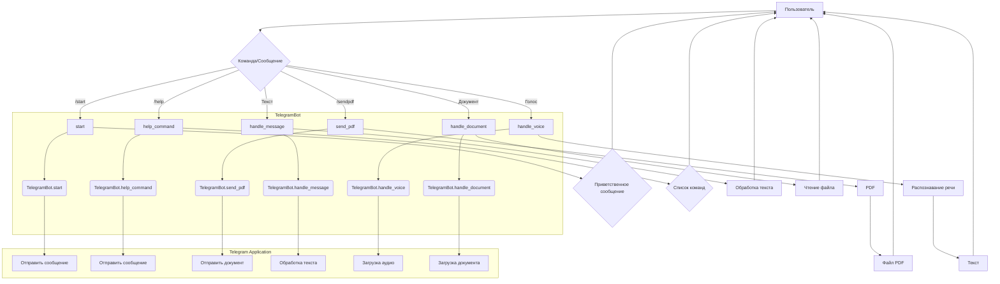

# <input code>

```python
## \file hypotez/src/endpoints/bots/telegram/bot.py
# -*- coding: utf-8 -*-\

#! venv/bin/python/python3.12

"""
.. module:: src.endpoints.bots.telegram 
	:platform: Windows, Unix
	:synopsis:

"""


from pathlib import Path
import tempfile
import asyncio
from telegram import Update
from telegram.ext import Application, CommandHandler, MessageHandler, filters, CallbackContext

import header
from src import gs
from src.utils.jjson import j_loads, j_loads_ns, j_dumps
from src.logger import logger
import requests  # For downloading files
from src.utils.convertors.tts import speech_recognizer, text2speech
from src.utils.file import read_text_file

class TelegramBot:
    """Telegram bot interface class."""

    application: Application

    def __init__(self, token: str):
        """Initialize the Telegram bot.

        Args:
            token (str): Telegram bot token, e.g., `gs.credentials.telegram.bot.kazarinov`.
        """
        self.application = Application.builder().token(token).build()
        self.register_handlers()

    def register_handlers(self):
        """Register bot commands and message handlers."""
        self.application.add_handler(CommandHandler('start', self.start))
        self.application.add_handler(CommandHandler('help', self.help_command))
        self.application.add_handler(CommandHandler('sendpdf', self.send_pdf))  # обработчик для отправки PDF
        self.application.add_handler(MessageHandler(filters.TEXT & ~filters.COMMAND, self.handle_message))
        self.application.add_handler(MessageHandler(filters.VOICE, self.handle_voice))
        self.application.add_handler(MessageHandler(filters.Document.ALL, self.handle_document))

    async def start(self, update: Update, context: CallbackContext) -> None:
        """Handle the /start command."""
        self.update = update
        self.context = context
        await self.update.message.reply_text('Hello! I am your simple bot. Type /help to see available commands.')

    async def help_command(self, update: Update, context: CallbackContext) -> None:
        """Handle the /help command."""
        self.update = update
        self.context = context
        await self.update.message.reply_text(
            'Available commands:\n'
            '/start - Start the bot\n'
            '/help - Show this help message\n'
            '/sendpdf - Send a PDF file'
        )

    async def send_pdf(self, pdf_file: str | Path) -> None:
        """Handle the /sendpdf command to generate and send a PDF file."""
        try:
            # Отправка PDF-файла пользователю
            with open(pdf_file, 'rb') as pdf_file_obj:
                await self.update.message.reply_document(document=pdf_file_obj)

        except Exception as ex:
            logger.error('Ошибка при отправке PDF-файла: ', ex)
            await self.update.message.reply_text('Произошла ошибка при отправке PDF-файла. Попробуй ещё раз.')

    # ... (other methods)
```

# <algorithm>

**Шаг 1: Инициализация бота.**

- Получает токен Telegram бота из `gs.credentials.telegram.bot.kazarinov`.
- Создаёт экземпляр класса `TelegramBot`, передавая токен.
- Регистрирует обработчики команд и сообщений.


**Пример:**

```
Токен = 'ваш_токен'
bot = TelegramBot(токен)
```


**Шаг 2: Регистрация обработчиков.**

- Добавляет обработчики для команд `/start`, `/help`, `/sendpdf`.
- Добавляет обработчики для текстовых сообщений, голосовых сообщений и документов.


**Пример:**

```
bot.application.add_handler(CommandHandler('start', bot.start))
```

**Шаг 3: Обработка команд.**

- `start`: Принимает команду `/start` и отправляет приветственное сообщение.
- `help`: Принимает команду `/help` и отправляет список доступных команд.
- `sendpdf`: Принимает путь к PDF файлу и отправляет его пользователю.


**Шаг 4: Обработка сообщений.**

- `handle_message`: Обрабатывает любые текстовые сообщения от пользователя.
- `handle_voice`: Обрабатывает голосовые сообщения и транскрибирует аудио.
- `handle_document`: Обрабатывает полученные документы, читает текст из них.


**Пример перемещения данных:**

Пользователь отправляет голосовое сообщение -> `handle_voice` получает Update объект -> `get_file` извлекает идентификатор файла -> `download_to_drive` сохраняет файл на диск -> `transcribe_voice` обрабатывает файл и возвращает текст -> ответ отправляется пользователю.


# <mermaid>



**Объяснение диаграммы:**

* Пользователь (A) взаимодействует с ботом, отправляя команды или сообщения.
* Команды и сообщения обрабатываются разными обработчиками (`start`, `help`, `sendpdf`, `handle_message`, `handle_voice`, `handle_document`) внутри класса `TelegramBot`.
* Telegram Application (подмодуль) отвечает за взаимодействие с Telegram API.
*  Внутри класса `TelegramBot`  обработчики взаимодействуют с внешними библиотеками (telegram, requests, gs).


# <explanation>

**Импорты:**

- `from pathlib import Path`: Импортирует класс `Path` для работы с путями к файлам.
- `import tempfile`: Импортирует модуль для временных файлов.
- `import asyncio`: Импортирует библиотеку для асинхронного программирования.
- `from telegram import Update`: Импортирует класс `Update` для обработки обновлений от Telegram.
- `from telegram.ext import Application, CommandHandler, MessageHandler, filters, CallbackContext`: Импортирует классы и функции для создания и обработки Telegram ботов.
- `import header`: Импортирует модуль `header`, который, скорее всего, содержит конфигурацию и/или другие вспомогательные функции.
- `from src import gs`: Импортирует модуль `gs`, который содержит глобальные настройки и сервисы (вероятно, хранит данные о доступах).
- `from src.utils.jjson import j_loads, j_loads_ns, j_dumps`: Импортирует функции для работы с JSON.
- `from src.logger import logger`: Импортирует объект логгера для записи сообщений об ошибках.
- `import requests`: Импортирует библиотеку для работы с HTTP запросами (вероятно, для загрузки файлов).
- `from src.utils.convertors.tts import speech_recognizer, text2speech`: Импортирует функции для распознавания речи и синтеза.
- `from src.utils.file import read_text_file`: Импортирует функцию для чтения текста из файла.

**Классы:**

- `TelegramBot`: Представляет интерфейс для создания и управления Telegram ботом.
    - `application: Application`: Атрибут для хранения экземпляра приложения Telegram бота.
    - `__init__(self, token: str)`: Инициализирует Telegram бота, создаёт приложение и регистрирует обработчики.
    - `register_handlers()`: Регистрирует обработчики для команд и сообщений.
    - `start()`, `help_command()`, `send_pdf()`, `handle_voice()`, `handle_document()`, `handle_message()`: Методы для обработки различных команд и типов сообщений.

**Функции:**

- `main()`: Точка входа для запуска бота. Получает токен, инициализирует бота, и запускает его.
- `transcribe_voice(self, file_path: Path) -> str`:  Заглушка для функции распознавания речи.
- `read_text_file(file_path) -> str`: Функция для чтения текста из файла.

**Переменные:**

- `MODE`: Переменная, содержащая режим работы (вероятно, `'dev'` для разработки).
- `token`: Содержит токен для аутентификации Telegram бота.

**Возможные ошибки и улучшения:**

- Функция `transcribe_voice` — заглушка, её нужно заменить на реальную логику распознавания речи (например, используя Google Cloud Speech-to-Text API).
- Отсутствует обработка ошибок при чтении файла и передаче PDF-файла.
- Логирование должно быть более подробным (указать, например, идентификатор пользователя).
- Необходимо добавить обработку других типов файлов (не только PDF).
- Можно улучшить структуру кода, вынеся повторяющиеся логические блоки в отдельные функции.

**Взаимосвязи с другими частями проекта:**

Код использует модули из пакета `src`, особенно `gs` (для доступа к глобальным настройкам) и `src.utils.jjson`, `src.utils.convertors.tts`, `src.utils.file` (для вспомогательных функций).  Логирование происходит с помощью `src.logger`. Это указывает на модульную архитектуру проекта, где бот взаимодействует с другими компонентами для получения данных и выполнения задач.