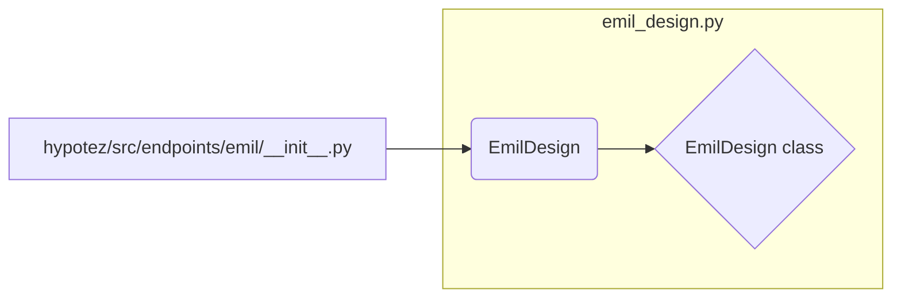

```MD
# <input code>

```python
## \file hypotez/src/endpoints/emil/__init__.py
# -*- coding: utf-8 -*-

#! venv/bin/python/python3.12

"""
.. module:: src.endpoints.emil 
	:platform: Windows, Unix
	:synopsis:

"""


from .emil_design import EmilDesign
```

# <algorithm>

Нет явного алгоритма, определяемого кодом. Файл `__init__.py` в папке `endpoints/emil` - это модуль, который импортирует класс `EmilDesign` из подмодуля `emil_design`.  Модуль `__init__.py` просто устанавливает переменную `MODE` со значением 'dev'. Данные не перемещаются между функциями, а только импортируются.


# <mermaid>



# <explanation>

**Импорты:**

- `from .emil_design import EmilDesign`: Эта строка импортирует класс `EmilDesign` из файла `emil_design.py`, который находится в той же директории (`endpoints/emil`).  Символ `. ` указывает на поиск файла `emil_design.py` в текущей директории (`src/endpoints/emil`).  Это стандартная импортная операция для модулей Python.  Подразумевается, что в папке `hypotez/src/endpoints/emil` существует файл `emil_design.py`, содержащий определение класса `EmilDesign`.

**Переменные:**

- ``:  Эта строковая переменная скорее всего используется для управления режимами работы приложения (например, для включения/выключения отладочных функций или выбора различных конфигураций).  Значение `'dev'` указывает на режим разработки.

**Классы:**

- `EmilDesign`:  В файле `emil_design.py` находится определение класса, а не в текущем файле.  Без доступа к этому файлу, невозможно сказать, какие методы и атрибуты имеет этот класс.


**Функции:**

В данном файле нет определений функций.

**Возможные ошибки или области для улучшений:**

- **Недостаток документирования:**  Файл `__init__.py` для пакета (`endpoints/emil`) мог бы содержать более подробную документацию, описывающую, какие классы или функции он экспортирует. Это помогло бы другим разработчикам понять функциональность этого модуля.

**Взаимосвязи с другими частями проекта:**

- Данный файл является частью более крупного проекта, искомая логика работы зависит от определения класса `EmilDesign` и его места в проекте.  Вероятно, класс `EmilDesign` взаимодействует с другими частями кодовой базы, например, через API вызовы или базу данных.  Для понимания всей логики, необходим обзор кода связанных компонентов (например, файлов `emil_design.py`, или файлов которые импортируют `EmilDesign`). Без этого, точный алгоритм работы невозможно восстановить.


**Вывод:**

Файл `__init__.py` в данном случае выполняет простую функцию импорта класса и инициализации константы, но его полноценное понимание зависит от `emil_design.py`. Без последнего файла сложно давать более точные объяснения.