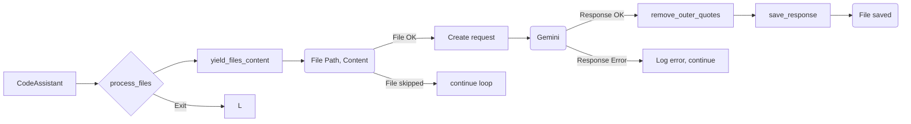

```MD
# Анализ кода `hypotez/src/endpoints/hypo69/code_assistant/assistant.py`

## <input code>

```python
# ... (оставлен код для краткости)
```

## <algorithm>

Алгоритм работы кода можно представить следующей блок-схемой:

1. **Инициализация:**
    * `CodeAssistant` принимает параметры (роль, язык, модели).
    * Загружаются настройки из `code_assistant.json`.
    * Инициализируются модели `GoogleGenerativeAI` (Gemini) и/или `OpenAIModel` (опционально).
    * Чтение инструкций из файлов `developer/role_lang.md` и `instructions/instruction_role_lang.md`.
    * Загрузка переводов из `translations/translations.json`.

2. **Обработка файлов:**
    * `process_files` итерируется по файлам в указанных директориях (`start_dirs`).
    * Для каждого файла, если его имя не входит в `exclude_files` и `exclude_file_patterns`, и индекс не меньше `start_file_number`:
        * Создание запроса `_create_request` для модели (с использованием переведенных строк).
        * Отправка запроса модели (Gemini в данном случае).
        * Обработка ответа `_remove_outer_quotes`.
        * Сохранение ответа в файл `_save_response`.
        * Вывод сообщения о обработанном файле.
        * Задержка на 20 секунд (для отладки).

3. **Запрос модели:**
    *  `gemini_model.ask` отправляет запрос на обработку файла.
    *  Обрабатывается ответ, и производится дальнейшая обработка.

4. **Сохранение ответа:**
    * `_save_response` формирует новый путь к файлу с правильным расширением (`.md`, `.rst`, etc.) и в целевой директории в `docs/gemini` (учитывая параметры `model`, `lang`, `role`).
    * Записывает ответ модели в файл.

5. **Зацикливание:**
    *  Программный цикл `while True` в `main` загружает конфигурацию, и для каждой пары `lang`/`role` инициализирует и запускает `CodeAssistant`.
    *  После обработки каждого файла конфигурация обновляется.

**Пример:** Если нужно обработать файл `src/mymodule/my_script.py`, то процесс будет включать:

- Чтение содержимого `my_script.py`.
- Создание запроса для Gemini с контекстом файла и инструкций.
- Получение ответа от Gemini.
- Сохранение обработанного ответа в `docs/gemini/<role>/<lang>/mymodule/my_script.md` (в зависимости от роли и языка).

## <mermaid>



## <explanation>

### Импорты

Импорты организованы иерархически.

* `src`: Базовый модуль, содержащий подмодули (в данном случае `utils`, `ai`, `logger`, `endpoints/hypo69/code_assistant`).  
* `src.utils.jjson`, `src.ai.gemini`, `src.ai.openai`, `src.utils.printer`, `src.utils.path`, `src.logger`: модули для работы с JSON, моделями Gemini и OpenAI, выводом в консоль, работой с путями и логгированием соответственно.
* `endpoints.hypo69.code_assistant.make_summary`: предполагает подмодуль для создания сводки.
* `header`: Модуль для определения корневого каталога проекта.
* `gs`: вероятно, глобальные настройки (global settings).

### Классы

* **`CodeAssistant`**:  Класс для обработки файлов кода, взаимодействия с моделями ИИ и сохранения результатов.  Атрибуты хранят роль, язык, модели, пути к файлам, настройки, объекты моделей Gemini и OpenAI.  Методы (`__init__`, `_initialize_models`, `process_files`, `_create_request`, `_save_response`, `_remove_outer_quotes`, `_yield_files_content`,  `system_instruction`, `code_instruction`, `run`, `parse_args`) отвечают за инициализацию, взаимодействие с моделями, обработку файлов, сохранение результатов, получение инструкций.

### Функции

* **`_create_request`**: Создает запрос для модели ИИ, формируя словарь с данными из файлов, ролью, языком и инструкцией.
* **`_save_response`**: Сохраняет ответ модели в файл, с учётом правил формирования имен и путей.
* **`send_file`**: Передаёт файл модели ИИ, и обрабатывает ответ, либо логирует ошибку.
* **`_yield_files_content`**: Генерирует итератор по файлам и их содержимому, с учётом фильтров `include_files`, `exclude_dirs`, `exclude_files` и `exclude_file_patterns` из настроек, обеспечивая возможность пропуска определённых файлов и директорий.

### Переменные

`MODE`, `role`, `lang`, `model`,  `start_dirs`,  `base_path`, `config`,  `gemini_model`,  `openai_model`: используются для хранения состояния и параметров ассистента.

### Возможные ошибки и улучшения

* **Обработка исключений**: Обработка исключений в `_save_response` и `_yield_files_content` была улучшена, но нужно учитывать потенциальные ошибки при чтении файлов, обработке запросов и записи в файлы.
* **Перегрузка**: Программа может перегрузить сервер Gemini, если обрабатывать файлы слишком быстро. В коде есть задержка на 20 секунд, но лучше добавить механизмы контроля скорости запросов.
* **Многопоточность**: Для повышения производительности, можно использовать многопоточность при обработке файлов.
* **Конфигурация**:  Использование json для `config` хорошо, но стоит подумать о более структурированном формате, для удобства внесения изменений.  Использование отдельных json файлов для ролей и языков улучшило бы организованность.
* **Тестирование**: Необходимо добавить тесты для проверки работы всех функций и обработки различных сценариев (пустые файлы, ошибки чтения, правильность сохранения).
* **Документация**: Документация может быть дополнена примерами использования, объяснением аргументов функций и возможных ошибок.
* **Логирование**: Логирование может быть более подробным, помогая отслеживать ошибки и отладку.

### Взаимосвязи с другими частями проекта

Код активно использует модули из `src` (например, `gs`, `utils.jjson`, `ai.gemini`), что указывает на тесную взаимозависимость с другими частями проекта.  `endpoints/hypo69/code_assistant` работает с инструментами, предоставляемыми другими частями проекта для работы с моделями ИИ, файлами и конфигурацией.  `docs/gemini` — директория для хранения выходных данных.  Неясно, как `code_assistant.py` связана с `make_summary`.

```
Project
└── src
    └── endpoints
        └── hypo69
            └── code_assistant
                └── assistant.py
                └── make_summary.py
            └── ... (other endpoints)
        └── ... (other endpoints)
    └── utils
        └── ... (utils modules)
    └── ai
        └── gemini
            └── ...
        └── openai
            └── ...
    └── logger
    └── gs  (global settings)
    └── ...
└── docs
    └── gemini
        └── ... (generated documentation)
```