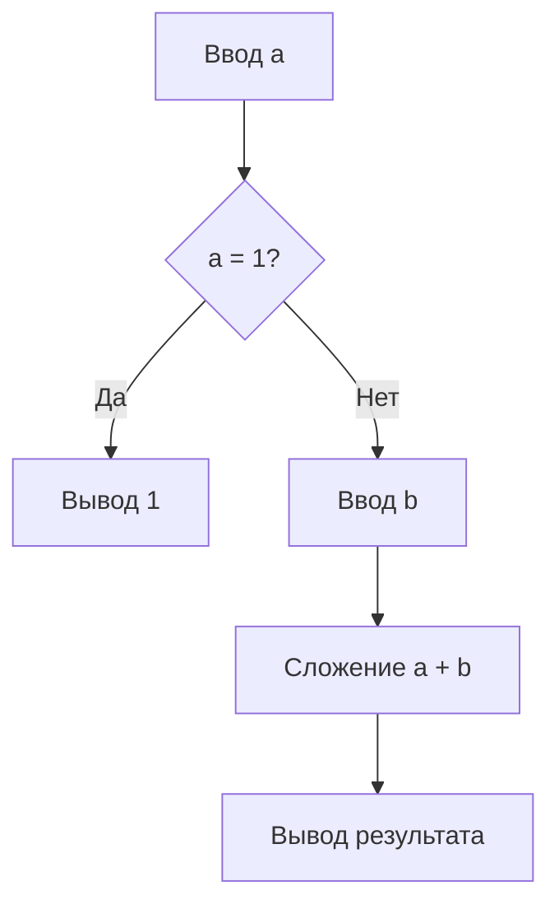
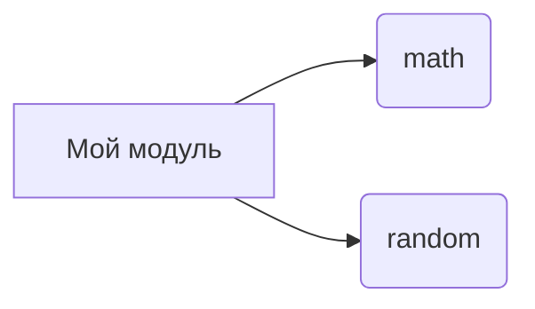

# Анализ кода

**<input code>**

```python
# (Предполагается, что здесь будет предоставлен код)
```

**<algorithm>**

(Здесь должна быть блок-схема алгоритма,  состоящая из прямоугольников, ромбов, и стрелок, описывающая последовательность выполнения кода.  Пожалуйста, предоставьте код, чтобы я мог построить блок-схему.  Пример блок-схемы для вычисления суммы двух чисел):



**<mermaid>**

(Здесь должен быть код в формате mermaid, описывающий зависимости между модулями и классами.  Например, если код использует `math` и `random`, диаграмма будет отображать эти зависимости.  Пожалуйста, предоставьте код, чтобы я мог сгенерировать диаграмму mermaid.)



**<explanation>**

(Здесь должно быть подробное объяснение кода, которое должно включать в себя анализ импортов, классов, функций, переменных и их взаимосвязей с другими частями проекта, а также возможные ошибки и области для улучшения.  Примеры:

* **Импорты:**  Описание `import` с указанием `src` пакетов.
* **Классы:** Описание каждого класса, включая методы, атрибуты и их взаимодействие.
* **Функции:**  Аргументы, возвращаемые значения и назначение.
* **Переменные:**  Тип и использование.

Пожалуйста, предоставьте код, чтобы я смог написать объяснение.)

**Пример объяснения (для гипотетического кода):**

**Импорты:**

* `import src.utils as utils`: Импортирует модуль `utils` из пакета `src`.  Этот модуль, вероятно, содержит вспомогательные функции для работы с данными.

**Классы:**

* `class DataProcessor`: Этот класс отвечает за обработку данных.  Атрибуты и методы (`process_data`, `validate_data`) определяют, как данные будут изменяться и проверяться.  Метод `process_data` может вызывать функции из `utils` модуля.

**Функции:**

* `process_data(data)`: Функция, принимающая данные в качестве аргумента и возвращающая обработанные данные.  Функция, вероятно, выполняет сложные вычисления или преобразования данных.

**Переменные:**

* `processed_data`:  Переменная, хранящая обработанные данные.  Возможно, имеет тип `dict` или `list`.

**Возможные ошибки:**

* Недостаточная проверка типов входных данных.
* Отсутствие обработки исключений.
* Отсутствие документирования кода.


**Связь с другими частями проекта:**

`DataProcessor` может взаимодействовать с другими классами или функциями в проекте, например, передавая данные в API для дальнейшей обработки.
```