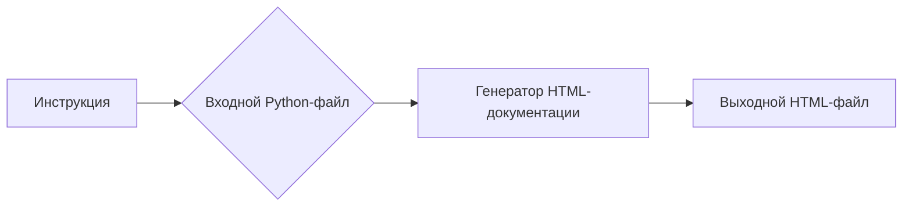

# Анализ кода

**1. <input code>**

```html
<!-- INSTRUCTION -->

<p>Для каждого входного Python-файла создайте документацию в формате <code>HTML</code> для последующего использования. Документация должна соответствовать следующим требованиям:</p>

<ol>
  <li>
    <strong>Формат документации</strong>:
    <ul>
      <li>Используйте стандарт <code>HTML</code>.</li>
      <li>Каждый файл должен начинаться с заголовка и краткого описания его содержимого.</li>
      <li>Для всех классов и функций используйте следующий формат комментариев:
        <pre><code>python
def function(param: str, param1: Optional[str | dict | str] = None) -> dict | None:
    """
    Args:
        param (str): Описание параметра `param`.
        param1 (Optional[str | dict | str], optional): Описание параметра `param1`. По умолчанию значение равно `None`.

    Returns:
        dict | None: Описание возвращаемого значения. Возвращает словарь или `None`.

    Raises:
        SomeError: Описание ситуации, в которой возникает исключение `SomeError`.
    """
</code></pre>
      </li>
      <li>Используйте <code>ex</code> вместо <code>e</code> в блоках обработки исключений.</li>
    </ul>
  </li>

  <li>
    <strong>Оглавление (TOC)</strong>:
    <ul>
      <li>Включите раздел оглавления в начале каждого документа.</li>
      <li>Структура должна включать ссылки на все основные разделы документации модуля.</li>
    </ul>
  </li>

  <li>
    <strong>Форматирование документации</strong>:
    <ul>
      <li>Используйте правильный синтаксис <code>HTML</code> для всех заголовков, списков и ссылок.</li>
      <li>Для документирования классов, функций и методов включайте структурированные разделы с описаниями, деталями параметров, значениями возвращаемых данных и поднятыми исключениями. Пример:
        <pre><code>html
<h2>Функции</h2>

<h3><code>function_name</code></h3>

<p><strong>Описание</strong>: Краткое описание функции.</p>

<p><strong>Параметры</strong>:</p>
<ul>
  <li><code>param</code> (str): Описание параметра <code>param</code>.</li>
  <li><code>param1</code> (Optional[str | dict | str], optional): Описание параметра <code>param1</code>. По умолчанию значение равно <code>None</code>.</li>
</ul>

<p><strong>Возвращаемое значение</strong>:</p>
<ul>
  <li><code>dict | None</code>: Описание возвращаемого значения.</li>
</ul>

<p><strong>Исключения</strong>:</p>
<ul>
  <li><code>SomeError</code>: Описание ситуации, в которой возникает исключение <code>SomeError</code>.</li>
</ul>
</code></pre>
      </li>
    </ul>
  </li>

  <!-- ... (остальные пункты) ... -->
</ol>

<p>Создайте соответствующую документацию для каждого входного Python-файла в формате <code>HTML</code>.</p>

<!-- END OF INSTRUCTION -->
```

**2. <algorithm>**

Этот код представляет собой инструкцию, описывающую **формат** и **структуру** HTML-документации, генерируемой для Python-файлов.  Алгоритма в виде пошаговой блок-схемы нет, т.к. это не код программы, а спецификация.  Инструкция направлена на то, как должен быть организован процесс генерации HTML-документов.

**3. <mermaid>**



**Описание диаграммы:**

Инструкция (A) задаёт требования к тому, как генерировать HTML-документацию из Python-файла (B).  Процесс генерации осуществляется с помощью некого генератора (C), который на основе входного файла создаёт выходной HTML-документ (D).  Взаимодействия между функциями и классами Python-файла в этой инструкции не определяются.

**4. <explanation>**

Это не код программы, а инструкция (или шаблон) для создания документации Python-кода в формате HTML.  В нем определены:

* **Формат комментариев**: Как должны выглядеть комментарии к функциям и классам в Python-файлах, чтобы их можно было использовать для автоматической генерации HTML.
* **Структура HTML-документации**:  Как организовать заголовки, списки, описания параметров, возвращаемых значений и исключений в сгенерированной HTML-странице.
* **Требования к оглавлению**: Нужно создавать оглавление, связывающее разные части документации.
* **Примеры**:  Приведены примеры кода, показывающие, как должны выглядеть заголовки, списки и т. д.

**Возможные ошибки или области для улучшений:**

Инструкция не содержит конкретной реализации генерации. Для ее выполнения нужен инструмент, который прочитает Python-код, проанализирует комментарии, и сгенерирует HTML.


**Цепочка взаимосвязей:**

Инструкция определяет шаблон для генерации, а в реальном процессе будут использоваться инструменты (возможно, скрипты на Python или другие технологии), которые будут читать Python-файлы, парсить комментарии и генерировать HTML-документацию.