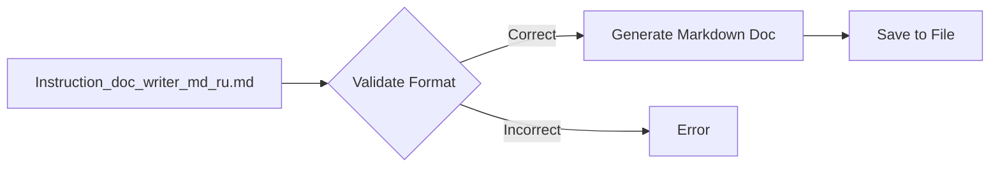

# ИНСТРУКЦИЯ по написанию документации для Python-файлов в формате Markdown

## Обзор

Данная инструкция описывает формат и структуру документации для Python-файлов в формате Markdown.  Документация должна быть структурированной и содержательной, обеспечивая полное понимание функциональности кода.

## Требования к формату

*   Используйте Markdown (.md).
*   Каждый файл должен начинаться с заголовка и краткого описания содержимого.
*   Для функций и классов используйте docstrings в формате:

```python
def function(param: str, param1: Optional[str | dict | str] = None) -> dict | None:
    """
    Args:
        param (str): Описание параметра `param`.
        param1 (Optional[str | dict | str], optional): Описание параметра `param1`. По умолчанию `None`.

    Returns:
        dict | None: Описание возвращаемого значения. Возвращает словарь или `None`.

    Raises:
        SomeError: Описание ситуации, в которой возникает исключение `SomeError`.
    """
```

*   В блоках обработки исключений используйте `ex` вместо `e`.
*   В начале документации добавьте оглавление со ссылками на основные разделы.

## Структура документации

Каждый файл должен содержать следующие разделы:

### 1. Заголовок и Обзор

*   Заголовок (```# Название модуля```)
*   Краткое описание (```## Обзор```).

### 2. Классы

*   Заголовок (```## Классы```)
*   Для каждого класса (```### ClassName```)
*   Описание класса.
*   Список методов класса с кратким описанием.

### 3. Функции

*   Заголовок (```## Функции```)
*   Для каждой функции (```### function_name```)
*   Описание функции.
*   Список параметров с типами и описаниями.
*   Описание возвращаемого значения.
*   Список вызываемых исключений с описанием ситуации.

### 4. Примеры (опционально)

*   Примеры использования функций и классов.


## Пример

```markdown
# Модуль для работы с пользователями

## Обзор

Модуль содержит классы для представления пользователей и функции для работы с ними.

## Классы

### User

**Описание**: Представляет информацию о пользователе.

**Атрибуты**:
*   `id` (int): Идентификатор пользователя.
*   `name` (str): Имя пользователя.

**Методы**:
*   `get_info()`: Возвращает информацию о пользователе.

## Функции

### create_user

**Описание**: Создает нового пользователя.

**Параметры**:
*   `name` (str): Имя пользователя.

**Возвращает**:
*   `User`: Объект пользователя, если создание прошло успешно.
*   `None`: Если произошла ошибка.

**Вызывает исключения**:
*   `ValueError`: Если имя пользователя некорректно.


```

## <mermaid>



## <algorithm>

1. Проверка соответствия входного файла требованиям.
2. Генерация заголовков, разделов оглавления, описаний.
3. Создание структуры документации в Markdown.
4. Сохранение документации в файл .md.

## <explanation>

Данный код представляет собой инструкцию (не сам код программы), описывающую, как нужно создавать документацию к Python-коду в формате Markdown.  Он определяет структуру, форматирование и содержание таких документов.  Инструкция не содержит реализации каких-либо классов или функций, а лишь описывает, как их нужно документировать.


В инструкции описываются:

*   **Формат Markdown** для документации.
*   **Структура документации** (заголовки, классы, функции, параметры, возвращаемые значения, исключения).
*   **Docstrings** в Python-коде, необходимые для генерации Markdown-документации.
*   **Пример файла** с полной структурой Markdown-документации.

**Возможные улучшения:**

*   Инструкция может быть дополнена примерами Python-кода с соответствующей документацией.
*   Инструкция могла бы содержать примеры обработки разных типов данных в аргументах и возвращаемых значениях.
*   Уточнение требований к оглавлению (например, какие уровни заголовков использовать для разных разделов).
*   Добавление раздела по структуризации очень больших проектов.
*   Добавление правил форматирования кода в Markdown.

**Взаимосвязи с другими частями проекта:**

Данная инструкция описывает процесс документирования, но не содержит кода или классов, поэтому не имеет прямых зависимостей от других частей проекта.  Однако, использование этой инструкции предположительно поможет в создании документации к другим частям проекта.