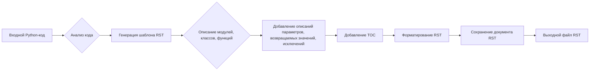

```MD
# Код инструкции по написанию документации в формате RST для Python-кода

## 1. <input code>

```plaintext
# הוראות
לכל קובץ Python קלט, צרו תיעוד בפורמט `rst` לצורך קומפילציה לאחר מכן עם Sphinx. התיעוד צריך לעמוד בדרישות הבאות:

1. **פורמט התיעוד**:
   - השתמשו בסטנדרט `reStructuredText (rst)`.
   - כל קובץ צריך להתחיל בכותרת ובתיאור קצר של התוכן שלו.
   - עבור כל המחלקות והפונקציות, השתמשו בפורמט ההערות הבא:
     ```python
     def function(param: str, param1: Optional[str | dict | str] = None) -> dict | None:
         """
         ארגומנטים:
             param (str): תיאור הפרמטר `param`.
             param1 (Optional[str | dict | str], optional): תיאור הפרמטר `param1`. ברירת המחדל היא `None`.

         ערך מוחזר:
             dict | None: תיאור הערך המוחזר. מחזיר מילון או `None`.

         יוצאים:
             SomeError: תיאור המצב שבו מתרחש החריג `SomeError`.
         """
     ```
   - השתמשו ב-`ex` במקום `e` בחסימות טיפול בחריגים.

2. **עץ תוכן (TOC)**:
   - כללו פרקים בתיעוד באמצעות `.. toctree::`.
   - מבנה הקובץ `index.rst` צריך לכלול קישורים לכל התיאורים של המודולים.

3. **עיצוב התיעוד**:
   - כל כותרות המחלקות, הפונקציות והשיטות צריכות להיות מתועדות באמצעות פקודות Sphinx (`autoclass`, `autofunction`).
   - דוגמה:
     ```rst
     .. automodule:: module_name
         :members:
         :undoc-members:
         :show-inheritance:
     ```

4. **כותרות פרקים**:
   - השתמשו בכותרות ברמה 1 (`=`), רמה 2 (`-`), רמה 3 (`~`) ורמה 4 (`^`).

5. **דוגמת קובץ**:
   ```rst
   שם המודול
   ===========\n
   .. automodule:: module_name
       :members:
       :undoc-members:
       :show-inheritance:

   פונקציות
   --------

   .. autofunction:: module_name.function_name
   ```

צור את התיעוד המתאים לכל קובץ Python קלט בפורמט `rst`.
# -------------------- סיום ההוראות -------------------------
```

## 2. <algorithm>

Эта инструкция описывает алгоритм генерации документации RST для Python-кода.  Нет конкретного алгоритма обработки кода, но есть порядок написания документации:

1. **Прочитать код**:  Алгоритм начинается с анализа предоставленного кода Python.
2. **Создать шаблон документации**: Создать шаблон документации RST с необходимыми заголовками, разделами и форматированием (например, указание параметров функций).
3. **Добавить описания**: Добавить описания для каждого модуля, класса и функции (например, описание параметров, возвращаемых значений, исключений и др.).
4. **Добавить TOC**: Добавить оглавление, чтобы пользователи быстро могли найти нужные части документации.
5. **Форматировать**: Правильно использовать форматирование RST.
6. **Создать файл**: Сохранить документ в формате RST.


## 3. <mermaid>




## 4. <explanation>

**Импорты:**  Нет импортов в предоставленном фрагменте кода.  Это инструкция, описывающая *как* генерировать документацию, а не код, который ее выполняет.

**Классы и функции:** В инструкции описывается, *как* нужно документировать классы и функции в коде Python.  Приводится пример использования docstrings для документации функций. Инструкция требует использования `reStructuredText` и инструментов Sphinx для генерации документации.

**Переменные:** Инструкция не определяет переменные.  Она описывает, как должен быть отформатирован код, чтобы его затем можно было обработать с помощью Sphinx.


**Возможные ошибки и улучшения:** Инструкция не содержит кода Python, поэтому говорить об ошибках в реализации невозможно.  Однако, важно понимать, что корректное оформление документации важно для понимания и использования кода другими разработчиками.  Ошибки могут возникнуть при неверном использовании синтаксиса RST или при неполной/неправильной документации.

**Связь с другими частями проекта:**  Инструкция описывает, как документировать код Python, и предполагает дальнейшую обработку с помощью Sphinx.  Таким образом, она связана с этапом генерации документации для проекта.