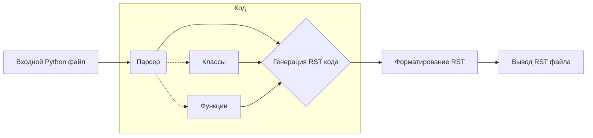

# <input code>

```python
# ИНСТРУКЦИЯ
Для каждого входного Python файла создайте документацию в формате `rst` для последующей компиляции с Sphinx. Документация должна соответствовать следующим требованиям:

1. **Формат документации**:
   - Используйте стандарт `reStructuredText (rst)`.
   - Каждый файл должен начинаться с заголовка и краткого описания его содержимого.
   - Для всех классов и функций используйте следующий формат комментариев:
     ```python
     def function(param: str, param1: Optional[str | dict | str] = None) -> dict | None:
         """
         Аргументы:
             param (str): Описание параметра `param`.
             param1 (Optional[str | dict | str], optional): Описание параметра `param1`. По умолчанию равно `None`.

         Возвращаемое значение:
             dict | None: Описание возвращаемого значения. Возвращает словарь или `None`.

         Исключения:
             SomeError: Описание ситуации, в которой возникает исключение `SomeError`.
         """
     ```
   - Используйте `ex` вместо `e` в блоках обработки исключений.

2. **Дерево оглавлений (TOC)**:
   - Включите разделы в документации с использованием `.. toctree::`.
   - Структура файла `index.rst` должна содержать ссылки на все описания модулей.

3. **Форматирование документации**:
   - Все заголовки классов, функций и методов должны быть задокументированы с использованием директив Sphinx (`autoclass`, `autofunction`).
   - Пример:
     ```rst
     .. automodule:: module_name
         :members:
         :undoc-members:
         :show-inheritance:
     ```

4. **Заголовки разделов**:
   - Используйте заголовки первого уровня (`=`), второго уровня (`-`), третьего уровня (`~`) и четвертого уровня (`^`).

5. **Пример файла**:
   ```rst
   Название модуля
   ===============\n

   .. automodule:: module_name
       :members:
       :undoc-members:
       :show-inheritance:

   Функции
   --------

   .. autofunction:: module_name.function_name
   ```

Сгенерируйте соответствующую документацию для каждого входного Python файла в формате `rst`.
```

# <algorithm>

Алгоритм работы заключается в автоматическом генерировании документации в формате reStructuredText (RST) для файлов на Python.

**Шаг 1:** Получение входного Python файла.

**Шаг 2:** Парсинг кода для идентификации классов и функций.

**Шаг 3:** Генерация RST-кода для каждого класса и функции.  Включает:
    * Добавление заголовка `=` и краткого описания.
    * Создание секции `.. automodule::` для модуля.
    * Создание секции `.. autofunction::` для каждой функции.
    * Создание секции `.. autoclass::` для каждого класса.
    * Использование директивы `:members:` для включения всех членов.

**Шаг 4:** Форматирование RST-документации, включая:
    * Заголовки разного уровня (`=`, `-`, `~`, `^`).
    * TOC (`.. toctree::`).

**Шаг 5:** Вывод сгенерированной RST-документации в файл.

**Пример:** Если на входе есть файл `my_module.py` с классом `MyClass` и функцией `my_function`, то алгоритм создаст файл `my_module.rst` с соответствующей структурой:
```rst
Мой Модуль
==========

.. automodule:: my_module
    :members:
    :undoc-members:
    :show-inheritance:

Функции
--------

.. autofunction:: my_module.my_function

Классы
-------

.. autoclass:: my_module.MyClass
    :members:
```


# <mermaid>



В данном случае парсер (B) анализирует входной Python-файл (A), определяет функции и классы (F, G), извлекает информацию из их документации (которая должна быть написана определенным образом) и генерирует соответствующие RST-структуры (C).  Форматирование (D) добавляет структуру и заголовки RST-файла.  Зависимостей от других пакетов нет, так как реализация полностью базируется на стандартных Python инструментах.


# <explanation>

Этот код представляет собой инструкцию, описывающую процесс создания документации на основе Python-кода с помощью `reStructuredText` (RST) для последующей компиляции с `Sphinx`.

**Импорты**: Нет никаких импортов, только упоминания о Python-фреймворке `Sphinx` и стандартной библиотеки `Optional` (на самом деле он относится к `typing`, который является частью стандартной библиотеки).

**Классы**:  Инструкция не содержит кода с классами, это описание процесса создания документации для классов.  Сгенерированная документация будет использовать `.. autoclass::` для обработки классов.

**Функции**: Инструкция описывает формат документации для функций. Она не содержит примера кода функции, но показывает как нужно писать документацию для функций (документ string). В функции используется стандартный формат документации `docstrings`.


**Переменные**:  Инструкция не определяет переменных; она задаёт правила для описания переменных в документации.

**Возможные ошибки и улучшения**:

* **Недостаток примера кода**: Нет примеров Python кода.  Эта инструкция скорее объясняет, *как* должен быть написан код, чем сама реализация процесса создания `rst` файла.
* **Сложность генерирования файла index.rst**:  Инструкция не объясняет, как генерировать файл `index.rst`, который содержит перечень всех создаваемых файлов документации.
* **Важная деталь:** Инструкция НЕ содержит функционального кода для обработки Python-файлов. Она только задаёт *формат*, в котором должны быть представлены файлы.  Для реализации процесса нужно написать код, который выполняет шаги парсинга, генерирования и записи в файлы.


**Связь с другими частями проекта**:

Если в проекте есть модули на Python, то эти файлы с кодом будут входными данными для данного скрипта, который генерирует документацию в формате RST.  Результат работы будет использоваться в системе сборки `Sphinx` для создания документации проекта.

**Заключение**: Инструкция даёт концептуальное представление, но не содержит функционального кода.  Для реальной реализации требуется написать программу, которая считывает, анализирует и преобразует Python-файлы в RST.