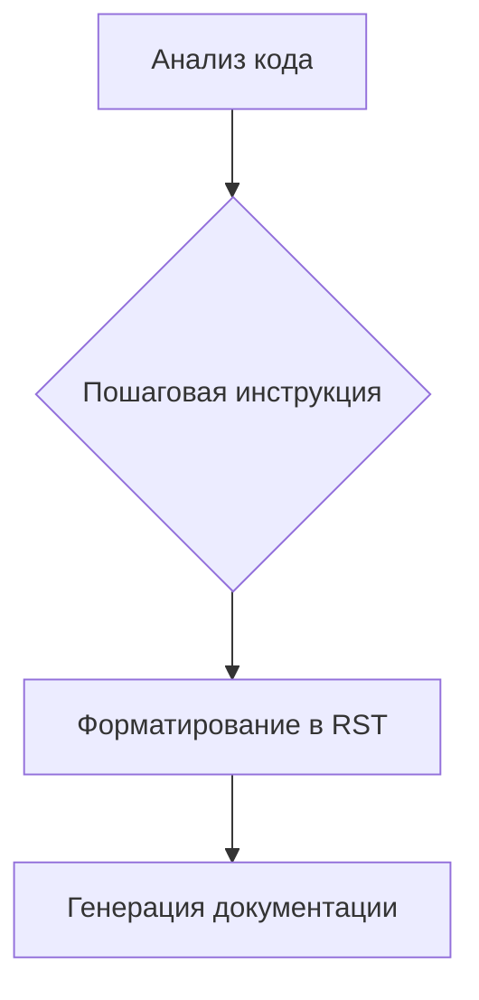

# Анализ кода: Инструкции для генерации документации

**1. <input code>**

```
**Инструкции для генерации документации к коду**

1. **Анализируй код**: Пойми логику и действия, выполняемые данным фрагментом кода.

2. **Создай пошаговую инструкцию**:
    - **Описание**: Объясни, что делает данный блок кода.
    - **Шаги выполнения**: Опиши последовательность действий в коде.
    - **Пример использования**: Приведи пример кода, как использовать данный фрагмент в проекте.

3. **Форматирование**: Следуй структуре в `reStructuredText (RST)`:

```rst
Как использовать этот блок кода
=========================================================================================\n
Описание
-------------------------
[Объяснение, что делает код.]

Шаги выполнения
-------------------------
1. [Описание первого шага.]
2. [Описание второго шага.]
3. [Продолжай по необходимости...]

Пример использования
-------------------------
.. code-block:: python

    [Пример использования кода]
```

4. **Избегай расплывчатых терминов** вроде "получаем" или "делаем". Будь конкретным, что именно делает код, например: "проверяет", "валидирует" или "отправляет".
```

**2. <algorithm>**

Этот код представляет собой набор инструкций для написания документации к коду. Алгоритм работы заключается в следующем:

**Шаг 1**:  Анализ кода. Разработчик должен понять логику и действия, выполняемые кодом.

**Шаг 2**:  Создание пошаговой инструкции. Необходимо описать:
    * **Описание:** Что делает блок кода.
    * **Шаги выполнения:** Последовательность действий.
    * **Пример использования:** Как применять блок кода в проекте.

**Шаг 3**:  Форматирование в формате `reStructuredText (RST)`.  Это структурированный язык разметки, обеспечивающий читабельность и автоматическую генерацию документации.

**Шаг 4**:  Избегать расплывчатых терминов.  Вместо "получить" - использовать "получить данные", "валидировать".

**Пример**:  Для блока кода, который вычисляет сумму двух чисел, инструкция будет содержать:

* **Описание:** Вычисляет сумму двух входных чисел.
* **Шаги выполнения:** 1. Принимает два числа как вход; 2. Складывает их; 3. Возвращает результат.
* **Пример использования**: `sum_numbers(5, 3)`,  возвращает `8`.

**Данные**:  Код и его логика являются входными данными. Результатом работы является описание кода и инструкция в формате RST.


**3. <mermaid>**



**Описание диаграммы**: Эта диаграмма представляет собой линейную последовательность шагов, необходимых для создания документации. Анализ кода приводит к созданию пошаговой инструкции, которая, в свою очередь, форматируется в формате RST и затем генерирует полную документацию. Зависимостей от других файлов или библиотек в этом коде нет.


**4. <explanation>**

* **Импорты**: Нет импортов, так как это инструкции, а не код программы.
* **Классы**: Нет классов.
* **Функции**: Нет функций.
* **Переменные**: Нет переменных.
* **Возможные ошибки/улучшения**:  Инструкции содержат важные рекомендации, но не реализуют сам процесс написания документации. Для этого потребуется дополнительный код (например, на Python) для обработки анализа кода и генерации RST-файлов. Инструкции не учитывают различные сложности анализа кода (например, комментарии, сложные алгоритмы).


**Цепочка взаимосвязей с другими частями проекта**:  Эти инструкции являются частью руководства по разработке и/или инструментария для генерации документации. Они необходимы для того, чтобы разработчики понимали, как описывать и документировать свой код.  Взаимосвязь – косвенная, через процесс написания документации для кода, написанного в рамках проекта.