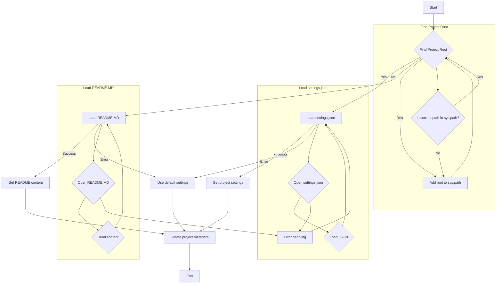
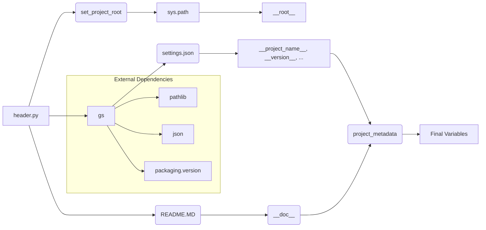

# <input code>

```python
## \file hypotez/src/endpoints/hypo69/header.py
# -*- coding: utf-8 -*-\

#! venv/bin/python/python3.12

"""
.. module:: src.endpoints.hypo69 
	:platform: Windows, Unix
	:synopsis:

"""


import sys
import json
from packaging.version import Version

from pathlib import Path
def set_project_root(marker_files=('__root__','.git')) -> Path:
    """
    Finds the root directory of the project starting from the current file's directory,
    searching upwards and stopping at the first directory containing any of the marker files.

    Args:
        marker_files (tuple): Filenames or directory names to identify the project root.
    
    Returns:
        Path: Path to the root directory if found, otherwise the directory where the script is located.
    """
    __root__:Path
    current_path:Path = Path(__file__).resolve().parent
    __root__ = current_path
    for parent in [current_path] + list(current_path.parents):
        if any((parent / marker).exists() for marker in marker_files):
            __root__ = parent
            break
    if __root__ not in sys.path:
        sys.path.insert(0, str(__root__))
    return __root__


# Get the root directory of the project
__root__ = set_project_root()
"""__root__ (Path): Path to the root directory of the project"""

from src import gs

settings:dict = None
try:
    with open(gs.path.root / 'src' /  'settings.json', 'r') as settings_file:
        settings = json.load(settings_file)
except (FileNotFoundError, json.JSONDecodeError):
    ...

doc_str:str = None
try:
    with open(gs.path.root / 'src' /  'README.MD', 'r') as settings_file:
        doc_str = settings_file.read()
except (FileNotFoundError, json.JSONDecodeError):
    ...


__project_name__ = settings.get("project_name", 'hypotez') if settings  else 'hypotez'
__version__: str = settings.get("version", '')  if settings  else ''
__doc__: str = doc_str if doc_str else ''
__details__: str = ''
__author__: str = settings.get("author", '')  if settings else ''
__copyright__: str = settings.get("copyrihgnt", '')  if settings else ''
__cofee__: str = settings.get("cofee", "Treat the developer to a cup of coffee for boosting enthusiasm in development: https://boosty.to/hypo69")  if settings else "Treat the developer to a cup of coffee for boosting enthusiasm in development: https://boosty.to/hypo69"
```

# <algorithm>



**Example Data Flow:**

1. The script starts (A).
2. It searches for the project root (B).  If `pyproject.toml`, `requirements.txt`, or `.git` is found in the current directory or any parent directory, the root is determined.
3. If the root is found and not in `sys.path`, it's added to `sys.path` (C1).
4. It tries to open `src/settings.json` (J). If the file exists and is valid JSON, it loads the JSON data into the `settings` variable (K).
5. It tries to open `src/README.MD`. If the file exists, it reads its content into `doc_str` (N).
6. Based on the `settings` and `doc_str` variables, the script constructs project metadata (H): `__project_name__`, `__version__`, etc.
7. The process finishes (I).


# <mermaid>




# <explanation>

**Импорты:**

- `sys`: Предоставляет доступ к системным переменным и функциям, в частности к пути поиска модулей (`sys.path`).
- `json`: Используется для работы с файлами JSON.
- `packaging.version`:  Для работы с версиями пакетов.
- `pathlib`: Для работы с путями к файлам.
- `src.gs`: Скорее всего, это собственный модуль или пакет, содержащий константы или функции для работы с ресурсами проекта (`gs.path.root`).  Необходимо проверить исходный код `gs`-модуля для понимания деталей.

**Классы:**

Код не содержит классов.

**Функции:**

- `set_project_root(marker_files)`:  Находит корневую директорию проекта, идя вверх по дереву директорий от текущего файла.  Использует кортеж `marker_files` для поиска:  это позволяет определить проект, если он не располагается непосредственно в том же каталоге, что и выполняемый скрипт. Возвращает `Path` к корневой директории, которая также добавляется в `sys.path`.


**Переменные:**

- `MODE`:  Строковая константа, вероятно, обозначает режим работы приложения ('dev' в данном примере).
- `__root__`: `Path` объект, хранящий путь к корневой директории проекта.
- `settings`: Словарь, содержащий настройки проекта из `settings.json`.
- `doc_str`: Строка, содержащая текст из файла `README.MD`.
- `__project_name__`, `__version__`, `__doc__`, `__details__`, `__author__`, `__copyright__`, `__cofee__`:  Переменные, хранящие различные метаданные проекта, извлеченные из `settings`.

**Возможные ошибки и улучшения:**

- **Обработка исключений:**  Блоки `try...except` обрабатывают `FileNotFoundError` и `json.JSONDecodeError`. Это хорошо, но можно добавить более конкретные сообщения об ошибках, чтобы помочь при отладке.
- **Проверка типов:**  Добавление проверок типов (например, с использованием `typing`)  улучшило бы читаемость и надежность кода.
- **Использование `Path`:**  Весьма разумно использовать `Path` для работы с файлами вместо строковых представлений путей. Это делает код более переносимым и безопасным.
- **`gs.path.root`:**  Надобность в `gs.path.root` неясна без дополнительного контекста. В случае необходимости его следует использовать с осторожностью и документировать в `gs.py`.

**Взаимосвязь с другими частями проекта:**

Код явно зависит от модуля или пакета `src.gs`, который предоставляет информацию о корневом каталоге проекта (`gs.path.root`).  Без доступа к `gs.py` сложно оценить полную взаимосвязь с остальными частями проекта.  Но ясно, что этот скрипт играет роль инициализации, определяя `sys.path` и загружая глобальные константы.