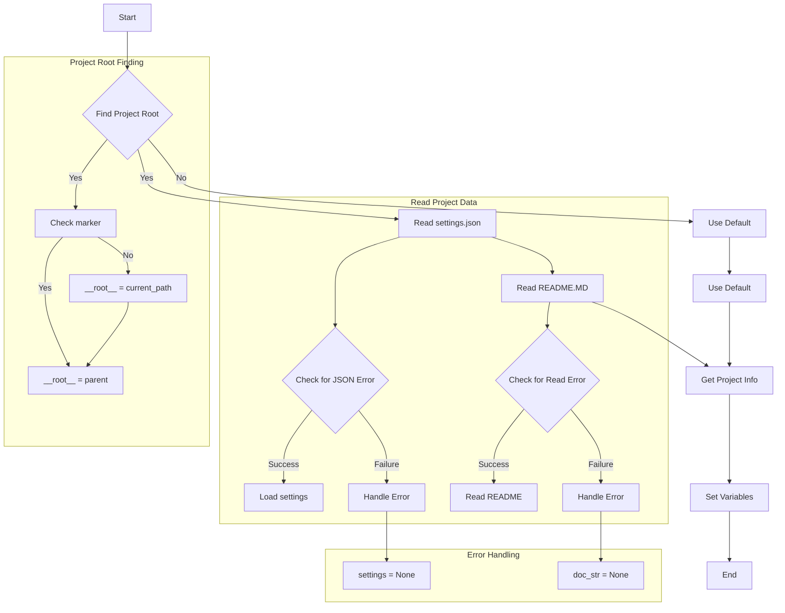
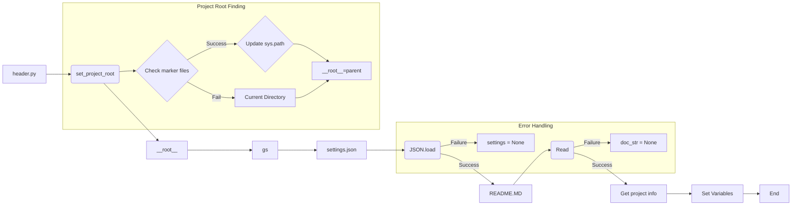

# <input code>

```python
## \file hypotez/src/endpoints/hypo69/small_talk_bot/header.py
# -*- coding: utf-8 -*-\
#! venv/Scripts/python.exe
#! venv/bin/python/python3.12

"""
.. module:: src.endpoints.hypo69.small_talk_bot 
	:platform: Windows, Unix
	:synopsis:

"""


import sys
import json
from packaging.version import Version

from pathlib import Path
def set_project_root(marker_files=('__root__')) -> Path:
    """
    Finds the root directory of the project starting from the current file's directory,
    searching upwards and stopping at the first directory containing any of the marker files.

    Args:
        marker_files (tuple): Filenames or directory names to identify the project root.
    
    Returns:
        Path: Path to the root directory if found, otherwise the directory where the script is located.
    """
    __root__:Path
    current_path:Path = Path(__file__).resolve().parent
    __root__ = current_path
    for parent in [current_path] + list(current_path.parents):
        if any((parent / marker).exists() for marker in marker_files):
            __root__ = parent
            break
    if __root__ not in sys.path:
        sys.path.insert(0, str(__root__))
    return __root__


# Get the root directory of the project
__root__ = set_project_root()
"""__root__ (Path): Path to the root directory of the project"""

from src import gs

settings:dict = None
try:
    with open(gs.path.root / 'src' / 'settings.json', 'r') as settings_file:
        settings = json.load(settings_file)
except (FileNotFoundError, json.JSONDecodeError):
    ...

doc_str:str = None
try:
    with open(gs.path.root / 'src' / 'README.MD', 'r') as settings_file:
        doc_str = settings_file.read()
except (FileNotFoundError, json.JSONDecodeError):
    ...


__project_name__ = settings.get("project_name", 'hypotez') if settings  else 'hypotez'
__version__: str = settings.get("version", '')  if settings  else ''
__doc__: str = doc_str if doc_str else ''
__details__: str = ''
__author__: str = settings.get("author", '')  if settings else ''
__copyright__: str = settings.get("copyrihgnt", '')  if settings else ''
__cofee__: str = settings.get("cofee", "Treat the developer to a cup of coffee for boosting enthusiasm in development: https://boosty.to/hypo69")  if settings else "Treat the developer to a cup of coffee for boosting enthusiasm in development: https://boosty.to/hypo69"
```

# <algorithm>


This code snippet finds the project root directory, then retrieves project settings from a JSON file and the project description from a README.md file.  If either file is not found or has invalid JSON format, default values are used. Finally, it sets relevant project variables based on the data obtained.

# <mermaid>




# <explanation>

* **Импорты**:
    * `sys`:  Используется для доступа к системным переменным, в частности, для добавления корня проекта в `sys.path`, что позволяет Python импортировать модули из него.
    * `json`: Для работы с файлами JSON.
    * `packaging.version`: Возможно, используется для работы с версиями пакетов, но в этом фрагменте кода не используется.
    * `pathlib`:  Для работы с путями файлов, что улучшает читаемость и безопасность кода.
    * `src import gs`: Импортирует модуль `gs` из папки `src`.  `gs` вероятно содержит вспомогательные функции для работы с файловой системой, в данном случае для получения пути к корню проекта.


* **Классы**:  Нет классов, только функции и переменные.


* **Функции**:
    * `set_project_root(marker_files)`: Эта функция находит корень проекта. Она принимает кортеж `marker_files` (по умолчанию `('pyproject.toml', 'requirements.txt', '.git')`) с именами файлов или каталогов, которые должны быть найдены в проекте, чтобы определить корень. Функция последовательно проверяет родительские каталоги текущего файла, пока не найдет тот, который содержит любой из файлов в `marker_files`. Если корень найден, он добавляется в `sys.path`, чтобы модули могли быть найдены.  Возвращает `Path` объекта, представляющий найденный корень проекта.


* **Переменные**:
    * `MODE`: Строковая константа, вероятно, используемая для определения режима работы приложения (например, `dev`, `prod`).
    * `__root__`:  Переменная, хранящая путь к корню проекта.  Используется для относительных путей к файлам.
    * `settings`: Словарь, хранящий настройки проекта, загруженные из файла `settings.json`.
    * `doc_str`: Строка, хранящая содержание файла README.md.
    * `__project_name__`, `__version__`, `__doc__`, `__details__`, `__author__`, `__copyright__`, `__cofee__`: Переменные, содержащие информацию о проекте, извлеченную из `settings`. Они используются для метаданных и, вероятно, для документации.


* **Возможные ошибки и улучшения**:
    * **Обработка ошибок**:  Использование `try...except` блоков для `settings.json` и `README.MD` является хорошей практикой, предотвращая аварийную остановку программы при проблемах с файлами.  Можно добавить более подробные сообщения об ошибках или логгирование.
    * **Проверка типов**: Проверка типов (`-> Path`) в  `set_project_root` улучшает читаемость и позволяет статическому анализатору кода выявлять возможные ошибки.
    * **Более гибкое определение корня**:  Можно добавить дополнительные критерии для поиска корня проекта (например, файлы `.vscode`, `setup.py`).


* **Взаимосвязи с другими частями проекта**:
    * Функция `set_project_root` необходима для корректного импорта модулей из других частей проекта.
    * Переменные `settings`, `doc_str` и другие, которые хранят информацию о проекте, используются в других частях проекта для настройки поведения.  Модуль `gs` из `src` вероятно предоставляет функции для работы с файловой системой и конфигурацией проекта.  Связь с `src` очень важна и показывает, что код является частью более крупной системы.


**Общий итог:**

Код предоставляет удобную структуру для определения корня проекта и инициализации важных переменных, необходимых для его последующей работы.  В нем используются хорошие практики, такие как обработка ошибок и работа с путями с помощью `pathlib`.