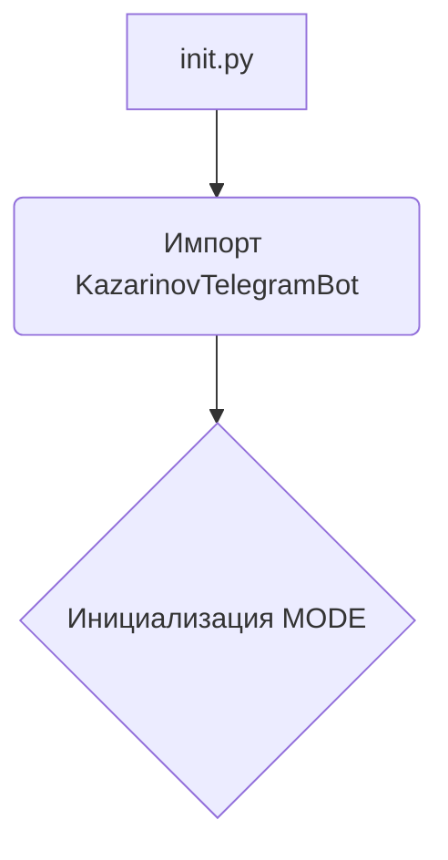
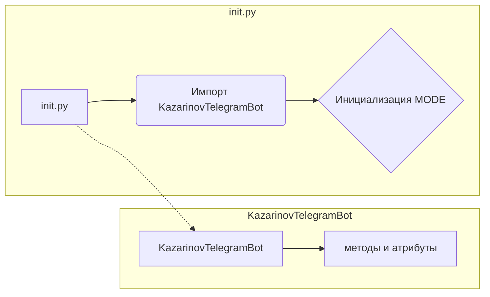

# <input code>

```python
## \file hypotez/src/endpoints/kazarinov/__init__.py
# -*- coding: utf-8 -*-
#! venv/Scripts/python.exe
#! venv/bin/python/python3.12

"""
.. module:: src.endpoints.kazarinov 
	:platform: Windows, Unix
	:synopsis:

"""


from .kazarinov_bot import KazarinovTelegramBot
```

# <algorithm>

Этот код представляет собой инициализационный модуль для подсистемы `kazarinov` в приложении. Он импортирует класс `KazarinovTelegramBot` из модуля `kazarinov_bot`.  

**Блок-схема:**



**Пример:**

1. Модуль `__init__.py` импортирует класс `KazarinovTelegramBot`.
2. При последующем импорте этого модуля, `KazarinovTelegramBot` становится доступным для использования.
3. Переменная `MODE` устанавливается в 'dev'.  Это, скорее всего, конфигурационная переменная, определяющая режим работы приложения (например, 'dev', 'prod', 'test').

# <mermaid>



# <explanation>

* **Импорты**:
   - `from .kazarinov_bot import KazarinovTelegramBot`: Импортирует класс `KazarinovTelegramBot` из модуля `kazarinov_bot`.  Символ `.` указывает на то, что модуль `kazarinov_bot` находится в текущей директории (`.kazarinov_bot`). Это типичная организация кода Python, где модули сгруппированы по функциональности.  Данный импорт предполагает, что `kazarinov_bot` содержит необходимые классы и функции для взаимодействия с ботом Telegram.

* **Классы**:
    - `KazarinovTelegramBot`:  Этот класс, определенный в `kazarinov_bot`, отвечает за работу с ботом Telegram. Подробная информация о его атрибутах и методах доступна в файле `kazarinov_bot.py`.  Без доступа к этому файлу невозможно получить полное описание.

* **Функции**:
   - Нет явных функций.  Файл `__init__.py` предназначен для инициализации и импорта других компонентов.

* **Переменные**:
   - ``:  Переменная глобального уровня, скорее всего, используемая для выбора конфигурации приложения (различные настройки для разработки, тестирования или производства).  Это пример конфигурационной переменной.


**Цепочка взаимосвязей**:

Файл `__init__.py` служит начальной точкой для доступа к функционалу бота.  Он импортирует класс `KazarinovTelegramBot` из модуля `kazarinov_bot`. В свою очередь, `KazarinovTelegramBot` скорее всего взаимодействует с библиотекой `python-telegram-bot` или подобной, для управления Telegram-ботом.  Таким образом, `__init__.py` связывает `kazarinov`-подсистему с остальными частями проекта.  Для более полного анализа необходимо рассмотреть `kazarinov_bot.py` и другие сопутствующие файлы.


**Возможные ошибки/улучшения**:

* **Документация**: Добавление более подробной документации к классу `KazarinovTelegramBot` существенно повысит читаемость и понимание кода.
* **Конфигурация**: Использование файла конфигурации (например, `.ini`, `YAML`) вместо прямой установки переменных (MODE) сделает код более гибким и масштабируемым.
* **Типизация**: Для повышения безопасности и читабельности кода рекомендуется использовать типизацию (например, через `typing`).


**В итоге:** Этот код является небольшой частью более крупного проекта. Без доступа к остальным частям проекта сложно дать исчерпывающий анализ.