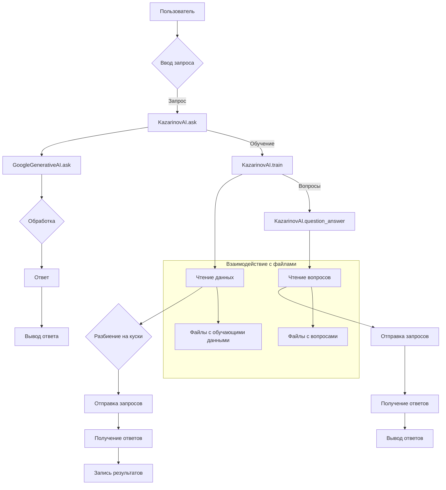

```MD
# <input code>

```python
## \file hypotez/src/endpoints/kazarinov/gemini_chat.py
# -*- coding: utf-8 -*-
#! venv/Scripts/python.exe
#! venv/bin/python/python3.12

"""
.. module:: src.endpoints.kazarinov 
	:platform: Windows, Unix
	:synopsis: Module that handles model training using GoogleGenerativeAI for the Kazarinov project

"""
MODE = 'dev'
import header
import time
import json
import random
from typing import Optional
from pathlib import Path
from src import gs
from src.ai.openai import OpenAIModel
from src.ai.gemini import GoogleGenerativeAI
from src.utils.file import get_filenames, read_text_file, recursively_read_text_files, recursively_get_filepath
from src.utils.jjson import j_dumps
from src.utils.printer import pprint
from src.logger import logger


class KazarinovAI:
    """Handles model training and dialog generation for the Kazarinov project using GoogleGenerativeAI."""

    api_key = gs.credentials.gemini.kazarinov
    # Base paths for system instructions and training files
    base_path = gs.path.google_drive / 'kazarinov'
    system_instruction_list: list = recursively_read_text_files(base_path, ['*.txt', '*.md'])
    #questions_list:list = recursively_read_text_files(gs.path.google_drive / 'kazarinov' / 'prompts' / 'q', ['*.*'])
    history_file = f'{gs.now}.txt'

    gemini_1: GoogleGenerativeAI
    gemini_2: GoogleGenerativeAI
    timestamp = gs.now

    def __init__(self,
                 system_instruction: str = None,
                 generation_config: dict | list[dict] = {"response_mime_type": "text/plain"}):
        """Initialize the Kazarinov model.

        Args:
            system_instruction (str, optional): Instruction for the model's system role. Defaults to None.
            generation_config (dict | list[dict], optional): Configuration for content generation. 
                Defaults to {"response_mime_type": "text/plain"}.
        """
        self.gemini_1 = GoogleGenerativeAI(
            api_key=self.api_key,
            system_instruction=system_instruction,
            generation_config={"response_mime_type": "text/plain"},
            history_file=f'{gs.now}.txt'
        )

        self.gemini_2 = GoogleGenerativeAI(
            api_key=self.api_key,
            system_instruction=system_instruction,
            generation_config={"response_mime_type": "text/plain"},
            history_file=f'{gs.now}.txt'
        )


    def train(self):
        """
        Train the model using the provided list of training files, sending data in chunks of specified size.

        Args:
            train_files (list | str): A list or single file name for training.
        """
        chunk_size = 500000
        all_chunks = []
        train_data_list = recursively_read_text_files(gs.path.data / 'kazarinov' / 'prompts' / 'train_data', ['*.*'], as_list=True)

        current_chunk = ""

        for line in train_data_list:
            while len(current_chunk) + len(line) > chunk_size:
                space_left = chunk_size - len(current_chunk)
                current_chunk += line[:space_left]
                all_chunks.append(current_chunk)
                line = line[space_left:]
                current_chunk = ""

            current_chunk += line

        if current_chunk:
            all_chunks.append(current_chunk)

        for idx, chunk in enumerate(all_chunks):
            pprint(f"{chunk=}\n{len(chunk)}", text_color='light_blue')
            response = self.gemini_1.ask(q=chunk)
            pprint(response, text_color='yellow')
            time.sleep(5)


    def question_answer(self):
        """
        Handles the question-answering process using the provided training files.
        """
        questions = recursively_read_text_files(self.base_path / 'prompts' / 'train_data' / 'q', as_list=True)
        for q in questions:
            pprint(self.gemini_1.ask(q))


    def dialog(self):
        """
        Runs a dialog based on pre-defined questions, shuffling questions from different languages.
        """
        questions = recursively_read_text_files(self.base_path / 'prompts' / 'train_data' / 'q', patterns=['*.*'], as_list=True)
        random.shuffle(questions)
        for q in questions:
            pprint(f'Q:> {q}', text_color='yellow')
            pprint(' ', text_color='green')
            a = self.gemini_1.ask(q)
            pprint(f'A:> {a}', text_color='cyan')
            pprint('------------------------------------', text_color='green')
            time.sleep(5)
            ...


    def ask(self, q: str, no_log: bool = False, with_pretrain: bool = True) -> bool:
        """Спрашиваю у машины """
        return self.gemini_1.ask(f"role: ** assistant asst_w5cM3yqOX1pDJARO2hzNMVZrq ** \n Question: {q}", no_log=no_log, with_pretrain=False)


def chat():
    """Initiates a chat session with the AI assistant, Kazarinov."""
    questions_list = recursively_read_text_files(gs.path.google_drive / 'kazarinov' / 'prompts' / 'q', ['*.*'])

    print(f"""
    Чтобы завершить чат, напишите `--q`
    Чтобы загрузить вопрос из базы вопросов напишите `--next`""")
    logger.info(k.ask("Привет, представься"))
    while True:
        q = input_colored(">>>> ", GREEN)
        if q.lower() == 'exit':
            print("Чат завершен.")
            break
        if q.lower() == '--next' or q.lower() == '--нехт':
            q_list = questions_list[random.randint(0, len(questions_list) - 1)].split('\n')
            q = q_list[random.randint(0, len(q_list) - 1)]
            print(f"{q=}")
            response = k.ask(f"{q}", no_log=True, with_pretrain=False)
            logger.info(response)
            continue

        response = k.ask(q, no_log=False, with_pretrain=False)
        logger.info(response)


if __name__ == "__main__":
    system_instruction = read_text_file(gs.path.google_drive / 'kazarinov' / 'prompts' / 'system_instruction.txt')
    k = KazarinovAI(system_instruction=system_instruction)
    k.train()
    #k.dialog()
```

# <algorithm>

**Описание алгоритма:**

1. **Инициализация:**
    * Создается экземпляр класса `KazarinovAI`.
    * Инициализируются модели `gemini_1` и `gemini_2` с использованием API ключа, системных инструкций и файла истории.

2. **Обучение (train):**
    * Чтение данных из файлов для обучения в заданном формате (`chunk_size`) с помощью `recursively_read_text_files`.
    * Разбиение данных на куски (chunks) размером `chunk_size`.
    * Отправка каждого куска (chunk) модели `gemini_1` для обработки.
    * Получение ответа от модели.
    * Запись результата в файл (в коде есть, но временно закомментирован).

3. **Ответ на вопросы (question_answer):**
    * Чтение вопросов из заданных файлов.
    * Отправка каждого вопроса модели `gemini_1` для получения ответа.
    * Вывод ответа.

4. **Диалог (dialog):**
    * Чтение вопросов из заданных файлов.
    * Перемешивание вопросов.
    * Отправка каждого вопроса модели `gemini_1` для получения ответа.
    * Вывод вопроса и ответа.

5. **Запрос к модели (ask):**
    * Создание запроса к модели с добавлением роли и вопроса.
    * Обработка запроса с использованием `gemini_1`.
    * Возврат результата.

6. **Чат (chat):**
    * Вывод сообщений для пользователя.
    * Чтение запросов пользователя.
    * Если запрос `--next` или `--нехт`, выбор случайного вопроса из списка вопросов и отправка его модели.
    * Если запрос не является `--next` или `--нехт`, отправка запроса модели `gemini_1` и вывод ответа.


# <mermaid>




# <explanation>

**Импорты:**

* `header`: Вероятно, содержит настройки или вспомогательные функции для проекта (без деталей).
* `time`, `json`, `random`: Стандартные библиотеки Python для работы с временем, JSON-данными и генерацией случайных чисел.
* `typing.Optional`, `pathlib.Path`: Для работы с типами данных и путями к файлам.
* `src.gs`:  Управление ресурсами Google. Содержит данные, необходимые для доступа к Google Drive или другим Google-сервисам. Важно, что `gs` — это, скорее всего, собственная утилита, определенная в проекте.
* `src.ai.openai`, `src.ai.gemini`: Модули для взаимодействия с моделями OpenAI и Gemini соответственно.  Эти модули предоставляют интерфейсы для отправки запросов и получения ответов от моделей.
* `src.utils.file`:  Функции для работы с файлами (чтение, запись, поиск).
* `src.utils.jjson`:  Функции для работы с JSON-данными.
* `src.utils.printer`:  Функции для красивой печати данных (включая вывод цвета).
* `src.logger`: Модуль для логирования.


**Классы:**

* `KazarinovAI`:
    * `api_key`:  API ключ для доступа к Gemini.
    * `base_path`: Базовый путь к файлам данных.
    * `system_instruction_list`: Список системных инструкций, считываемых из файлов.
    * `history_file`: Файл истории диалогов.
    * `gemini_1`, `gemini_2`: Экземпляры класса `GoogleGenerativeAI` для взаимодействия с моделью.
    * `__init__`: Инициализация экземпляра класса. Создает экземпляры моделей `gemini_1` и `gemini_2`. Принимает системные инструкции и настройки для генерации.
    * `train`: Метод для обучения модели на данных. Читает данные из файлов, разбивает на куски и отправляет в модели для обработки.
    * `question_answer`: Метод для получения ответа на вопрос. Читает вопросы из файла и отправляет их модели `gemini_1`.
    * `dialog`: Метод для запуска диалога. Читает вопросы, перемешивает их и отправляет модели.
    * `ask`: Метод для отправки запроса к модели `gemini_1`.


**Функции:**

* `chat()`:  Функция запускает сеанс чата. Читает системные инструкции, запрашивает у пользователя ввод, и отправляет запросы модели `gemini_1`.
* `read_text_file()`, `recursively_read_text_files`, `recursively_get_filepath`, `get_filenames`: Функции из модуля `src.utils.file` для работы с файлами.


**Переменные:**

* `MODE`: Переменная, хранящая режим работы.
* `chunk_size`: Размер кусков данных для обучения.


**Возможные ошибки и улучшения:**

* **Обработка ошибок:** Не хватает обработки потенциальных исключений (например, проблем с чтением файлов, ошибками API). Необходимо добавить обработку ошибок `try...except` во всех операциях ввода-вывода.
* **Логирование:** В коде используется `logger`, но не всегда понятно, что именно логгируется. Необходимо дополнить логированием, особенно для успешности запросов к Gemini.
* **Кэширование:** В методе `train` отсутствует кэширование запросов. В дальнейшем это может улучшить производительность, если данные для обучения не меняются часто.
* **Управление памятью:** Для обработки очень больших объемов данных (много файлов или длинных текстов) стоит рассмотреть чтение данных по частям, чтобы избежать ошибок `MemoryError`.
* **`input_colored` и `GREEN`:** Не определены в коде, но по контексту являются функцией для цветного ввода. Нужно добавить определение этих элементов, если они используются.
* **Чтение вопросов:**  `questions_list` не используется для чтения в методе `chat`, возможно, ошибка в коде.
* **Управление состояниями:** Нет явного управления состоянием модели, что может привести к проблемам с сохранением истории диалогов.
* **`...` в `dialog`:** Необходимо добавить реализацию `...` в методе `dialog`.


**Взаимосвязи с другими частями проекта:**

Код сильно зависит от модулей `src`: `gs`, `ai.openai`, `ai.gemini`, `utils.file`, `utils.jjson`, `utils.printer`, `logger`, предполагая, что эти модули определены в проекте.  Функции и классы взаимодействуют через эти модули. Необходимо предоставить описание модулей `src`, чтобы понять детали их функциональности.