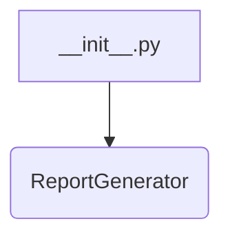

# <input code>

```python
## \file hypotez/src/endpoints/kazarinov/pricelist_generator/__init__.py
# -*- coding: utf-8 -*-

#! venv/bin/python/python3.12

"""
.. module:: src.endpoints.kazarinov.pricelist_generator 
	:platform: Windows, Unix
	:synopsis:

"""


from .pricelist_generator import ReportGenerator
```

# <algorithm>

Этот код импортирует класс `ReportGenerator` из модуля `pricelist_generator`.  Алгоритм работы крайне прост: он импортирует нужный класс.  Дальнейшая работа с этим классом (создание экземпляров, вызов методов) происходит в других частях проекта, которые используют этот модуль.



**Пример:**

В файле `__init__.py` не происходит никакой вычислительной или обработки данных логики.  Он просто предоставляет доступ к классу `ReportGenerator` для других модулей.  Функциональность этого класса определяется в файле `pricelist_generator.py`.

# <mermaid>


# <explanation>

* **Импорты:**
    * `from .pricelist_generator import ReportGenerator`:  Этот импорт извлекает класс `ReportGenerator` из модуля `pricelist_generator`, который находится в текущей директории (`.`) относительно файла `__init__.py`. Это стандартный способ импорта модулей, расположенных в одном пакете.  Это указывает на иерархическую структуру проекта: `src/endpoints/kazarinov/pricelist_generator` - это пакет, который содержит модули, связанные с генерацией прайс-листов.  `ReportGenerator` - это ключевой класс этого пакета.

* **Классы:**
    * `ReportGenerator`: Этот класс, скорее всего, определен в файле `pricelist_generator.py` внутри пакета `src.endpoints.kazarinov.pricelist_generator`.  Его функциональность пока не видна, так как код только импортирует этот класс.

* **Функции:**
    * Нет функций в этом коде.  Вся работа происходит на уровне классов.


* **Переменные:**
    * ``: Эта переменная, вероятно, определяет режим работы приложения (например, 'dev' для разработки, 'prod' для производства). Она нужна для конфигурации, но ее использование в данном примере не демонстрирует.

* **Возможные ошибки или улучшения:**

    * Нет явной проверки существования файла `pricelist_generator.py`. Если его нет, будет ошибка `ImportError`. Лучше использовать проверку или обработку исключений для повышения надежности кода.


* **Взаимосвязь с другими частями проекта:**

    Этот файл `__init__.py` является частью пакета, отвечающего за генерацию прайс-листов в рамках проекта.  Он предоставляет доступ к необходимым компонентам (классу `ReportGenerator`) для других модулей, которые будут использовать этот функционал.  Для получения более подробной информации о взаимосвязях нужно посмотреть код в `pricelist_generator.py`, а также те модули, которые импортируют `ReportGenerator` и, следовательно, извлекают из `__init__.py` функциональность.


**Вывод:**

Файл `__init__.py` играет роль точки входа в пакет `pricelist_generator`.  Он устанавливает связь между другими частями проекта, позволяя им получать доступ к функционалу класса `ReportGenerator`.