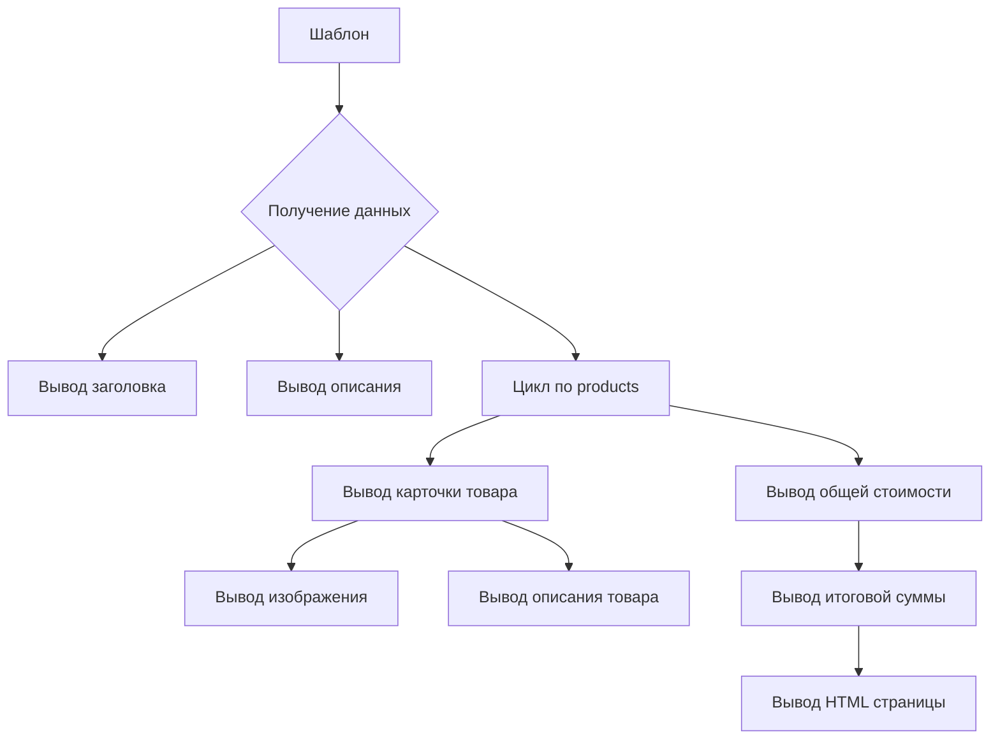

```MD
# Анализ HTML-шаблона для генерации прайс-листа

## <input code>

```html
<!DOCTYPE html>
<html>

<head>
    <meta charset="UTF-8">
    <meta name="viewport" content="width=device-width, initial-scale=1.0">
    <title>{{ title }}</title>
    <style>
        /* ... (стили CSS) ... */
    </style>
</head>

<body>
    <div class="container">
        <h1>{{ title }}</h1>
        <p class="lead">{{ description }}</p>

        <div class="row">
            \
            <div class="product-card">
                <h3>{{ product.product_title }}</h3>
                <div class="product-content">
                    
                    <div class="product-info">
                        <p>{{ product.product_description }}</p>
                        <p>{{ product.specification }}</p>
                    </div>
                </div>
            </div>
            
        </div>

        <div class="footer">
            <p>Общая стоимость:
                <span class="price-tag">{{ price }} {{ currency }}</span>
            </p>
        </div>
    </div>
</body>

</html>
```

## <algorithm>

Шаблон генерирует HTML-страницу с прайс-листом.  Алгоритм работы:

1. **Инициализация:** Получаются данные (`title`, `description`, `products`, `price`, `currency`).
2. **Вывод заголовка:** Выводится `title` страницы.
3. **Вывод описания:** Выводится `description`.
4. **Вывод списка товаров:**
   - Для каждого `product` в списке `products`:
     - Выводится карточка товара с `product_title`.
     - Выводится изображение товара по пути `image_local_saved_path`.
     - Выводятся `product_description` и `specification` товара.
5. **Вывод общей стоимости:** Выводится итоговая `price` и `currency`.

**Пример:**

Если `products` содержит 3 товара, то алгоритм проитерируется 3 раза, создавая 3 карточки товаров.  Данные `title`, `description`, `price`, `currency` и `products` должны быть доступны шаблону в момент его рендеринга.


## <mermaid>



## <explanation>

Этот код представляет собой HTML-шаблон, используемый для генерации страницы прайс-листа.  Он не содержит никакой логики, а является статическим шаблоном, который будет заполняться данными, полученными из какого-то другого источника.  Шаблон работает, используя язык шаблонов, скорее всего, Jinja2 (судя по использованию ``).


**Импорты:**

Нет импортов, так как это чистый HTML. Импортные модули Jinja2 или другого подобного механизма шаблонов необходимы для динамического заполнения данных в шаблоне, но они находятся вне данного шаблона.

**Классы:**

Нет классов.  Шаблон - это HTML, который описывает структуру страницы.

**Функции:**

Нет функций.  Шаблон - это HTML-структура, а не блок кода с функциями.

**Переменные:**

- `title`: Строка, представляющая заголовок прайс-листа.
- `description`: Строка, описывающая прайс-лист.
- `products`: Список (или итерируемый объект) товаров. Каждый элемент списка (`product`) должен иметь атрибуты `product_title`, `image_local_saved_path`, `product_description`, `specification`.
- `price`: Число, представляющее общую стоимость.
- `currency`: Строка, представляющая валюту.

**Возможные ошибки/улучшения:**

- **Отсутствие валидации данных:** Шаблон полагается на то, что данные, которые ему передаются (`products`, `price`, `currency`), будут корректного типа и формата. Без валидации могут возникнуть ошибки при выводе данных на страницу.
- **Условные выводы:**  В шаблоне нет механизмов для условного вывода, т.е. не будет отображаться "Общая стоимость" если не будет передан `price` или `currency`.
- **Сложные вычисления:**  Если логика вычисления общей стоимости сложная, стоит использовать отдельный обработчик данных, а не встраивать эти вычисления в сам шаблон.
- **Международность:** Шаблон не адаптирован к разным языкам и форматам отображения данных.

**Взаимосвязи с другими частями проекта:**

Этот шаблон зависит от другого кода (вероятно, контроллера или сервиса), который предоставляет ему необходимые данные: `title`, `description`, `products`, `price`, и `currency`.  Возможно, это часть API, которая возвращает эти данные.  Без этого кода шаблон не будет работать.