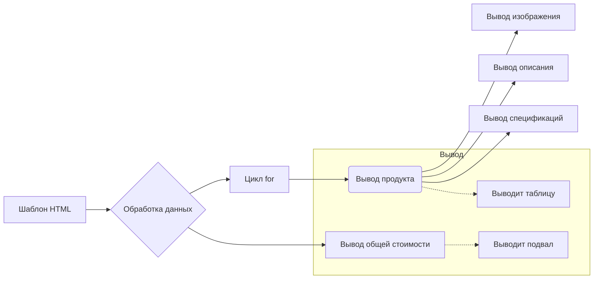

# <input code>

```html
<!DOCTYPE html>
<html dir="rtl">

<head>
    <meta charset="UTF-8">
    <meta name="viewport" content="width=device-width, initial-scale=1.0">
    <title>{{ title }}</title>
    <style>
        body {
            background-color: #ffffff; /* Белый фон */
            color: #000000; /* Черный текст */
            font-family: 'Segoe UI', Tahoma, Geneva, Verdana, sans-serif;
            margin: 0;
            padding: 0;
            direction: rtl; /* Направление текста справа налево */
        }
        h1 {
            text-align: center;
            margin-top: 50pt;
            font-size: 36pt;
        }
        .lead {
            text-align: center;
            font-size: 18pt;
            margin: 10pt 0;
        }
        .container {
            width: 90%;
            margin: 0 auto;
        }
        table {
            width: 100%;
            border-collapse: collapse;
            direction: rtl; /* Направление текста справа налево */
        }
        .product-card {
            background-color: #f8f9fa; /* Светлый фон карточек */
            border: 1pt solid #dee2e6;
            border-radius: 8pt;
            padding: 15pt;
            margin: 15pt 0;
            width: 100%;
            box-sizing: border-box;
        }
        .product-card h3 {
            margin-top: 0; /* Убираем верхний отступ у заголовка */
        }
        .product-card img {
            width: 150pt; /* Новая ширина */
            height: auto; /* Автоматическая высота, чтобы сохранить пропорции */
            object-fit: contain; /* Сохранение пропорций изображения */
            border-radius: 5pt;
            background-color: white; /* Белый фон под изображением */
            margin-left: 15pt; /* Отступ слева от изображения */
        }
        .product-info {
            flex: 1; /* Занимает оставшееся пространство */
        }
        .price-tag {
            background-color: #238636;
            color: white;
            padding: 5pt 10pt;
            border-radius: 5pt;
            font-weight: bold;
        }
        .footer {
            text-align: center;
            margin-top: 30pt;
            padding: 15pt;
            border-top: 1pt solid #dee2e6;
        }
    </style>
</head>

<body>
    <div class="container">
        <h1>{{ title }}</h1>
        <p class="lead">{{ description }}</p>

        <table>
            <tbody>
                \
                <tr class="product-card">\
                    <td>\
                        <h3>{{ product.product_title }}</h3>\
                        <table>\
                            <tr>\
                                <td>\
                                    \
                                </td>\
                                <td class="product-info">\
                                    <p>{{ product.product_description }}</p>\
                                    <p>{{ product.specification }}</p>\
                                </td>\
                            </tr>\
                        </table>\
                    </td>\
                </tr>\
                \
            </tbody>
        </table>

        <div class="footer">
            <p>מחיר כוךך הכל: <span class="price-tag">{{ price }} {{ currency }}</span></p>
        </div>
    </div>
</body>

</html>
```

# <algorithm>

**Шаг 1:**  Инициализация страницы.  
    *   Вывод заголовка `{{ title }}`.
    *   Выводит `{{ description }}`.
    *   Инициализируется таблица для вывода продуктов.

**Шаг 2:**  Итерация по продуктам.
    *   Для каждого продукта `product` в списке `products`:
        *   Создаётся строка таблицы `<tr>` с классом `product-card`.
        *   Выводит название продукта `{{ product.product_title }}`.
        *   Внутри таблицы встраивается картинка `{{ product.image_local_saved_path }}`.
        *   Выводит описание продукта `{{ product.product_description }}`.
        *   Выводит спецификации продукта `{{ product.specification }}`.

**Шаг 3:** Вывод итоговой стоимости.
    *   Выводит общую стоимость `{{ price }}`.
    *   Выводит валюту `{{ currency }}`.

**Пример:** Если `products` содержит два продукта, цикл `for` выполнится дважды, создавая две строки таблицы с информацией о каждом продукте.


# <mermaid>



# <explanation>

**Импорты:**  Нет импортов. Это шаблон HTML, использующий шаблонизатор (Django, Jinja2 и т.п.). Он не содержит логики, а лишь структуру вывода.


**Классы:**  Нет определенных классов.  Используются только HTML-элементы (теги).


**Функции:** Нет определенных функций. Шаблон использует переменные, переданные извне (например, `products`, `title`, `price`, `currency`).


**Переменные:**
  - `title`: Строка, содержащая заголовок страницы.
  - `description`: Строка, содержащая описание.
  - `products`: Список объектов продукта (возможно, из модели базы данных). Каждый объект содержит `product_title`, `image_local_saved_path`, `product_description`, `specification`.
  - `price`: Число, представляющее общую стоимость.
  - `currency`: Строка, содержащая обозначение валюты.


**Возможные ошибки или области для улучшений:**

*   **Связь с другими частями проекта:**  Шаблон ожидает, что переменные `title`, `description`, `products`, `price`, и `currency` будут доступны извне (например, Django view).  Необходимо убедиться, что эти переменные корректно заполняются и передаются в шаблон.
*   **Валидация данных:** Шаблон не проверяет корректность данных, которые получает. Например, `image_local_saved_path` может быть пустым или некорректным. Необходимо убедиться в валидации таких данных на стороне сервера.
*   **Локализация:**  Использование `dir="rtl"` и тексты на иврите предполагают, что шаблон предназначен для локализации. Это может потребовать дополнительных настроек и обработки данных для корректного отображения.

**Цепочка взаимосвязей:** Шаблон использует переменные, заполненные в коде сервера (например, в Django view), которые получаются из модели данных и контроллера.  Взаимодействие происходит через передачу данных.