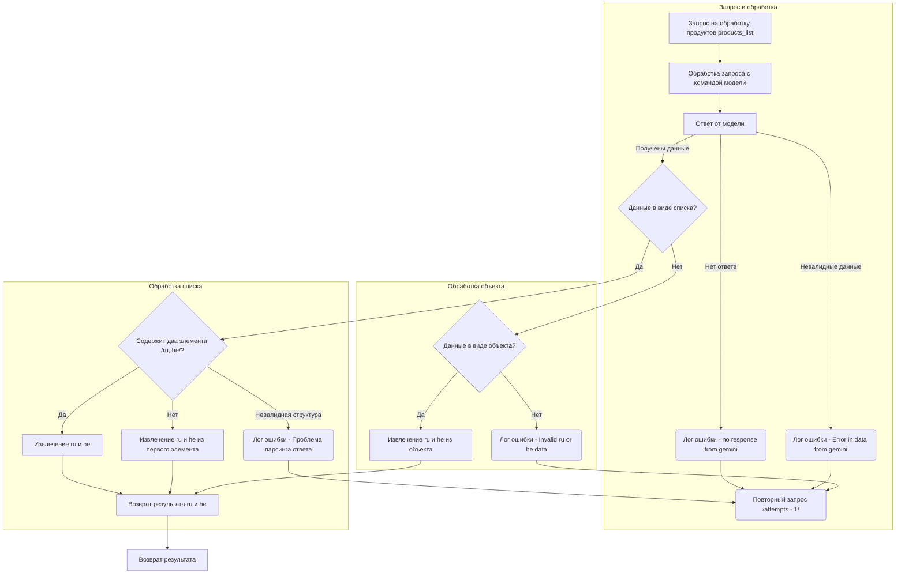

```MD
# Анализ кода (README.md)

## <algorithm>

Алгоритм обработки запросов на обработку продуктов `products_list` представлен в виде блок-схемы:

1. **Запрос на обработку продуктов:** Пользовательский запрос `products_list` отправляется на обработку.
2. **Обработка запроса с командой модели:** Запрос обрабатывается с использованием модели (например, Gemini).
3. **Ответ от модели:** Модель возвращает ответ.
4. **Проверка на отсутствие ответа:** Если ответа нет, происходит логирование ошибки `no response from gemini` и повторный запрос (уменьшение счетчика попыток).
5. **Проверка на валидность данных:** Если данные невалидны, происходит логирование ошибки `Error in data from gemini` и повторный запрос.
6. **Проверка на полученные данные:** Если данные получены, проверяется их тип (список или объект).
7. **Проверка структуры списка:** Если данные - список, проверяется, содержит ли он два элемента (ru, he). Если да, происходит извлечение этих элементов. Если нет, извлекаются `ru` и `he` из первого элемента списка. Если структура невалидна, происходит логирование ошибки `Проблема парсинга ответа` и повторный запрос.
8. **Проверка структуры объекта:** Если данные - объект, происходит извлечение `ru` и `he` из объекта. Если данные невалидны, происходит логирование ошибки `Invalid ru or he data` и повторный запрос.
9. **Возврат результата:** Если все проверки пройдены, результат (`ru`, `he`) возвращается.

**Примеры:**

* **Успешный запрос:** Запрос обработан, получен ответ в виде списка с двумя элементами (ru, he). Извлечение происходит корректно и возвращается результат.
* **Ошибка модели:** Модель не отвечает. Логируется ошибка, счетчик попыток уменьшается и запрос повторяется.
* **Невалидные данные:** Модель возвращает некорректные данные. Логируется ошибка, и запрос повторяется.
* **Неверный формат ответа:** Модель возвращает ответ не в виде списка или объекта. Логируется ошибка, и запрос повторяется.

Данные перемещаются между шагами алгоритма посредством функций, которые обрабатывают запросы, ответы, и возвращают результаты.


## <mermaid>



**Зависимости:**

Диаграмма отображает взаимодействие между различными этапами обработки запроса. Зависимости скрыты внутри блока обработки запроса, включая:

- Запросы к модели (Gemini или аналогичной).
- Логирование ошибок.
- Функции для извлечения данных из разных структур (списков и объектов).


## <explanation>

Данный код (в формате Mermaid) описывает алгоритм обработки запросов на обработку продуктов, а не  фрагмент Python кода.  Он представляет собой блок-схему процесса, демонстрирующую логику проверки и обработки ответа от модели.

- **Импорты:** Нет импортов.  Этот код представляет структуру алгоритма, а не фрагмент кода, который требует импортов из внешних библиотек.
- **Классы:** Нет классов.
- **Функции:** Нет функций.
- **Переменные:** Нет переменных. 

**Возможные ошибки/улучшения:**

- **Детали реализации:** Блок-схема не содержит деталей реализации. Нужно уточнить, как именно происходит извлечение данных из ответа модели (извлечение по ключу, обработка ошибок при отсутствии ключей, и т.д.).
- **Уровни логирования:** Не указан уровень детализации логирования ошибок (DEBUG, INFO, ERROR).
- **Обработка исключений:** Отсутствует информация об обработке потенциальных исключений (например, при работе с некорректными данными).
- **Переменные состояния:** Не указаны переменные, хранящие состояние процесса, например, количество попыток.

**Взаимосвязь с другими частями проекта:**

Необходимо знать, где происходит отправка запроса `products_list`.  Это напрямую связано с приложением, которое вызывает этот алгоритм.  Алгоритм, вероятнее всего, находится в части проекта, отвечающей за взаимодействие с моделью и обработку ответов.

**Выводы:**

Блок-схема хорошо иллюстрирует логику обработки запроса, но не содержит деталей реализации, что требует дальнейшей проработки применительно к конкретному проекту.