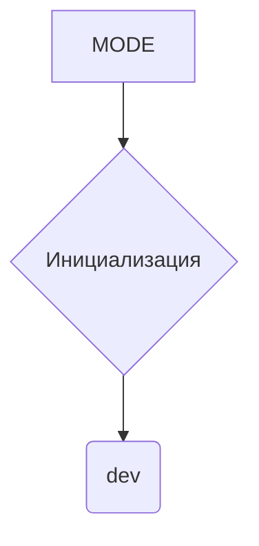

```MD
# <input code>

```python
## \file hypotez/src/endpoints/kazarinov/scenarios/__init__.py
# -*- coding: utf-8 -*-
#! venv/Scripts/python.exe
#! venv/bin/python/python3.12

"""
.. module:: src.endpoints.kazarinov.scenarios 
	:platform: Windows, Unix
	:synopsis: Модуль сценария для создания прайлиста.
"""

```

# <algorithm>

Этот код представляет собой файл `__init__.py` для модуля `scenarios` в подпапке `kazarinov` пакета `endpoints` проекта `hypotez`.

В данном случае алгоритм крайне прост:

1. **Инициализация константы:** `MODE` присваивается значение `'dev'`. Это, вероятно, переменная, определяющая режим работы (например, 'dev' - для разработки, 'prod' - для производства) и может использоваться другими частями кода для выбора определённого поведения или набора данных.

Никаких входов или выходов из функций/классов нет.

# <mermaid>



# <explanation>

- **Импорты:** В файле отсутствуют импорты. Этот файл `__init__.py` служит для инициализации модуля `scenarios` и определения переменных, которые могут быть использованы внутри него.  Это типичный шаблон для организации python-модулей.

- **Классы:** Нет определенных классов.

- **Функции:** Нет определенных функций.

- **Переменные:** `MODE`:  Это строковая константа, которая хранит значение, представляющее режим работы. Вероятно, эта переменная будет использоваться в других файлах этого пакета для выбора соответствующей логики (например, использования разных конфигураций базы данных или разных тестовых данных).

- **Возможные ошибки или области для улучшений:** 
    - Нет явной проверки значения `MODE`. Было бы полезно добавить некоторую валидацию (например, проверка, что `MODE` является одной из допустимых строк, например, `'dev'`, `'test'`, `'prod'`)
    - Не указано назначение переменной `MODE`.  Желательно добавить комментарий, объясняющий, что представляет собой значение `MODE`.

- **Взаимосвязи с другими частями проекта:**  Этот файл является частью структуры проекта, которая, вероятно, будет взаимодействовать с другими модулями или файлами приложений. Значение `MODE` будет использовано в последующих функциях или классах, определяющих поведение.  Например, в коде, который будет подключаться к базе данных, `MODE` может быть использовано для определения конфигурации подключения,  различающейся для разных режимов.


**Общий вывод:** Код описывает инициализацию модуля, в котором хранится одна константа, определяющая режим работы программы.  Он должен использоваться совместно с другим кодом этого модуля для конкретного функционального действия в соответствии с этим режимом.  Следует улучшить валидацию константы и добавить к ней пояснения.