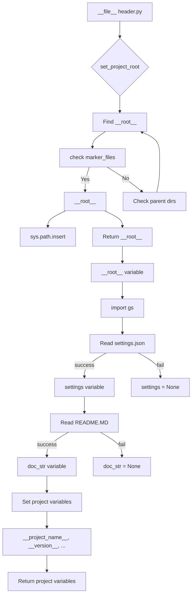

# <input code>

```python
## \file hypotez/src/endpoints/kazarinov/scenarios/header.py
# -*- coding: utf-8 -*-
#! venv/Scripts/python.exe
#! venv/bin/python/python3.12

"""
.. module:: src.endpoints.kazarinov.scenarios 
	:platform: Windows, Unix
	:synopsis:

"""
MODE = 'dev'

import sys
import json
from packaging.version import Version

from pathlib import Path
def set_project_root(marker_files=('__root__')) -> Path:
    """
    Finds the root directory of the project starting from the current file's directory,
    searching upwards and stopping at the first directory containing any of the marker files.

    Args:
        marker_files (tuple): Filenames or directory names to identify the project root.
    
    Returns:
        Path: Path to the root directory if found, otherwise the directory where the script is located.
    """
    __root__:Path
    current_path:Path = Path(__file__).resolve().parent
    __root__ = current_path
    for parent in [current_path] + list(current_path.parents):
        if any((parent / marker).exists() for marker in marker_files):
            __root__ = parent
            break
    if __root__ not in sys.path:
        sys.path.insert(0, str(__root__))
    return __root__


# Get the root directory of the project
__root__ = set_project_root()
"""__root__ (Path): Path to the root directory of the project"""

from src import gs

settings:dict = None
try:
    with open(gs.path.root / 'src' /  'settings.json', 'r') as settings_file:
        settings = json.load(settings_file)
except (FileNotFoundError, json.JSONDecodeError):
    ...

doc_str:str = None
try:
    with open(gs.path.root / 'src' /  'README.MD', 'r') as settings_file:
        doc_str = settings_file.read()
except (FileNotFoundError, json.JSONDecodeError):
    ...


__project_name__ = settings.get("project_name", 'hypotez') if settings  else 'hypotez'
__version__: str = settings.get("version", '')  if settings  else ''
__doc__: str = doc_str if doc_str else ''
__details__: str = ''
__author__: str = settings.get("author", '')  if settings else ''
__copyright__: str = settings.get("copyrihgnt", '')  if settings else ''
__cofee__: str = settings.get("cofee", "Treat the developer to a cup of coffee for boosting enthusiasm in development: https://boosty.to/hypo69")  if settings else "Treat the developer to a cup of coffee for boosting enthusiasm in development: https://boosty.to/hypo69"
```

# <algorithm>

**Шаг 1:**  Функция `set_project_root` ищет корень проекта.
    - Принимает список маркеров (файлов или каталогов), которые указывают на корень проекта.
    - Начинает поиск с текущей директории файла, в котором она вызывается.
    - Перебирает родительские каталоги, пока не найдет каталог, содержащий хотя бы один из маркеров.
    - Если корень проекта найден, добавляет его в `sys.path`.
    - Возвращает найденный корень проекта.

**Шаг 2:** Вызов `set_project_root()`.
   - Запись найденного корня в глобальную переменную `__root__`.

**Шаг 3:** Импорт модуля `gs` из пакета `src`.
   - Доступ к `gs` в последующих строках.

**Шаг 4:**  Чтение `settings.json`
   - Попытка открыть `settings.json` в корне проекта.
   - Если файл найден и корректно отформатирован, загружает его содержимое в `settings`.

**Шаг 5:** Чтение `README.MD`
   - Попытка открыть `README.MD` в корне проекта.
   - Если файл найден, то его содержимое сохраняется в `doc_str`.

**Шаг 6:** Установка переменных проекта.
    - Используя метод `get()` для извлечения данных из словаря `settings` для:
        - `__project_name__`
        - `__version__`
        - `__author__`
        - `__copyright__`
        - `__cofee__`
    - Если `settings` не задан, используется значение по умолчанию.
    - `__doc__` присваивает значение из `doc_str`.

**Пример:**  Если `settings.json` содержит `{ "project_name": "MyProject", "version": "1.0.0" }`, то `__project_name__` будет равно "MyProject", а `__version__` - "1.0.0".


# <mermaid>



**Описание диаграммы:**

Диаграмма описывает последовательность действий при исполнении кода. Начинается с вызова функции `set_project_root` для определения корня проекта. Затем происходит чтение файлов `settings.json` и `README.MD` и установка переменных проекта. Итогом являются установленные переменные проекта, например, `__project_name__`, `__version__`.


# <explanation>

**Импорты:**

- `sys`: предоставляет доступ к системным переменным, в частности `sys.path` для управления поиском модулей.
- `json`: используется для работы с JSON-файлами, что позволяет парсить и сериализовать данные в формате JSON.
- `packaging.version`: для работы с версиями пакетов, но в данном контексте не используется для проверки версий.
- `pathlib`: предоставляет класс `Path` для работы с файлами и каталогами, обеспечивая переносимый способ обращения к файлам.
- `gs`:  очевидно, это внутренний модуль из пакета `src`. Он нужен, чтобы получить путь к корню проекта.  Необходимость в нём обусловлена структурой проекта, где модуль `gs` предоставляет вспомогательные функции для работы с путями.


**Классы:**

- Нет пользовательских классов в данном коде.


**Функции:**

- `set_project_root(marker_files) -> Path`: находит корневую директорию проекта, начиная с текущей директории и перебирая родительские каталоги до тех пор, пока не найдет папку содержащую хотя бы один из файлов `marker_files`. Если такой корень не найден, возвращает текущую директорию.


**Переменные:**

- `MODE`: Строковая константа, указывающая на режим работы.
- `__root__`:  Путь к корневой директории проекта.
- `settings`: Словарь, содержащий настройки проекта, считываемые из `settings.json`.
- `doc_str`: Строка, содержащая содержимое файла README.MD.
- `__project_name__`, `__version__`, `__doc__`, `__details__`, `__author__`, `__copyright__`, `__cofee__`:  Глобальные переменные, содержащие информацию о проекте. Они получены из `settings.json`, если тот существует, и имеют значения по умолчанию в противном случае.
- `marker_files`: кортеж, содержащий список файлов, которые используются для определения корня проекта.
- `current_path`: временная переменная, содержащая путь к текущему файлу.

**Возможные ошибки и улучшения:**

- **Обработка исключений:**  Обработка `FileNotFoundError` и `json.JSONDecodeError` в `try...except` блоках - хорошая практика, но было бы лучше использовать более информативные сообщения об ошибках. Например, вывести имя файла, который не найден или не может быть прочитан.
- **Переменные с двойными подчеркиваниями:**  Использование `__root__`, `__project_name__`, и т.д. не рекомендуется для обычных глобальных переменных в Python. Это может привести к путанице с именами, защищенными с помощью двойных подчеркиваний. Лучше переименовать в `project_root`, `project_name` и т.д.
- **Явное указание кодировки в `with open(...)`**: В `with open(...)` лучше явно указывать кодировку файла, например: `with open(gs.path.root / 'src' / 'settings.json', 'r', encoding='utf-8') as settings_file:`
- **Проверка типа данных:**  В некоторых случаях (например, при чтении из `settings.json`) полезно проверять, что полученный тип данных соответствует ожидаемому.
- **Документация для `gs`:**  Необходимо наличие документации для внутренних модулей, например `gs`, чтобы другие разработчики понимали, как им пользоваться.


**Взаимосвязь с другими частями проекта:**

Код в `header.py` устанавливает важные переменные, которые используются по всему проекту для доступа к корню проекта, настройкам и документации.  Это является основой для работы других модулей в `hypotez`.  Связь реализуется через импорт модуля `gs` и использование пути к корню проекта (`__root__`) для доступа к файлам настроек и документации.