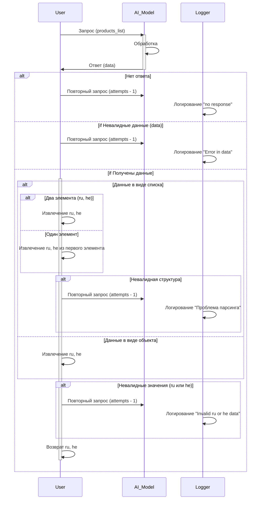

```MD
# Анализ кода

**1. <input code>**

```sequenceDiagram
    participant User
    participant AI_Model
    participant Logger
    
    User->>AI_Model: Запрос на обработку продуктов (products_list)
    AI_Model->>AI_Model: Обработка запроса с командой модели
    AI_Model->>User: Ответ от модели

    alt Нет ответа от модели
        Logger->>Logger: Логирирование ошибки "no response from gemini"
        User->>AI_Model: Повторный запрос (attempts - 1)
    end

    alt Невалидные данные (data)
        Logger->>Logger: Логирирование ошибки "Error in data from gemini"
        User->>AI_Model: Повторный запрос (attempts - 1)
    end

    alt Получены данные (data)
        alt Данные в виде списка
            alt Два элемента (ru, he)
                User->>User: Извлечение ru и he
            end
            alt Один элемент
                User->>User: Извлечение ru и he из первого элемента
            end
            alt Невалидная структура данных
                Logger->>Logger: Логирирование ошибки "Проблема парсинга ответа"
                User->>AI_Model: Повторный запрос (attempts - 1)
            end
        end

        alt Данные в виде объекта
            User->>User: Извлечение ru и he из объекта
        end

        alt Невалидные значения (ru или he)
            Logger->>Logger: Логирирование ошибки "Invalid ru or he data"
            User->>AI_Model: Повторный запрос (attempts - 1)
        end

        User->>User: Возврат результата ru и he
    end
```

**2. <algorithm>**

Блок-схема описывает алгоритм обработки запроса на обработку списка продуктов.  В коде представлена последовательность действий пользователя, модели и логирования. Алгоритм состоит из следующих этапов:

1. **Запрос пользователя:**  Пользователь отправляет запрос на обработку списка продуктов (products_list) к модели.
2. **Обработка запроса моделью:** Модель обрабатывает запрос, используя свою логику.
3. **Ответ модели:** Модель возвращает результат.
4. **Обработка ответа:**
   - **Проверка ответа:**  Проверяется наличие ответа, валидность данных и их структура.
   - **Обработка ошибок:** Если ответ отсутствует, невалидный или имеет неправильную структуру, записываются ошибки в логи. Запрос повторяется с уменьшением попыток.
   - **Извлечение данных:** Если ответ валидный, извлекаются нужные данные (ru и he) в зависимости от формата ответа (список или объект).
5. **Возврат результата:** Пользователю возвращаются извлеченные данные.


**3. <mermaid>**




**4. <explanation>**

* **Импорты:**  В коде отсутствуют импорты, так как это диаграмма последовательности, а не код на каком-либо языке программирования.
* **Классы:** Нет классов, только участники (User, AI_Model, Logger).
* **Функции:** Нет функций, только описание действий.
* **Переменные:**  Переменные `products_list`, `attempts` и др. могут представлять данные, передаваемые между User и AI_Model.
* **Возможные ошибки и улучшения:**  Диаграмма не содержит реализации конкретных действий, которые должны быть выполнены. Необходимо добавить детали о том, как данные будут парситься, и какой формат ответа ожидается.  Не указано, как хранятся, и как используются переменные `attempts` и `data`.


**Взаимосвязь с другими частями проекта:**

Диаграмма описывает взаимодействие между пользователем, моделью и логированием, но не показывает, как эти компоненты взаимодействуют с другими частями проекта (например, с API обработки данных, или с базами данных).  Для полного анализа, необходимо посмотреть код, который генерирует эту диаграмму последовательности и использует ее.