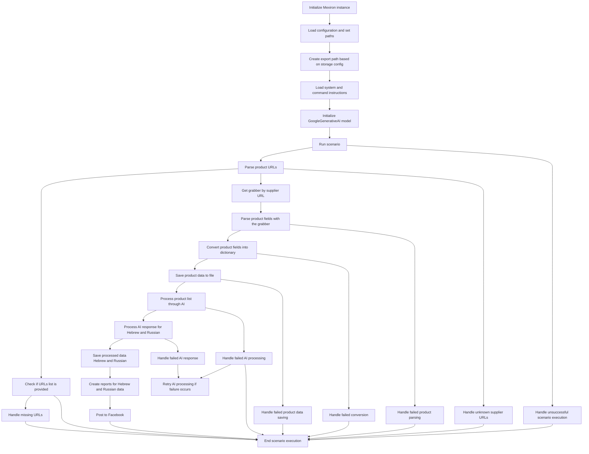

```MD
# Анализ кода сценария pricelist

## <input code>



## <algorithm>

Блок-схема описывает последовательность действий сценария pricelist.  Сценарий начинается с инициализации экземпляра Mexiron, загрузки конфигурации, определения пути экспорта, загрузки инструкций, инициализации модели Google GenerativeAI, и запуска сценария.  Далее происходит парсинг URL-адресов продуктов, проверка списка URL-адресов, обработка отсутствующих URL-адресов, получение парсера (grabber) по URL поставщика, парсинг полей продукта, конвертация в словарь, сохранение данных о продуктах в файл, обработка списка продуктов с помощью AI, обработка ответа AI для языков иврит и русский, сохранение обработанных данных, генерация отчётов и публикация на Facebook. Есть обработка ошибок на каждом шаге и возможность ретрия AI обработки.

## <mermaid>

```mermaid
graph TD
    subgraph Init
        InitMexiron --> LoadConfig
        LoadConfig --> CreateExportPath
        CreateExportPath --> LoadInstructions
        LoadInstructions --> InitializeAI
    end
    subgraph RunScenario
        InitializeAI --> RunScenario
        RunScenario --> ParseURLs
        RunScenario --> HandleScenarioFailure
    end
    subgraph DataProcessing
        ParseURLs --> CheckURLs
        CheckURLs -- Success --> GetGrabber
        CheckURLs -- Failure --> HandleMissingURLs --> EndScenario
        GetGrabber --> ParseFields
        ParseFields -- Success --> ConvertToDict
        ParseFields -- Failure --> HandleParseFailure --> EndScenario
        ConvertToDict --> SaveToFile
        SaveToFile --> ProcessWithAI
        ProcessWithAI --> HandleAIProcessingFailure
        ProcessWithAI -- Success --> HandleAIResponse
        HandleAIResponse -- Success --> SaveProcessedData
        HandleAIResponse -- Failure --> HandleAIResponseFailure --> RetryAI
        SaveProcessedData --> GenerateReports
        GenerateReports --> PostToFacebook
    end
    PostToFacebook --> EndScenario
    HandleScenarioFailure --> EndScenario
    HandleParseFailure --> EndScenario
    HandleConversionFailure --> EndScenario
    HandleSaveFailure --> EndScenario
    HandleAIProcessingFailure --> EndScenario
    HandleMissingURLs --> EndScenario
    subgraph ErrorHandling
        ParseURLs --> HandleUnknownSupplierURLs --> EndScenario
        ParseFields --> HandleParseFailure --> EndScenario
        ConvertToDict --> HandleConversionFailure --> EndScenario
        SaveToFile --> HandleSaveFailure --> EndScenario
        ProcessWithAI --> HandleAIProcessingFailure --> RetryAI
        HandleAIResponseFailure --> RetryAI
    end


```

## <explanation>

**Импорты:**  В данном коде импортов нет.  Диаграмма описывает последовательность вызовов функций и обработку ошибок в рамках сценария pricelist.

**Классы:**  Диаграмма описывает работу сценария, но не содержит определений классов.

**Функции:**  Диаграмма изображает последовательность вызовов функций, таких как `Initialize Mexiron`, `Load configuration`, `Create export path`, `LoadInstructions`, `InitializeAI`, `RunScenario`, `ParseURLs`,  `ParseFields`, `ConvertToDict`, `SaveToFile`, `ProcessWithAI`, `HandleAIResponse`, `SaveProcessedData`, `GenerateReports`, `PostToFacebook`, и обработку ошибок.  Не указано, какие именно аргументы принимают и возвращают эти функции, но видно, что они связаны по логике выполнения.

**Переменные:**  Диаграмма не показывает определения переменных, но предполагает, что используются переменные, хранящие конфигурацию, пути к файлам, результаты парсинга, данные о продуктах и т.д.

**Возможные ошибки/улучшения:**

* Отсутствуют детали о возвращаемых значениях функций, обработке исключений и детальном взаимодействии с Google GenerativeAI.
* Не указана логика обработки ретриев (RetryAI).
* Нет информации о структуре данных, используемых на разных этапах.
* Не указаны типы данных для переменных.

**Цепочка взаимосвязей:**  Сценарий pricelist, очевидно, зависит от конфигурации системы, библиотек для работы с Google GenerativeAI, парсеров (grabber) для различных поставщиков.


**Общая оценка:** Диаграмма представляет собой хороший стартовый анализ, но требует расширения, чтобы быть полезной для реализации. Она показывает, как части системы взаимодействуют друг с другом, но не описывает конкретное взаимодействие.