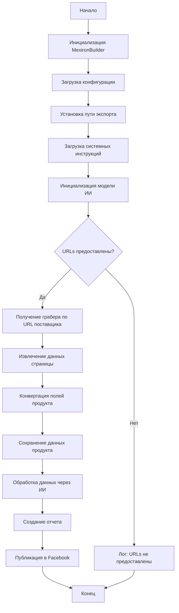

```MD
# Анализ кода сценария создания мехирона для Сергея Казаринова

## <input code>

```
## Сценарий создания мехирона для Сергея Казаринова

... (описание, возможности, легенда, блок-схема, классы, методы)
```

## <algorithm>

Блок-схема описывает алгоритм работы сценария, который можно представить как последовательность действий:

1. **Инициализация `MexironBuilder`**:  Создается экземпляр класса `MexironBuilder`.  Передается драйвер Selenium для взаимодействия с веб-страницами.  Возможны дополнительные инициализирующие параметры, как `mexiron_name`.
2. **Загрузка конфигурации**: Загружается конфигурация из JSON файла. Данные конфигурации нужны для настройки параметров сценария.
3. **Установка пути экспорта**: Определяется директория для сохранения результатов.
4. **Загрузка системных инструкций**: Загружаются инструкции для модели ИИ.
5. **Инициализация модели ИИ**: Инициализируется модель Google Generative AI.
6. **Проверка наличия URL**: Проверяется, имеются ли предоставленные URL адреса товаров.
7. **Получение грабера по URL**: Если URL имеются, выбирается соответствующий грабер (для разных поставщиков) для извлечения данных.
8. **Извлечение данных страницы**: Грабер извлекает данные с указанной страницы.
9. **Конвертация полей продукта**: Извлеченные данные преобразуются в структурированный формат (словарь).
10. **Сохранение данных продукта**: Данные сохраняются в файл (возможна база данных).
11. **Обработка данных через ИИ**: Обработанные данные передаются в модель ИИ для дальнейшей обработки.
12. **Создание отчета**:  Генерируются HTML и PDF отчеты на основе обработанных данных.
13. **Публикация в Facebook**: Данные публикуются в Facebook.
14. **Конец**: Выполнение сценария завершено.


**Пример:**

Если `urls` содержит `['url1', 'url2']`, грабер для `url1` извлекает данные, грабер для `url2` извлекает данные, и т.д.  Далее данные обрабатываются и сохраняются.

**Перемещение данных:**

Данные перемещаются между шагами через аргументы функций и атрибуты класса `MexironBuilder`.  `urls` передаются в метод `run_scenario`, данные из `GrabPage` передаются в `ConvertFields`, из `ConvertFields` - в `SaveData`, и так далее по цепочке.


## <mermaid>



**Зависимости:**

Диаграмма отображает поток управления и взаимодействие компонентов.  Зависимости на внешних библиотеках (Selenium, asyncio, pathlib, typing) и  модулях приложения (`src.ai.gemini`, `src.suppliers.*.graber`, `src.endpoints.advertisement.facebook.scenarios`) не отображаются прямо в диаграмме, но они используются в реализации соответствующих функций.

## <explanation>

**Импорты:**

Импорты обеспечивают подключение необходимых библиотек и модулей.  `src.` указывает на модули приложения. Например, `src.ai.gemini` подключает функционал ИИ обработки данных, `src.suppliers.*.graber` — различные граберы для разных поставщиков, а `src.endpoints.advertisement.facebook.scenarios` отвечает за публикацию в Facebook.

**Классы:**

`MexironBuilder` — основной класс сценария. Он отвечает за инициализацию, выполнение сценария (`run_scenario`), взаимодействие с поставщиками (`get_graber_by_supplier_url`), обработку данных (`convert_product_fields`, `save_product_data`, `process_ai`), создание отчётов (`create_report`) и публикацию в Facebook (`post_facebook`).  Важно отметить, что `Driver` (Selenium WebDriver) передается в конструктор класса, что означает его использование для управления браузером.

**Функции:**

* `run_scenario`: Основная функция, запускающая весь сценарий, принимающая  данные (URL) и инструкцию для обработки.
* `get_graber_by_supplier_url`: Определяет подходящий грабер для извлечения данных с конкретной страницы.
* `convert_product_fields`, `save_product_data`, `process_ai`, `create_report`, `post_facebook`:  Эти функции реализуют разные этапы обработки данных.

**Переменные:**

Переменные хранят данные, например, `urls`, `system_instruction`, `export_path`, `products_list` — все они влияют на выполнение сценария.

**Возможные ошибки и улучшения:**

* **Обработка исключений:**  В коде требуется более подробная обработка исключений (например, исключения `selenium` и другие).
* **Проверка валидности данных:** Необходимо добавить проверку валидности полученных данных на разных этапах, чтобы избежать ошибок обработки.
* **Логирование:**  Внедрение логирования, которое позволит отследить ход выполнения сценария, позволит найти и исправить ошибки.
* **Параллелизация:** Для увеличения производительности можно рассмотреть возможности параллельного выполнения запросов к различным поставщикам или выполнение отдельных операций асинхронно.


**Взаимосвязи:**

Сценарий тесно связан с другими частями проекта (`src.`), используя модули для работы с ИИ, поставщиками и публикацией в Facebook.  Правильная структура пакета и импорты, определённые в `src.`, показывают эти взаимосвязи.