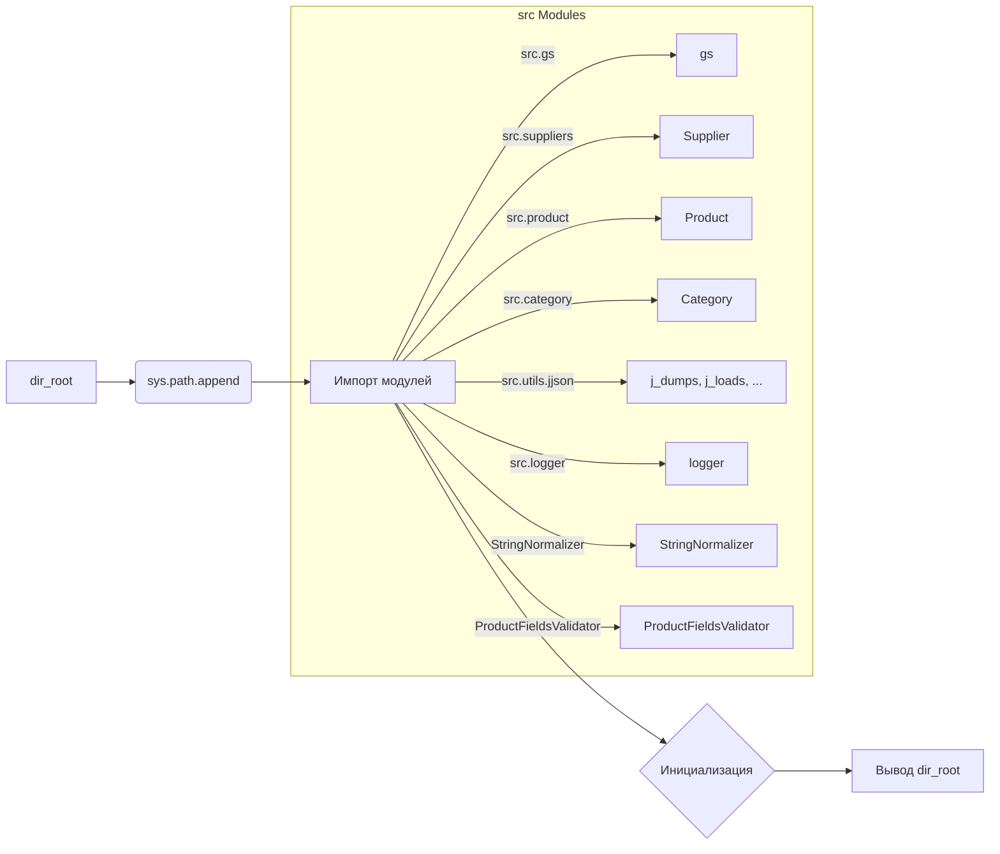

```MD
# Анализ кода hypotez/src/endpoints/prestashop/_examples/header.py

## <input code>

```python
## \file hypotez/src/endpoints/prestashop/_examples/header.py
# -*- coding: utf-8 -*-
#! venv/Scripts/python.exe
#! venv/bin/python/python3.12

"""
.. module:: src.endpoints.prestashop._examples 
	:platform: Windows, Unix
	:synopsis:

"""
MODE = 'dev'

"""
	:platform: Windows, Unix
	:synopsis:

"""

"""
	:platform: Windows, Unix
	:synopsis:

"""


"""
  :platform: Windows, Unix

"""
"""
  :platform: Windows, Unix
  :platform: Windows, Unix
  :synopsis:
"""MODE = 'dev'
  
""" module: src.endpoints.prestashop._examples """


import sys
import os
from pathlib import Path

dir_root : Path = Path (os.getcwd()[:os.getcwd().rfind('hypotez')+11])
sys.path.append (str (dir_root) )  # Добавляю корневую папку в sys.path
dir_src = Path (dir_root, 'src')
sys.path.append (str (dir_root) ) 
...

print(dir_root)
# ----------------
from pathlib import Path
import json
import re
# ----------------

from src import gs
from src.suppliers import Supplier
from src.product import Product, ProductFields, ProductFieldsLocators
from src.category import Category
from src.utils.jjson import j_dumps, j_loads,   pprint, save_text_file
from src.logger import logger
, StringNormalizer, ProductFieldsValidator
...
```

## <algorithm>

Алгоритм работы кода представляет собой инициализацию и настройку среды выполнения, а также импорт необходимых модулей.

1. **Установка корневой директории проекта:** Код определяет `dir_root`, получая путь к корневой директории проекта `hypotez`.
2. **Добавление корневой директории в `sys.path`:**  Этот шаг критически важен для корректного импорта модулей из подпапок проекта. Он добавляет путь к корневой директории в список поиска модулей Python.
3. **Импорт необходимых модулей:** Код импортирует модули `sys`, `os`, `Path` (для работы с путями), `json` и другие.  Ключевые импорты из пакета `src` (например, `gs`, `Supplier`, `Product`, `Category`, `j_dumps`, `j_loads`, `logger`).


**Пример:**

Если корневой директории проекта `hypotez` находится в `/home/user/projects/hypotez/`, то `dir_root` будет равен `/home/user/projects/hypotez/`.  `sys.path` будет дополнен этим путем.

## <mermaid>



## <explanation>

**Импорты:**

- `sys`, `os`: Стандартные библиотеки Python для работы с системными переменными и операционной системой соответственно.
- `pathlib`: Модуль для работы с путями к файлам и каталогам, что обеспечивает более безопасную и читабельную работу с файловой системой.
- `json`: Модуль для работы с JSON-данными.
- `re`: Модуль для работы с регулярными выражениями.
- `gs`, `Supplier`, `Product`, `Category`, `j_dumps`, `j_loads`, `logger`, `StringNormalizer`, `ProductFieldsValidator`: Эти импорты относятся к модулям, вероятно, созданным внутри проекта `hypotez`.  Ключевые модули из пакета `src`. Их назначение неясно без контекста кода в других файлах пакета `src`.

**Классы:**

- `Supplier`, `Product`, `Category`: Вероятно, представляют собой классы для работы с поставщиками, продуктами и категориями товаров в системе. Подробнее об этих классах, их атрибутах и методах можно узнать из соответствующих файлов проекта `src`.

**Функции:**

Функции из импортированных модулей (`j_dumps`, `j_loads`, `pprint`, `save_text_file`, возможно другие) определены в модулях `src.utils.jjson` и `src.logger`.  Их точное назначение не определено в данном фрагменте.

**Переменные:**

- `dir_root`: Тип `Path`. Содержит путь к корневой директории проекта.
- `dir_src`: Тип `Path`. Содержит путь к директории `src`.
- `MODE`: Строковая переменная, вероятно, определяющая режим работы системы ('dev' в данном примере).

**Возможные ошибки или области для улучшений:**

- **Неполные импорты:**  Часть импорта `from src.logger import logger, ...` завершается запятыми, и следующая строка кода  обрезана.  Неясно, какие именно классы или функции были импортированы из этого модуля.
- **Пустые строковые комментарии:**  Некоторые строки комментариев являются пустыми.
- **Комментарии `:platform`, `:synopsis`:** Нужно понять, для чего эти комментарии нужны. Возможно, это информация для документации или генерации кода.
- **Многоточие (`...`):** Многоточие указывает на отсутствие части кода. Это затрудняет понимание полного контекста и работы программы. Необходимо рассмотреть фрагменты кода, предшествующие и следующие за многоточием.

**Взаимосвязи с другими частями проекта:**

Импорт модулей `src.suppliers`, `src.product`, `src.category`, `src.utils.jjson`, `src.logger` свидетельствует о том, что эти модули находятся в других частях проекта `hypotez`.  Они, вероятно, содержат бизнес-логику для работы с данными продуктов, поставщиков, категорий и т.д.