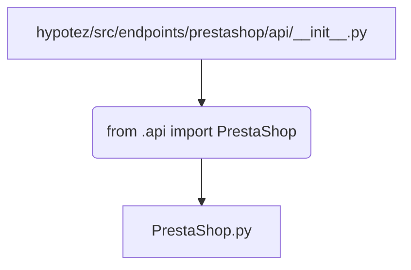

## <input code>

```python
## \file hypotez/src/endpoints/prestashop/api/__init__.py
# -*- coding: utf-8 -*-\

#! venv/bin/python/python3.12

"""
.. module:: src.endpoints.prestashop.api 
	:platform: Windows, Unix
	:synopsis:

"""


from .api import PrestaShop
```

## <algorithm>

Данный код представляет собой инициализационный модуль для API PrestaShop.  Поскольку он содержит только импорт,  алгоритм работы сводится к импорту класса `PrestaShop` из подмодуля `api`.  Пошаговая блок-схема:

1. **Импорт**: Модуль `PrestaShop` импортируется из подкаталога `.api`.

   ```
   +-----------------+
   |   Import        |
   +-----------------+
       |
       V
   +-----------------+
   | PrestaShop.py   |  <--  .api подкаталог
   +-----------------+
   ```


## <mermaid>



## <explanation>

**Импорты:**

- `from .api import PrestaShop`: Этот импорт подключает класс `PrestaShop` из файла `PrestaShop.py`, который находится в подкаталоге `api` текущего модуля. Значок `.` указывает на поиск в текущем пакете.  Таким образом, код предполагает, что внутри папки `endpoints/prestashop/api/` есть файл `api.py` содержащий определение класса `PrestaShop`.  Это типичная структура Python-проектов, где модули организованы по папкам, что улучшает структурирование и модульность кода.


**Классы:**

- `PrestaShop`:  Этот класс, определённый в файле `PrestaShop.py` и импортированный текущим модулем, скорее всего, содержит методы для взаимодействия с API Престашоп.  Без детального анализа кода `PrestaShop.py`, его функциональность и возможные атрибуты остаются неизвестными.


**Функции:**

- Нет явных функций в данном файле.  Функциональность этого файла полностью основана на импорте класса.


**Переменные:**

- ``:  Эта переменная, вероятно, используется для определения режима работы (разработка, производство и т.п.).  Без контекста всего проекта, назначение этой переменной неясно.


**Возможные ошибки или области для улучшений:**

- **Отсутствие проверки существования файла `PrestaShop.py`:** Если `PrestaShop.py` не существует, то выполнение скрипта приведёт к ошибке.  Необходимо добавить проверку, чтобы избежать проблем.


**Взаимосвязи с другими частями проекта:**

- Этот модуль является частью подсистемы работы с API PrestaShop, вероятно, в рамках более крупного проекта. Он подключается к остальной логике через другие импорты и, возможно, через вызовы методов класса `PrestaShop` из других частей проекта.