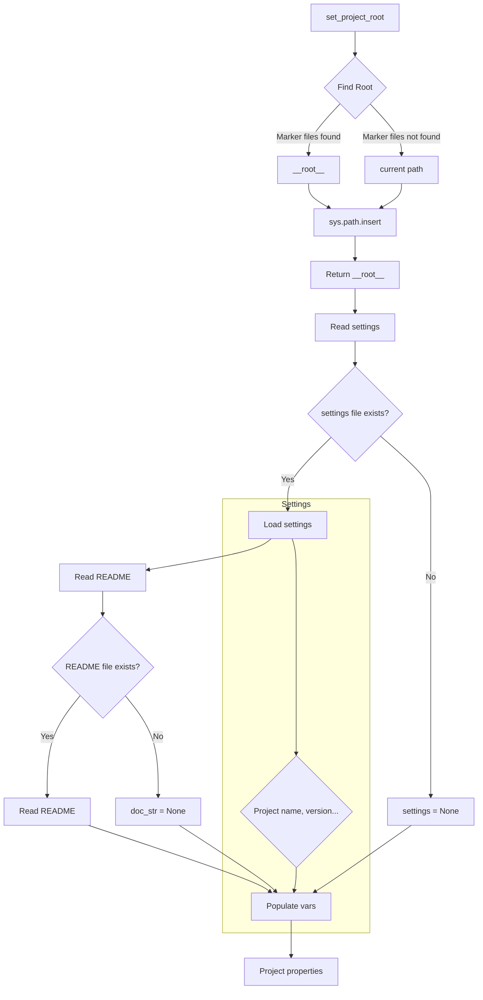

```MD
# <input code>

```python
## \file hypotez/src/endpoints/prestashop/api/header.py
# -*- coding: utf-8 -*-\
#! venv/Scripts/python.exe
#! venv/bin/python/python3.12

"""
.. module:: src.endpoints.prestashop.api 
	:platform: Windows, Unix
	:synopsis:

"""


import sys
import json
from packaging.version import Version

from pathlib import Path
def set_project_root(marker_files=('__root__','.git')) -> Path:
    """ Finds the root directory of the project starting from the current file's directory,
    searching upwards and stopping at the first directory containing any of the marker files.

    Args:
        marker_files (tuple): Filenames or directory names to identify the project root.
    
    Returns:
        Path: Path to the root directory if found, otherwise the directory where the script is located.
    """
    __root__:Path
    current_path:Path = Path(__file__).resolve().parent
    __root__ = current_path
    for parent in [current_path] + list(current_path.parents):
        if any((parent / marker).exists() for marker in marker_files):
            __root__ = parent
            break
    if __root__ not in sys.path:
        sys.path.insert(0, str(__root__))
    return __root__


# Get the root directory of the project
__root__ = set_project_root()
"""__root__ (Path): Path to the root directory of the project"""

from src import gs

settings:dict = None
try:
    with open(gs.path.root / 'src' /  'settings.json', 'r') as settings_file:
        settings = json.load(settings_file)
except (FileNotFoundError, json.JSONDecodeError):
    ...

doc_str:str = None
try:
    with open(gs.path.root / 'src' /  'README.MD', 'r') as settings_file:
        doc_str = settings_file.read()
except (FileNotFoundError, json.JSONDecodeError):
    ...


__project_name__ = settings.get("project_name", 'hypotez') if settings  else 'hypotez'
__version__: str = settings.get("version", '')  if settings  else ''
__doc__: str = doc_str if doc_str else ''
__details__: str = ''
__author__: str = settings.get("author", '')  if settings  else ''
__copyright__: str = settings.get("copyrihgnt", '')  if settings  else ''
__cofee__: str = settings.get("cofee", "Treat the developer to a cup of coffee for boosting enthusiasm in development: https://boosty.to/hypo69")  if settings  else "Treat the developer to a cup of coffee for boosting enthusiasm in development: https://boosty.to/hypo69"
```

# <algorithm>

1. **`set_project_root` function:**
    * Takes a tuple of marker files as input.
    * Starts from the current file's directory.
    * Iterates through parent directories until it finds a directory containing any of the marker files.
    * If found, adds the root directory to `sys.path`.
    * Returns the found root directory.

   **Example:** If the script is located in `/path/to/project/hypotez/src/endpoints/prestashop/api`, and marker files are present in `/path/to/project`, the function will return `/path/to/project`.
   
2. **Initialization:** The script retrieves the root directory (`__root__`) using `set_project_root`.

3. **Reading settings:**
    * Tries to read settings from `gs.path.root / 'src' / 'settings.json'`.
    * Handles `FileNotFoundError` and `json.JSONDecodeError` if the file doesn't exist or has invalid JSON.

4. **Reading documentation:**
    * Tries to read documentation from `gs.path.root / 'src' / 'README.MD'`.
    * Handles `FileNotFoundError` and `json.JSONDecodeError` similarly.

5. **Setting project properties:**
    * Retrieves project name, version, documentation, author, copyright, and a developer support link from the settings file.
    * Uses default values if the settings file doesn't exist or relevant keys are missing.

**Data flow:** The function `set_project_root` returns the path to the project root.  This path is then used within the script itself, such as in the `settings` and `doc_str` reading. The data from the settings file is then used to populate project properties.


# <mermaid>




# <explanation>

**Imports:**

* `sys`: Provides access to system-specific parameters and functions, including the `sys.path` list which is modified by the `set_project_root` function to enable importing modules from the project's root directory.
* `json`: Used for working with JSON data, specifically to read settings from a file.
* `packaging.version`: Used to handle package versions in a more robust way.
* `pathlib`: Used for working with file paths in a platform-independent way, central to `set_project_root` to find the project root directory and for interacting with files using paths like `gs.path.root`.


**Classes:**

* No classes are defined. The script uses functions (`set_project_root`) and variables to perform operations.

**Functions:**

* `set_project_root(marker_files)`:
    * Takes a tuple of marker files (`pyproject.toml`, `requirements.txt`, `.git`) as input.
    * Recursively searches parent directories for the marker file.
    * If a marker file is found, returns the parent directory.
    * Inserts the root directory to `sys.path` to enable importing modules from that directory.
    * Handles cases where the directory isn't found.


**Variables:**

* `MODE`: A string specifying the mode (e.g., 'dev', 'prod').
* `__root__`: A `Path` object representing the root directory of the project.
* `settings`: A dictionary holding project settings.
* `doc_str`: A string containing the project documentation.
* `__project_name__`, `__version__`, `__doc__`, `__details__`, `__author__`, `__copyright__`, `__cofee__`:  Strings containing information about the project (name, version, documentation, author, etc.). These variables are populated from the `settings.json` file if available, otherwise using default values.

**Possible errors and improvements:**

* **Error Handling:**  The `try...except` blocks are good for handling `FileNotFoundError` and `json.JSONDecodeError` when reading files. Consider adding more specific error handling, like logging the error or raising a custom exception.
* **`gs.path.root`:**  The code assumes a module named `gs` exists and defines a `gs.path` object containing the `root` attribute.  This module needs to be defined elsewhere.  The use of external module `gs` needs to be explained, otherwise it is hard to understand where it comes from.
* **`__root__` variable:**  The variable `__root__` is used twice (as a function and as a global variable). This is not a problem, but using clearer variable names (`project_root` in place of `__root__`) might improve readability.
* **Settings file structure:** Ensure that the structure of `settings.json` matches the expected keys so that relevant variables are correctly populated.


**Relationships with other parts of the project:**

The script heavily relies on the `gs` module (which appears to be project-specific).  This module likely provides functionalities related to file paths and other core project tasks.