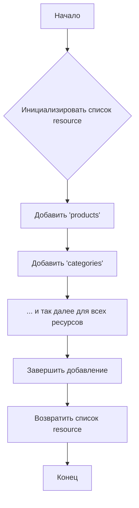

# <input code>

```python
## \file hypotez/src/endpoints/prestashop/api_schemas/api_resourses_list.py
# -*- coding: utf-8 -*-\

#! venv/bin/python/python3.12

"""
.. module:: src.endpoints.prestashop.api_schemas 
	:platform: Windows, Unix
	:synopsis: Список всех доступных ресурсов для API вызовов

"""


resource:list = [
    'products', 
    'categories', 
    'attachments', 
    'addresses',  
    'carriers', 
    'cart_rules', 
    'carts',
    'countries',
    'content_management_system',
    'currencies', 
    'customer_messages', 
    'customer_threads',
    'customers',
    'customizations',
    'deliveries',
    'employees', 
    'groups', 
    'guests',
    'image_types',
    'customizations',
    'images',
    'languages', 
    'manufacturers', 
    'messages',
    'order_carriers',
    'order_cart_rules',
    'order_details',
    'order_histories', 
    'order_invoices', 
    'order_payments',
    'order_slip',
    'order_states',
    'orders',
    'price_ranges',
    'product_customization_fields',
    'product_feature_values',
    'product_features', 
    'product_option_values', 
    'product_options',
    'product_suppliers',
    'products',
    'search',
    'shop_groups',
    'shop_urls',
    'shops', 
    'specific_price_rules', 
    'specific_prices',
    'states',
    'stock_availables',
    'stock_movement_reasons',
    'stock_movements',
    'stocks',
    'stores',
    'suppliers', 
    'supply_order_details', 
    'supply_order_receipt_histories',
    'supply_order_states',
    'supply_orders',
    'tags',
    'tax_rule_groups',
    'tax_rules',
    'taxes',
    'translated_configurations',
    'warehouse_product_locations', 
    'warehouses', 
    'weight_ranges',
    'zones',
    ]
```

# <algorithm>

Этот код определяет список строк, представляющих имена ресурсов, доступных через API.  Алгоритм прост:

1. **Инициализация:**  Создается список `resource`.
2. **Заполнение:**  В список последовательно добавляются имена ресурсов (строки).
3. **Возврат:**  Список `resource` возвращается.

**Пример:**

Вход: Нет явного ввода.
Выход: Список строк `resource`, содержащий все имена ресурсов.

# <mermaid>



# <explanation>

Этот Python-код определяет список строк, представляющий имена доступных ресурсов для API.  Он не содержит сложной логики, а просто перечисляет наименования ресурсов.

* **Импорты:**  Нет импортов. Это чисто локальная конфигурация.

* **Классы:**  Нет классов.

* **Функции:**  Нет функций.

* **Переменные:**
    * `MODE`: Строковая переменная, вероятно, задающая режим работы (например, 'dev', 'prod').
    * `resource`: Список (list), содержащий строки с именами ресурсов.

* **Структура:**  Список `resource` содержит набор строк, представляющих имена доступных API-ресурсов.  Это, по всей видимости, служит справочником для API Престашоп, позволяющим клиентам узнать, какие ресурсы поддерживаются.

* **Возможные ошибки/улучшения:**
    * Отсутствие документации.  Добавление документации (документальных строк) о цели и назначении этого списка улучшило бы читаемость и понимание кода.
    * Жестко заданный список. Изменение списка `resource` должно происходить через управляющую логику, чтобы изменять его динамически. Это не позволяет переиспользованию кода и не подходит для случаев, когда список должен обновляться в зависимости от состояния системы.
    * Неочевиден способ использования.  Неясно, как этот список используется в других частях проекта.  Необходимо знать, какая часть приложения обращается к списку `resource` и как использует его.

* **Связи с другими частями проекта:**  Этот файл (`api_resourses_list.py`) предоставляет данные для других частей проекта, например, для модуля, отвечающего за обработку API-запросов, для генерации документации API, для валидации входящих запросов.  Взаимодействие между этим файлом и другими частями проекта происходит через вызовы функций/методов, которые используют этот список ресурсов.  Данные о ресурсах будут использоваться для определения, поддерживает ли приложение заданные запросы.

**Подводя итог:** Это простой, но важный файл, который определяет интерфейс API.  Возможно, в будущем,  для большей гибкости, этот список будет загружаться из базы данных или конфигурационного файла, а не храниться жестко в коде.