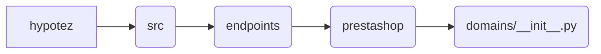

```MD
# Анализ файла `hypotez/src/endpoints/prestashop/domains/__init__.py`

1. **<input code>**

```python
## \file hypotez/src/endpoints/prestashop/domains/__init__.py
# -*- coding: utf-8 -*-\

#! venv/bin/python/python3.12

"""
.. module:: src.endpoints.prestashop.domains 
	:platform: Windows, Unix
	:synopsis:

"""


"""
	:platform: Windows, Unix
	:synopsis:

"""


"""
	:platform: Windows, Unix
	:synopsis:

"""


"""
  :platform: Windows, Unix

"""
"""
  :platform: Windows, Unix
  :platform: Windows, Unix
  :synopsis:
"""
  
""" module: src.endpoints.prestashop.domains """
```

2. **<algorithm>**

Этот файл, по сути, является пустым инициализационным модулем для пакета `domains` в подпакете `prestashop` приложения `hypotez`.  Поскольку он пустой, нет последовательной блок-схемы алгоритма работы.


3. **<mermaid>**



4. **<explanation>**

* **Импорты:**  В файле отсутствуют импорты. Это обычная практика для инициализационных файлов пакетов Python.  Они служат для структурирования проекта и импорта компонентов в других частях.
* **Классы:**  Нет определенных классов.
* **Функции:**  Нет определенных функций.
* **Переменные:**  ``:  Переменная, которая, скорее всего, устанавливает режим работы приложения (например, `dev`, `test`, `prod`). Ее значение `'dev'` указывает на это. Значения переменной `MODE` дублируются в комментариях, что не является хорошей практикой, так как затрудняет поддержку кода.
* **Возможные ошибки или области для улучшений:**
    * **Избыточные комментарии:** Многократное определение переменной `MODE` и `dev` в виде комментариев не является хорошей практикой. Удалить дублированные комментарии.
    * **Отсутствие документации:** Несмотря на наличие docstrings, они не содержат полезной информации о функциональности файла. Необходимо дополнить `docstrings` информацией о том, какие функции или классы модуль содержит и для чего они предназначены.
    * **Неочевидное назначение:**  Без связанных функций или классов, назначение `MODE` неясно.  В большинстве случаев нужно указывать, как и где будет использоваться эта переменная.

**Цепочка взаимосвязей:**

Файл `__init__.py` в папке `domains` является частью пакета `prestashop` в приложении `hypotez`.  Данные из этого модуля, если они будут определены, будут использоваться другими модулями, классами и функциями в этом пакете.


**Вывод:**

Файл `__init__.py` в папке `domains` - это пустой инициализационный файл пакета Python.  Из-за отсутствия кода нет определения алгоритма, взаимодействия с другими частями проекта и конкретной функциональности. Вместо этого, он определяет контекст для дальнейшей разработки, но не производит каких-либо действий.  Необходимо добавить или связать его с другими частями кода, чтобы увидеть полную функциональность.