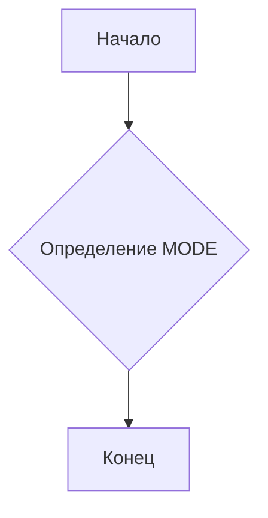
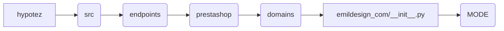

# <input code>

```python
## \file hypotez/src/endpoints/prestashop/domains/emildesign_com/__init__.py
# -*- coding: utf-8 -*-\n
#! venv/bin/python/python3.12

"""
.. module:: src.endpoints.prestashop.domains.emildesign_com 
	:platform: Windows, Unix
	:synopsis:

"""


"""
	:platform: Windows, Unix
	:synopsis:

"""


"""
	:platform: Windows, Unix
	:synopsis:

"""


"""
  :platform: Windows, Unix

"""
"""
  :platform: Windows, Unix
  :platform: Windows, Unix
  :synopsis:
"""
  
""" module: src.endpoints.prestashop.domains.emildesign_com """


"""    
"""
```

# <algorithm>

Этот файл, `__init__.py`,  является файлом инициализации для пакета `emildesign_com` в рамках проекта `hypotez`.  Он содержит константу `MODE`,  вероятно, для настройки режима работы (например, `dev`, `prod`).  Однако, в данном коде нет логики, которая бы использовала эту константу. Алгоритм работы сводится к определению константы `MODE`, но без дальнейших действий.  Поскольку нет функций, циклов или условных операторов,  пошаговая блок-схема будет минимальной.



Пример: При импорте этого модуля в другой части приложения, константа `MODE` будет доступна и может быть использована для выбора разных настроек.


# <mermaid>



Объяснение к диаграмме:

Диаграмма иллюстрирует иерархическую структуру проекта. Модуль `emildesign_com/__init__.py` находится в папке `domains` внутри пакета `prestashop`, который в свою очередь входит в пакет `endpoints`, который является частью корневого пакета `hypotez`. Стрелка от `F` к `G` показывает, что в этом файле определена переменная `MODE`.


# <explanation>

* **Импорты**: В файле отсутствуют импорты.  Это стандартный файл инициализации пакета, и часто для инициализации используются  импорты  из других модулей внутри пакета.  Отсутствуют импорты, следовательно нет зависимости от других пакетов.


* **Классы**: В коде нет определений классов.


* **Функции**:  Нет функций.


* **Переменные**:  ``:  Строковая переменная,  вероятно, используемая для определения режима работы (например,  `dev` - для разработки, `prod` - для производства).  В данном контексте ее значение не используется, так как нет кода, где оно используется.


* **Возможные ошибки или области для улучшений**:  Отсутствие логики. Нет функционального назначения `MODE`.  Необходимость использования `MODE` должна быть обеспечена и реализована.  Возможно, этот файл должен содержать импорты и функции, которые будут использоваться в других частях приложения.  


* **Цепочка взаимосвязей**:  Файл `__init__.py` для пакета `emildesign_com` является частью более крупной иерархической структуры проекта.  Для полноценного анализа, необходимо посмотреть на другие файлы в пакетах `endpoints/prestashop/domains` и их функциональность.  Цепочка взаимосвязей иллюстрирована в mermaid.