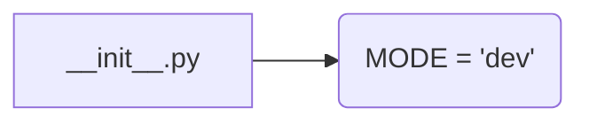

# <input code>

```python
## \file hypotez/src/endpoints/prestashop/domains/sergey_mymaster_co_il/__init__.py
# -*- coding: utf-8 -*-
#! venv/Scripts/python.exe
#! venv/bin/python/python3.12

"""
.. module:: src.endpoints.prestashop.domains.sergey_mymaster_co_il 
	:platform: Windows, Unix
	:synopsis:

"""
MODE = 'dev'

"""
	:platform: Windows, Unix
	:synopsis:

"""


"""
	:platform: Windows, Unix
	:synopsis:

"""


"""
  :platform: Windows, Unix

"""
"""
  :platform: Windows, Unix
  :platform: Windows, Unix
  :synopsis:
"""MODE = 'dev'
  
""" module: src.endpoints.prestashop.domains.sergey_mymaster_co_il """


"""    Client's websites
@namespace src: pestashop.domains
\file __init__.py
 @section libs imports:
Author(s):
  - Created by [Name] [Last Name] on 07.11.2023 .
"""
```

# <algorithm>

Этот файл `__init__.py` — это инициализирующий модуль для пакета `sergey_mymaster_co_il`.  Алгоритм работы прост:  он импортирует необходимые модули (если таковые имеются),  и определяет константу `MODE`, которая, судя по комментариям, используется для определения режима работы.

В данном случае алгоритм сводится к определению константы `MODE` со значением 'dev'.  Не существует никаких операций, которые изменяют данные или выполняют логические задачи.

**Пример:**

Файл инициализируется, и константа `MODE` имеет значение `'dev'`.

# <mermaid>



# <explanation>

* **Импорты:**  В файле отсутствуют импорты.  Комментарии, связанные с импортами, просто описывают возможные зависимости.


* **Классы:**  Нет определённых классов.


* **Функции:** Нет определённых функций.


* **Переменные:** Единственная переменная `MODE` имеет строковое значение `'dev'`.  Это константа, вероятно, используемая для определения режима работы (например, 'dev' для разработки, 'prod' для производства).


* **Возможные ошибки или области для улучшений:**

    * **Отсутствующие импорты:** Если этот файл должен использовать какие-либо функции или классы из других модулей, они должны быть импортированы.
    * **Недостаточная документация:**  Хотя есть много комментариев, они не полностью описывают назначение `MODE`. Лучше было бы добавить пояснение о том, для чего используется эта константа.


* **Взаимосвязь с другими частями проекта:**

    Этот файл `__init__.py` является частью иерархической структуры пакета `hypotez/src/endpoints/prestashop/domains/sergey_mymaster_co_il`.  Он играет роль инициализатора для этого пакета,  но без импортов и функций не выполняет сложных задач.  Для понимания полной функциональности необходим код других файлов в этой директории.  Вероятно, этот файл служит для импорта других, содержащих классы и функции, для обработки запросов по домену `sergey_mymaster_co_il`.