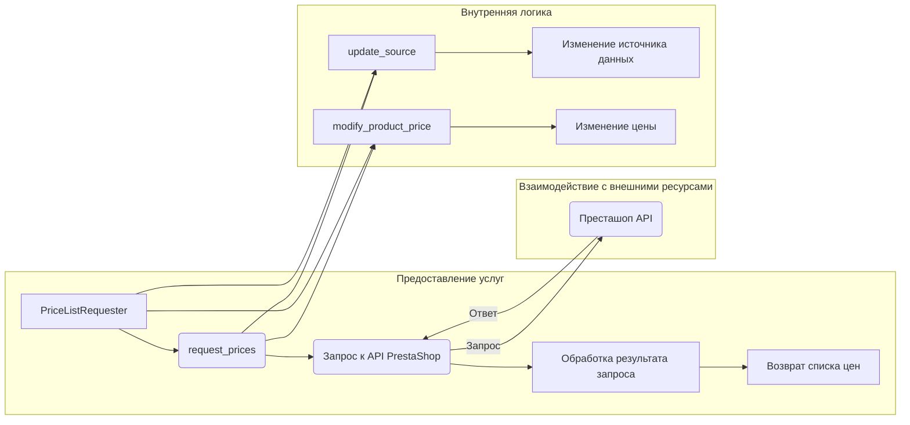

# <input code>

```python
## \file hypotez/src/endpoints/prestashop/pricelist.py
# -*- coding: utf-8 -*-\

#! venv/bin/python/python3.12

"""
.. module:: src.endpoints.prestashop 
	:platform: Windows, Unix
	:synopsis:

"""


import sys
import os
from attr import attr, attrs
from pathlib import Path
from typing import Union

import header
from src import gs
from src.logger import logger
from src.utils.jjson import j_loads, j_loads_ns
from .api import PrestaShop
from types import SimpleNamespace

class PriceListRequester(PrestaShop):
    """
    Класс для запроса списка цен.

    Inherits:
        PrestaShop
    """

    def __init__(self, api_credentials):
        """
        Инициализирует объект класса PriceListRequester.

        @param api_credentials: Словарь с учетными данными для API,
                                включая 'api_domain' и 'api_key'.
        """
        super().__init__(api_credentials['api_domain'], api_credentials['api_key'])

    def request_prices(self, products):
        """
        Запрашивает список цен для указанных товаров.

        @param products: Список товаров, для которых требуется получить цены.
        @return: Словарь, где ключами являются товары, а значениями - их цены.
                 Например: {'product1': 10.99, 'product2': 5.99}
        """
        # Здесь код для отправки запроса на получение цен из источника данных
        pass

    def update_source(self, new_source):
        """
        Обновляет источник данных для запроса цен.

        @param new_source: Новый источник данных.
        """
        self.source = new_source

    def modify_product_price(self, product, new_price):
        """
        Модифицирует цену указанного товара.

        @param product: Название товара.
        @param new_price: Новая цена товара.
        """
        # Здесь код для изменения цены товара в источнике данных
        pass
```

# <algorithm>

```mermaid
graph TD
    A[Инициализация PriceListRequester] --> B{Получение api_credentials};
    B -- api_credentials --> C[Вызов конструктора PrestaShop];
    C --> D[request_prices(products)];
    D --> E[Отправка запроса на получение цен];
    E --> F[Обработка ответа];
    F --> G[Возврат списка цен];
    H[update_source(new_source)] --> I[Изменение self.source];
    J[modify_product_price(product, new_price)] --> K[Изменение цены товара в источнике];
```

**Пример:**
Предположим, `api_credentials` - это `{'api_domain': 'example.com', 'api_key': 'mykey'}`.  В `request_prices`, передаются `products = ['productA', 'productB']`. Алгоритм отправит запрос на `example.com` с `api_key`, чтобы получить цены для `productA` и `productB`. После получения данных (например, `{'productA': 10, 'productB': 20}`) вернёт их в виде словаря.

# <mermaid>



**Объяснение зависимостей:**

* `PriceListRequester` наследуется от `PrestaShop`.  `PrestaShop` — это, вероятно, класс, определяющий базовые методы взаимодействия с API PrestaShop (например, отправку запросов).  Связь — наследование.
* `PriceListRequester` использует `src.gs`, `src.logger`, `src.utils.jjson` и `header`. Это указывает на то, что эти модули находятся в пакете `src` и предоставляют необходимые сервисы, такие как обработка данных, логирование, и вероятно, работу с ключами доступа к ресурсам.
* `PrestaShop` предположительно импортирован из `.api`.  Это означает, что  `PrestaShop` определен в другом файле (например, `hypotez/src/endpoints/prestashop/api.py`).


# <explanation>

**Импорты:**

* `sys`, `os`, `pathlib`: Стандартные библиотеки Python для работы с системой и файловой системой.
* `attr`: Библиотека для создания и работы с атрибутами классов.
* `typing`: Библиотека для типов данных в Python.
* `header`: Вероятно, содержит константы или другие данные, специфичные для этого проекта. Требуется дополнительная информация для подробного анализа.
* `gs`: Представляет собой вероятный модуль, связанный с Google Sheets или другими сервисами. Требуется дополнительная информация.
* `logger`: Модуль для логирования, обычно из пакета `logging`. Он необходим для записи сообщений об ошибках, информации и других событий в логи.
* `jjson`: Модуль для работы с JSON-данными.
* `PrestaShop`: Класс, вероятно, из модуля `hypotez/src/endpoints/prestashop/api.py`, предоставляющий методы для работы с API Престашоп.

**Классы:**

* `PriceListRequester`: Класс для запроса списка цен. Наследуется от `PrestaShop` для использования базовых методов работы с API. Имеет атрибут `source` (по умолчанию), необходимый для хранения источника данных.

**Функции:**

* `__init__(self, api_credentials)`: Инициализирует объект класса.  Получает данные авторизации (логин, пароль) для доступа к API.
* `request_prices(self, products)`: Отправляет запрос к API Престашоп для получения цен на указанные `products`.  Важный момент — функция *не реализована*.
* `update_source(self, new_source)`: Обновляет источник данных для запроса цен.
* `modify_product_price(self, product, new_price)`: Изменяет цену товара в источнике данных.  Функция *не реализована*.


**Переменные:**

* `MODE`: Вероятно, определяет режим работы (например, 'dev', 'prod').


**Возможные ошибки и улучшения:**

* Нет реализации для `request_prices`, `modify_product_price`.  Эти методы должны быть реализованы для работы с API Престашоп и изменением цен.
* Не хватает обработки ошибок (try-except блоков).  При запросах к внешним сервисам необходимо предусмотреть возможность возникновения исключений.
* Не указан формат данных, возвращаемых из API. Это важно для корректной работы.


**Взаимосвязи с другими частями проекта:**

* `PriceListRequester` зависит от `PrestaShop` для работы с API Престашоп.
* `PriceListRequester` использует логирование из `logger`.
* `PriceListRequester` использует функции `j_loads` и `j_loads_ns` из `jjson`, для работы с JSON-данными.